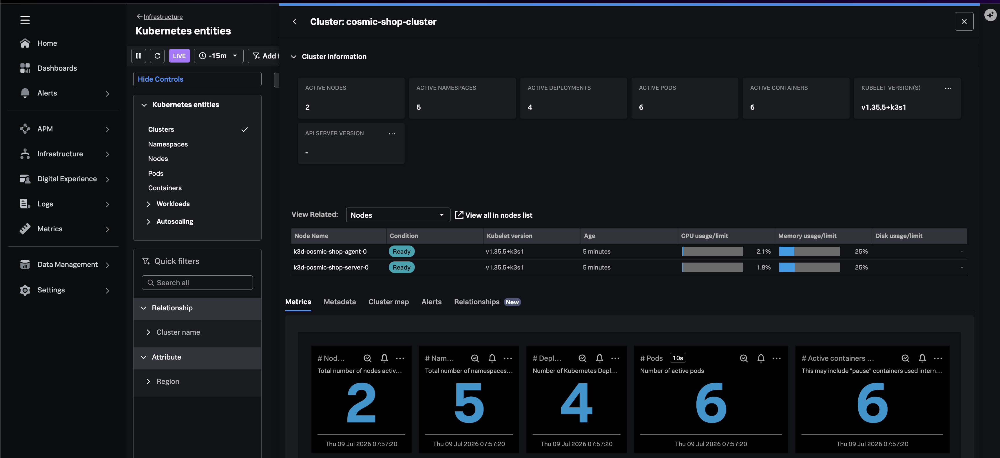

In this step, you'll deploy the Splunk Distribution of the OpenTelemetry Collector to your k3d cluster using Helm. The collector receives traces and metrics from instrumented services and forwards them to Splunk Observability Cloud.

{}

Each application pod sends data to the collector via the node IP:

```text
Pod → http://$(NODE_IP):4318 → Splunk OTel Collector DaemonSet → Splunk O11y Cloud
```
{}

## Install via Helm

Ensure your `.env` file is configured, then run:


{}

```bash
make collector
```

{}
{}

```bash
source .env

helm repo add splunk-otel-collector-chart https://signalfx.github.io/splunk-otel-collector-chart
helm repo update

helm upgrade --install splunk-otel-collector splunk-otel-collector-chart/splunk-otel-collector \
  --namespace cosmic-shop \
  --create-namespace \
  -f deploy/helm/splunk-otel-values.yaml \
  --set="splunkObservability.realm=${SPLUNK_REALM}" \
  --set="splunkObservability.accessToken=${SPLUNK_ACCESS_TOKEN}" \
  --set="clusterName=${CLUSTER_NAME}" \
  --set="environment=${SPLUNK_DEPLOYMENT_ENV}"
```
{}


## Validation Checklist

Run these commands after `make collector` completes.

#### 1. Confirm Helm release is installed


{}

```bash
helm list -n cosmic-shop
```

{}
{}

```
NAME                    NAMESPACE   REVISION   STATUS     CHART                         APP VERSION
splunk-otel-collector   cosmic-shop 1          deployed   splunk-otel-collector-0.x.x   0.x.x
```

STATUS must be `deployed`. If it shows `failed`, re-check `SPLUNK_REALM` and `SPLUNK_ACCESS_TOKEN` in `.env`.

{}


#### 2. Confirm collector pods are running


{}

```bash
kubectl -n cosmic-shop get pods -l 'app=splunk-otel-collector,component=otel-collector-agent'
```

{}
{}

```
NAME                            DESIRED   CURRENT   READY   UP-TO-DATE   AVAILABLE   NODE SELECTOR   AGE
splunk-otel-collector-agent     1         1         1       1            1           <none>          2m

NAME                                  READY   STATUS    RESTARTS   AGE
splunk-otel-collector-agent-xxxxx     1/1     Running   0          60s
```

READY should be `1/1` and STATUS should be `Running`. If STATUS is `CrashLoopBackOff`, check logs in step 3.

{}


#### 3. Confirm collector logs show no auth errors


{}

```bash
kubectl -n cosmic-shop logs -l 'app=splunk-otel-collector,component=otel-collector-agent' --tail=30
```

{}
{}

```
... Everything is ready. Begin running and processing data.
```

**Failure indicators to watch for:**

```
401 Unauthorized
access token is invalid
failed to export
connection refused
```

If you see auth errors, verify your org access token and realm in `.env`, then reinstall:

```bash
make collector
```

{}


## Confirm your Cluster in Splunk Observability Cloud

1. Open Splunk Observability Cloud
2. Navigate to **Infrastructure → Kubernetes → Kubernetes Entities → Clusters**
3. Search for your cluster name (`cosmic-shop-cluster` or the value of `CLUSTER_NAME` in `.env`)

The cluster should appear within a few minutes of the collector starting.



## Troubleshooting

Here's some of the potential issues you may encounter in this step & suggested remediation steps.



#### Potential Issue 1. Helm install fails with auth error

Verify `SPLUNK_ACCESS_TOKEN` and `SPLUNK_REALM` in `.env` are correct and the token has ingest permissions.

#### Potential Issue 2. No cluster in Infrastructure navigator

Wait 2–3 minutes. Confirm the collector pod is running and check its logs for export errors.


