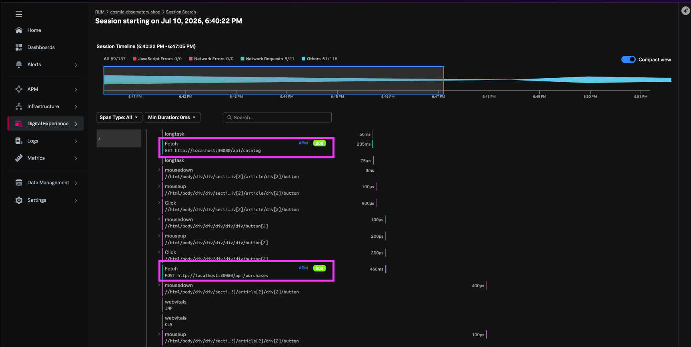

In this step we will review what the E2E correlation looks like from the web application -> through to the fulfilment service.

## Generate Request from Web Application

### Send New Web Request

1. Open http://localhost:30080
2. Click Buy now → Confirm & place order

{}
**Copy the traceID** - we will use this in the next step to validate APM e2e correlation
{}

## Verify in Splunk RUM

1. Navigate to **Digital Experience → Session Search**
2. Find your session (environment `workshop-context-prop`)
3. Click the session timeline
4. Select the `purchases` fetch event
5. Confirm:
   - Response time is displayed
   - **Backend Trace** link navigates to APM
   - Trace ID matches the browser `traceparent` header

