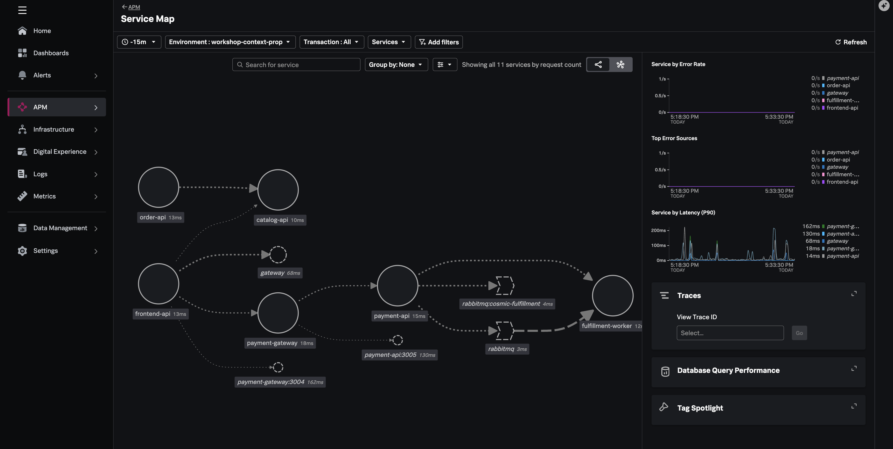

## Overview

In this workshop, you'll deploy the **Cosmic Observatory Shop** - an astronomy equipment storefront - and instrument it with Splunk RUM and Splunk APM. 

You will observe fragmented service map and traces when required W3C headers are stripped at these **three** layers. 
1. **Edge NGINX gateway** - drops W3C trace headers (frontend-api → order API)
2. **Payment gateway proxy** - instrumented Node.js proxy drops headers (frontend-api → payment API)
3. **RabbitMQ message bus** - async payment → fulfillment with no trace context in AMQP headers

We will then fix the issues to restore end-to-end context propagation across all service and infrastructure layers.

## Architecture | Expected Output

The goal is to reolve propagation issues across the three layers and go from a broken state

to a fully integrated and correlated view - PlaceHolder Image Below

