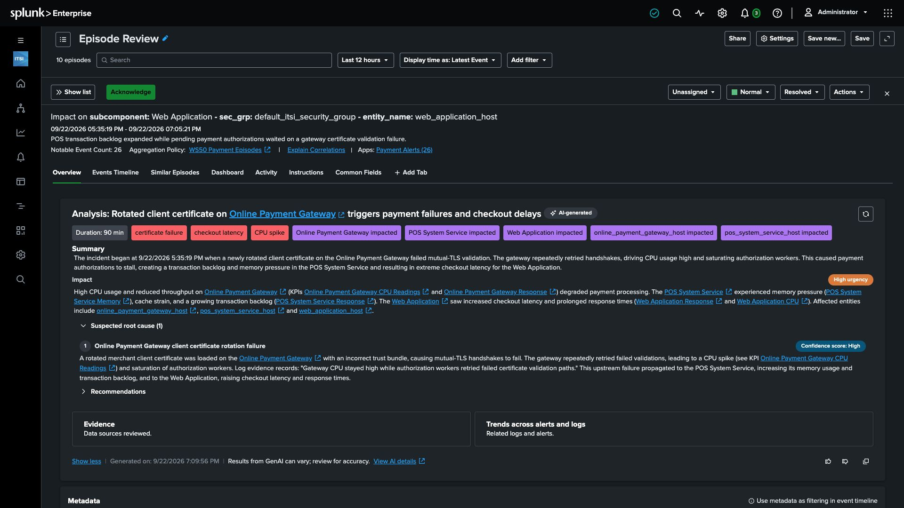

Customers are waiting at checkout. Payment authorizations are retrying, transactions are backing up, and the web application is responding slowly. Your operations team has alerts from several services, but it still needs to answer three questions: **What belongs together? Who should investigate? What evidence explains the impact?**

In this workshop, you will build the path from raw alerts to an investigation in **Splunk IT Service Intelligence (ITSI)**. The aim is to reduce the work between receiving an alert and understanding what to do next.

For operations, the business goal is less manual triage and fewer handoffs between teams. A shared episode with support-team context and evidence can help responders choose the next check more quickly and with greater confidence. That keeps the investigation focused on restoring customer checkout, rather than spending the incident translating alerts or deciding who should look at them.

## Why this matters

An alert describes something a monitoring system observed. It may use its own severity labels, identify a host differently from another tool, or omit the team responsible for it. When several services experience problems at once, operators spend time interpreting those differences before they can investigate.

**ITSI** brings that information into a shared workflow. Normalization makes alert fields consistent. Enrichment adds useful operational context. Grouping brings related symptoms into an episode. Clearing actions automate routine episode updates, and **EventiQ Diagnose** helps explain the incident with evidence for an operator to review.

| Operations challenge | What you will configure | Why it helps |
| --- | --- | --- |
| Useful alerts are already in **Splunk** but have not entered the incident workflow. | One alert connection over the payment data. | Make the selected signals available in **ITSI**. |
| Raw field names and severity labels need interpretation. | Reviewed field and severity mappings. | Give operators a consistent source, message, and priority. |
| An alert does not identify the team that supports its source. | A small enrichment policy. | Put support team and business criticality beside the alert. |
| Related symptoms appear across several services. | An aggregation policy using **EventiQ Detect** and the source incident identifier. | Bring the symptoms into one place for investigation. |
| Operators manually update episodes when the source reports recovery. | An action rule that sets the episode to Normal and Resolved on a clearing event. | Keep the incident workflow aligned with incoming recovery signals. |
| Investigators need to connect symptoms with supporting evidence. | A gateway log source and an **EventiQ Diagnose** analysis. | Review a suspected cause, service impact, and relevant evidence together. |

## Follow the customer journey

**1.** Start with the customer: a shopper submits an order through the **Web Application** and expects a prompt payment confirmation.

**2.** Follow the request through the payment environment. The **Online Payment Gateway** handles authorization, while the **POS System Service** tracks payment-related processing. Delays in one part of this flow can affect the others.

**3.** Read the symptoms as an operations team. A busy gateway, a POS backlog, and a slow checkout page may describe different effects of the same incident. Your task is to bring those signals together and inspect the evidence before deciding on a response.

The supplied scenario uses synthetic data that repeats variations of a payment incident. The records and services are already available, so you can concentrate on the event workflow.

## Connect the ITSI objects to the task

You will use a few **ITSI** concepts throughout the workshop:

| Object | Its role in this workshop |
| --- | --- |
| **Raw record** | The original payment signal indexed in **Splunk**. |
| **Notable event** | An alert produced by your connection with normalized fields and added context. |
| **Entity** | The host or component associated with an alert. |
| **Service and KPI** | The service context and measurements used to understand operational impact. |
| **Notable Event Aggregation Policy (NEAP)** | The configuration that determines which alerts belong together, when a group stops collecting them, and which lifecycle actions run. |
| **Episode** | A group of related alerts that an operator can investigate. |

**4.** Follow the workflow you will build:

**Select alerts → normalize → enrich → group → investigate.**

**EventiQ Detect** recommends correlation settings from historical alerts. You will review those settings and preserve the incident identifier supplied by this scenario. **EventiQ Diagnose** produces a suspected cause and investigation guidance. You will check the supporting records and their timestamps before accepting its explanation.

*Your final investigation will bring the explanation, affected services, and evidence into the episode. Wording, timestamps, and alert counts can differ from this example.*

## What is ready for you

Your workshop instance includes **ITSI 5**, running payment data, a prepared retail service model with entities and KPIs, and a small context lookup. You will focus on the three payment services within that model and create four objects:

- `WS50 Payment Alerts`: the alert connection.
- `WS50 Payment Context`: the enrichment policy.
- `WS50 Payment Episodes`: the aggregation policy.
- `WS50 Gateway Evidence`: the log source used during investigation.

{}
You can explain why consistent fields, support context, grouping, and evidence review each help the team move from a checkout complaint to an informed investigation. Next, open your instance and find the supplied services and raw alerts.
{}
