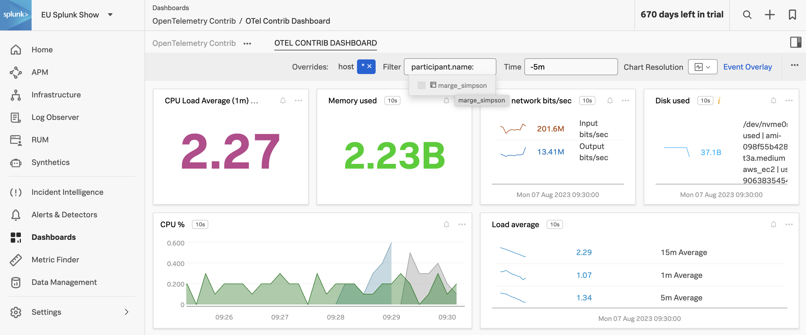

## Splunk Observability Cloud

Now that we have configured the OpenTelemetry Collector to send metrics to Splunk Observability Cloud, let's take a look at the data in Splunk Observability Cloud. If you have not received an invite to Splunk Observability Cloud, your instructor will provide you with login credentials.

Before that, let's make things a little more interesting and run a stress test on the instance. This in turn will light up the dashboards.

``` bash
sudo apt install stress
while true; do stress -c 2 -t 40; stress -d 5 -t 40; stress -m 20 -t 40; done
```

Once you are logged into Splunk Observability Cloud, using the left-hand navigation, navigate to **Dashboards**:


In the search box, search for **OTel Contrib**:


{}
If the dashboard does not exist, then your instructor will be able to quickly add it. If you are not attending a Splunk hosted version of this workshop then the Dashboard Group to import can be found at the bottom of this page.
{}

Click on the **OTel Contrib Dashboard** dashboard to open it:


In the **Filter** box, at the top of the dashboard, type in **participant** and select **participant.name**:


You can either start typing in the name you configured for `participant.name` in the `config.yaml` or you can select your name from the list:



You can now see the host metrics for the host upon which you configured the OpenTelemetry Collector.

{}
