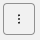

* Get familiar with the UI and options available from this landing page
* Identify Page Views/Errors and Request/Errors and Java Script Errors in a single view  
  Check the Web Vitals metrics and any Detector that has fired for in relation to your Browser Application

---

## 1. Browser Application Summary Dashboard Overview

### 1.1. Header Pane

As seen in the previous section the RUM Application Summary Dashboard consists of 6 major sections. 
The first section is the selection header, where you can collapse the Pane via the  Browser icon or the **>** in front of the application name. wich is *jmcj-rum-app* in the example below. 
It also provides access to the Detailed Application Overview page if you click the link with your application name wich is *jmcj-rum-app* in the example below. 

Further, you can also visit/open the Application Overview Page and an App Health Dashboard via the hamburger  menu on the right by selecting *View Dashboard*

Please visit the Detailed Overview page for a moment, then use the back button of your browser to return the landing page, then open the Browser App Health Dashboard for a quick visit (note: this dashboard will open in a new page, find the tab with the RUM landing page (Entitled **RUM**) and select it again).

We will looking at the Detail Overview page and the Browser App Health Dashboard in detail in one of the next sections).

### 1.3. Chart Area

### 1.4. Java Script Errors

### 1.5. Web Vitals

### 1.6. Most Recent Detectors

