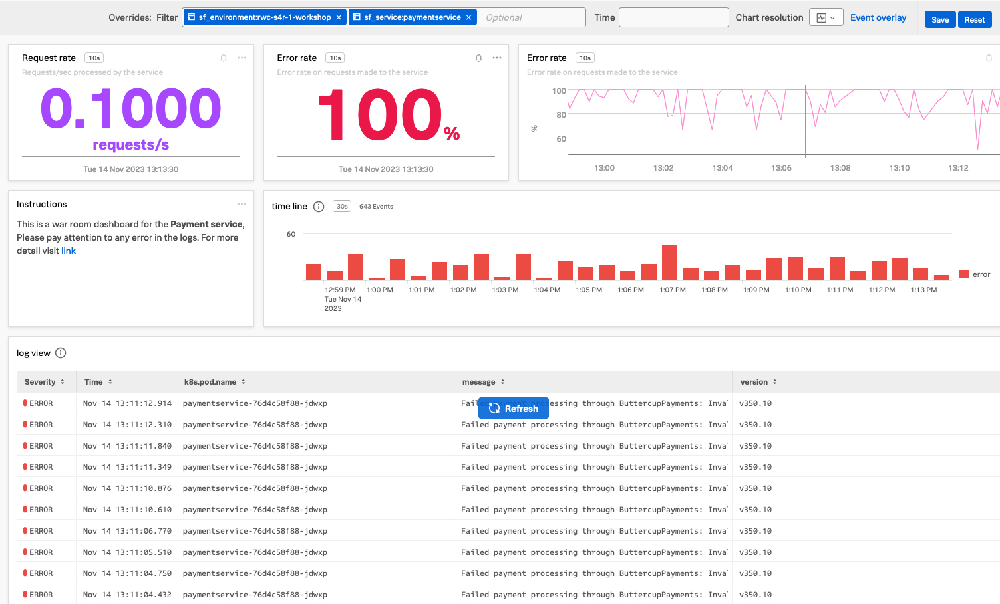

### WIP WIP WIP WIP WIP

Flow:

1. Go back to your war room dashboard with the two log charts
2. It can use a bit more information, so lets add request rate charts and Error rate charts.
3. Revisit APM, Select explore, and select the payment service.
4. Select the Dashboard option on the top right of the screen.
5. You should now be in the APM services map with the workshop and payment service selected.
6. Click on the three dots **...** and select *Copy*
7. Note that you now have a **1**  before the **+**  at the top right of the page, indicating you have a copied chart in your clipboard available.
8. Find you War room dashboard again.
9. Select the  **1+** at the top of the page and select Past Chart. this will create the chart in your dashboard.
10. Lets add some more,  go back to the APM services dashboard either via A the APM route , or selecting the *APM services* dashboard group followed by the *service* dashboard from **Dashboards**
11. This time select Error rate, click on  the **...**  and select copy, do the same for error rate chart, but this time choose add to dashboard. This will allow you to select and add multiple charts in one go. Note That the **+** now show t2 the number of charts copied into the clipboard.
12. Return to your war room dashboard and select past charts form  the **+* menu.
13. At this point these chart are not filtered, so lets add the correct filter
14. Add sf_environment=[WORKSHOPNAME] and sf_service=payment_service  to the override filter box.
15. Now with the  info for our service lets rearange the chart  so the are o usefull
16. Drag Request rate to the top left and resize it  with 50 % by dragging the left edge.  add Error rate next to it.
17. Drag the error rat cht next to the two chart and  resize it so it fille the page
19. click on **new text note* and replace the text below with the text in the note  then click save  name the chart instructions
{}
<pre>
This is a  war room dashboard for the **Payment service**,  
Please pay attention  to any error in the logs.
For more detail visit [link](https://https://www.splunk.com/en_us/products/observability.html)
</pre>
{}
20. place the instrunction belwo the requesrtt rate chart, add the time line log chart next  to it and size it to the page
21. Make sure the Log view chart is the bottom chart, is full sized and  extended to the bottom of you page.

the result should be like this:
