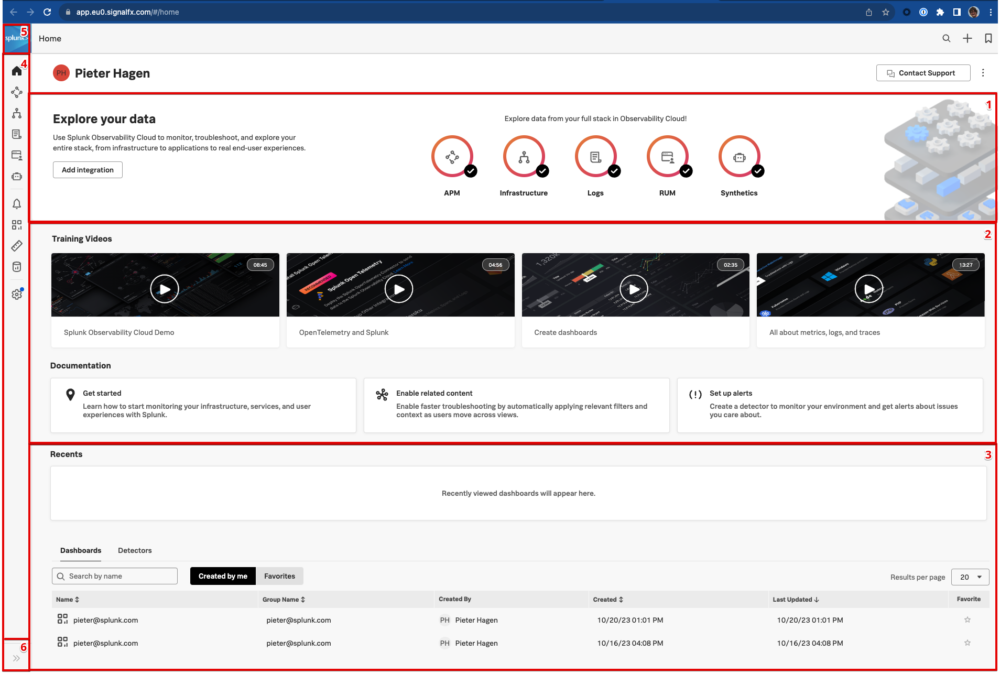

{}15 minutes{}

The goal of this section is to make you comfortable with the UI of Splunk Observability Cloud. To achieve this, we first will examine the main components of the ui, followed by an exercise to get you started.

---

### 1. Login in to Splunk Observability Cloud

Your instructor may already have told you that you should have received and e-mail from Splunk that invites you to the Workshop Org (short for Organization). This e-mail will look like the one below, and may have ended up in your Spam folder if you cannot find it. Once received, please click the {}Join Now{} or copy the provided url in the your browser.

If you cannot find your email, check our FAQ [here](25-login-faq), if that did not resolve the issue, inform your Instructor.

If you follow the link provided in the email, and this is your first time using this e-mail address with Splunk Observability, you will be presented by the below User Registration page, allowing you to set you desired name, and the desired password. After completing the form, click the {}SIGN IN NOW{} button.

{}
Please click the checkbox to agree to the terms, and make sure you password you select has between 8 and 32 characters, contain at least one capital letter, one number, and one symbol.

{}

If you have problems connection, please check our FAQ  [here](../25-login-faq)

---

### 1. Home page

After you register and log into the Splunk observability UI, you will be taken to the Home Page. This Home page has 6 distinct section that provide either useful information or allows you to navigate the Splunk Observability Suite.

* 1. Explore Data Pane, Here you can see what function of the Suit are active and you can add additional integrations.
* 2. Instruction Pane, Here you will find video's and references to document pages of interest.
* 3. Recent Pane, This pane shows your recently created or visited Dashboards or Detectors for easy access.
* 4. Main Menu Pane, this pane allows for quick movement between the components of the Splunk Observability Suite.
* 5. Org Switcher Pane, allows for switching between orgs that you are a member off.
* 6. Expand menu Pane, This pane allow you to expand the Main menu for icon mode to full mode.

{}

* Expand the main menu, check the drop down box if you have more than one Org assigned to you.
* Click on **Settings**.
* At the bottom of the menu, click on either **Light**, **Dark** or **Auto** mode.
* Did you also notice this is where the **Sign Out** option is?
* Click **Back to Main Menu**.

{}
