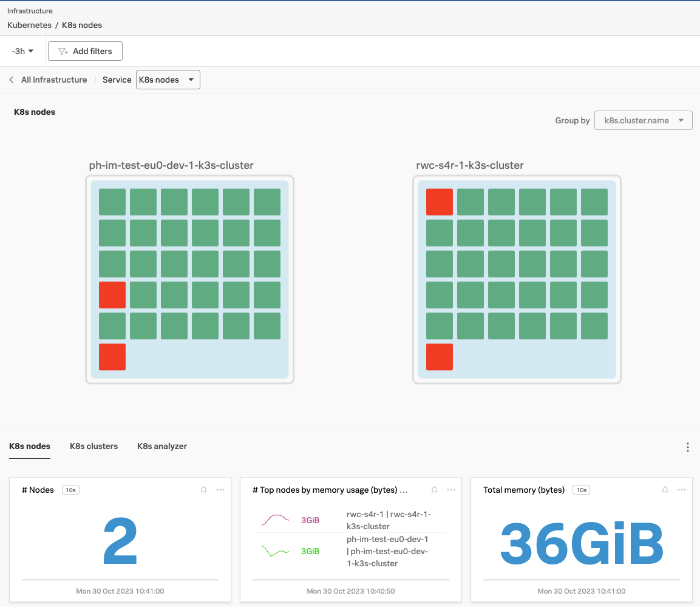

{}15 minutes{}

This is the second section, a deeper dive into some of the special features of the Splunk Observability suite.

Please select the *K8s nodes* tile from the Tile pane if you have not yet done so.
(Select Kubernetes as your Technology). This will bring you to the Kubernetes Navigator Page.

The screenshot above shows the main part of the kubernetes navigator. It will show all the clusters & their nodes that send metrics to the Splunk Observability Suite. In the workshop you will mostly see single node kubernetes cluster.

Let's make sure we are looking at our own cluster.

{}

* First, use the  option to pick your cluster.
* This can be done by selecting *k8s.cluster.name* from the filter drop down box.
* You then can start typing the name of you cluster, (as provided by your instructor). The name should also appear in the drop down values. Select yours and make sure just the one for your workshop is highlighted with a .
* Click the {}  Apply Filter   {} button to focus on our Cluster
* We now should have a single cluster visible.
{}

Let's move on the next page of this exercise and look at your cluster in detail.

---

Navigate to the K8s Navigator ... walk through ... filtering, metrics, node dependencies, etc.

Talk around what has been deployed

* Talk around initial panes goto Nodes
* Filter to workshop cluster
* Review default metrics
* Node dependencies
* Click on mysql pod
* Talk around metadata for the container
* Back to Infrastructure

Something to trigger alerts in Navigator?

