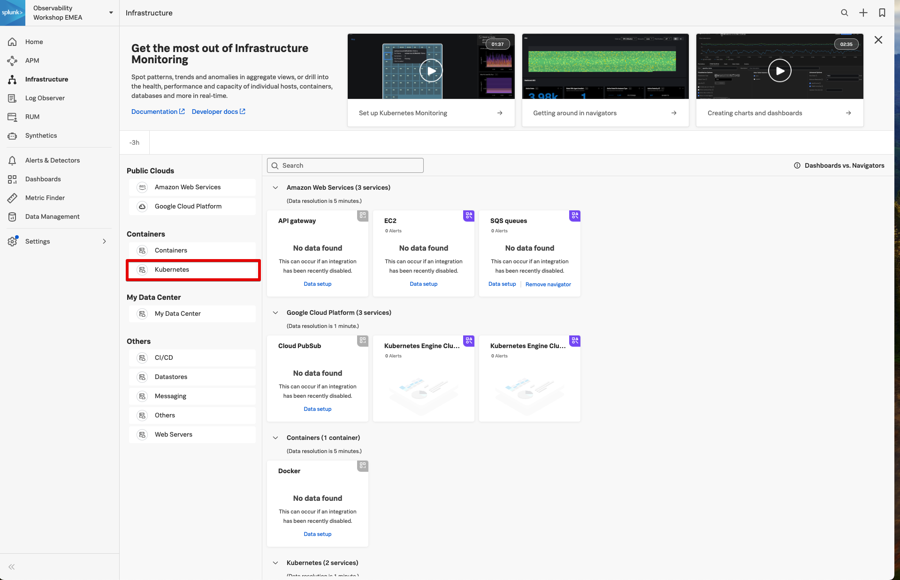

TBD

Navigate to the K8s Navigator ... walk through ... filtering, metrics, node dependencies, etc.

Talk around what has been deployed

* Talk around initial panes goto Nodes
* Filter to workshop cluster
* Review default metrics
* Node dependencies
* Click on mysql pod
* Talk around metadata for the container
* Back to Infrastructure

Something to trigger alerts in Navigator?

