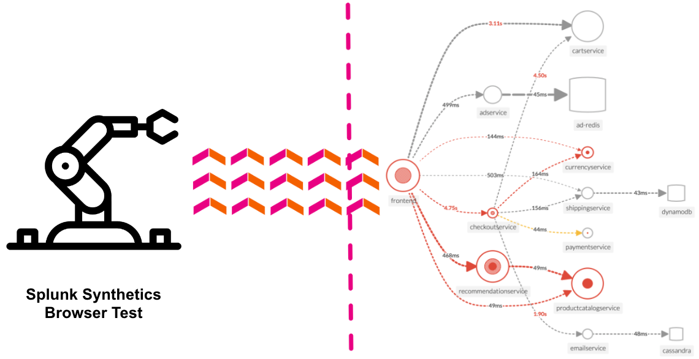

{}5 minutes{}

Splunk Synthetic Monitoring provides visibility across URLs, APIs and critical web services to solve problems faster. IT Operations and engineering teams can easily detect, alert and prioritize issues, simulate multi-step user journeys, measure business impact from new code deployments and optimize web performance with guided step-by-step recommendations to ensure better digital experiences.

**Ensure Availability:** Proactively monitor and alert on the health and availability of critical services, URLs and APIs with customizable browser tests to simulate multi-step workflows that make up the user experience.  
**Improve Metrics:** Core Web Vitals and modern performance metrics allow users to view all their performance defects in one place, measure and improve page load, interactivity and visual stability, and find and fix JavaScript errors to improve page performance.  
**front-end to back-end:** Integrations with Splunk APM, Infrastructure Monitoring, On-Call and ITSI help teams view endpoint uptime against back-end services, the underlying infrastructure and within their incident response coordination so they can troubleshoot across their entire environment, in a single UI.  
**Detect and Alert:** Monitor and simulate end-user experiences to detect, communicate and resolve issues for APIs, service endpoints and critical business transactions before they impact customers.  
**Business Performance:** Easily define multi-step user flows for key business transactions and start recording and testing your critical user journeys in minutes. Track and report SLAs and SLOs for uptime and performance.  
**Filmstrips and Video Playback:** View screen recordings, film strips, and screenshots alongside modern performance scores, competitive benchmarking, and metrics to visualize artificial end-user experiences. Optimize how fast you deliver visual content, and improve page stability and interactivity to deploy better digital experiences.

