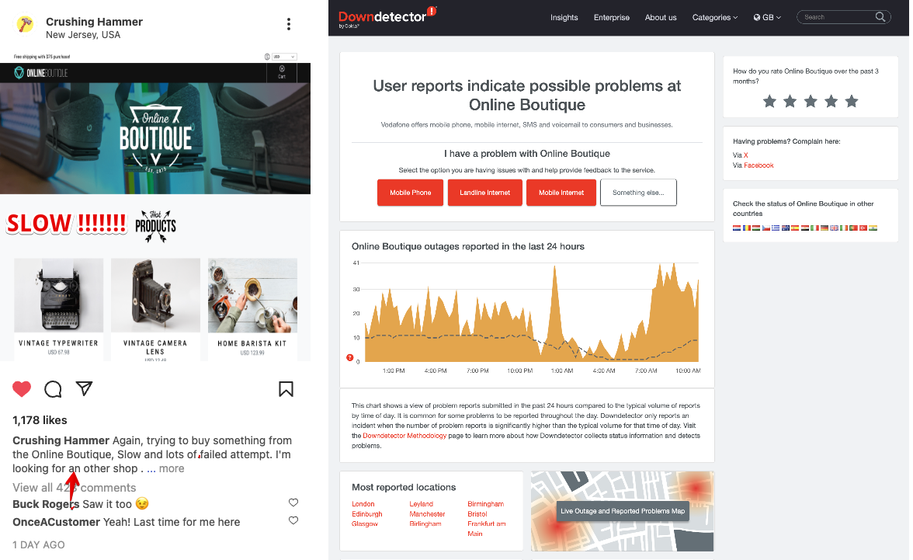

Given you can run these tests 24/7, it is an ideal tool to get warned early if your tests are failing or starting to run longer than your agreed SLA instead of getting informed by social media, or Uptime websites.

 To stop that from happening let's detect if our test is taking more than 1.1 minutes.

 {}

* Go back to the Synthetics home page via the menu on the left
* Select the workshop test again and click the {}Create Detector{} button at the top of the page.  

* First, click on the pencil to rename the detector to something meaningful like [YOUR INITIALS - WORKSHOP Detector].
* Ensure that Run Duration and static threshold are selected.
* Set trigger threshold to be around 68000.  Make sure the threshold line is cutting through the long spikes as shown above. (You may have to adjust the threshold value a bit to match your actual latency.)
* Leave the rest as default.
* Note that there is now a row of red and white triangles appearing below the spikes. The red triangles let you know that your detector found that your test was above the given threshold & the white triangle indicates that the result returned below the threshold. Each red triangle will trigger an alert.  
* You can change the Alerts criticality by changing the drop-down to a different setting, as well as the method of alerting.  Make sure you do **NOT** Add a Recipient. (This will help your Instructor with cleaning up the workshop afterward).
* If you are interested in the analytics used for this detector you can click the ellipses **⋮**  at the top right of the dialog. This will show you the generated analytics.
* Click Activate to deploy your detector
* This returns you to the Synthetic home page, to see if your test is active click on {}Edit Test{} button
* At the bottom of the page, there is a list of active detectors,  including the one you just created.

* If you can't find yours, but see one called *New Synthetic Detector*, you may not have saved it correctly with your name. Click on the *New Synthetic Detector* link, and redo the rename.

{}
