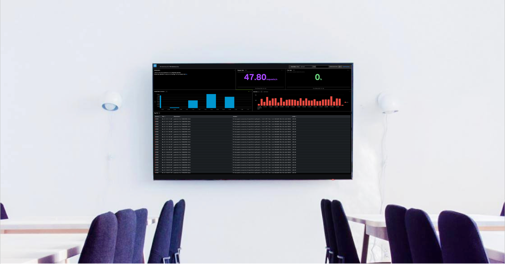

It is common for development and SRE teams to require a summary of the health of their applications and/or services. More often or not these are displayed on wall-mounted TVs. Splunk Observability Cloud has the perfect solution for this by creating custom dashboards.

In this section we are going to build a **Service Health Dashboard** we can use to display on teams' monitors or TV screens.

 
