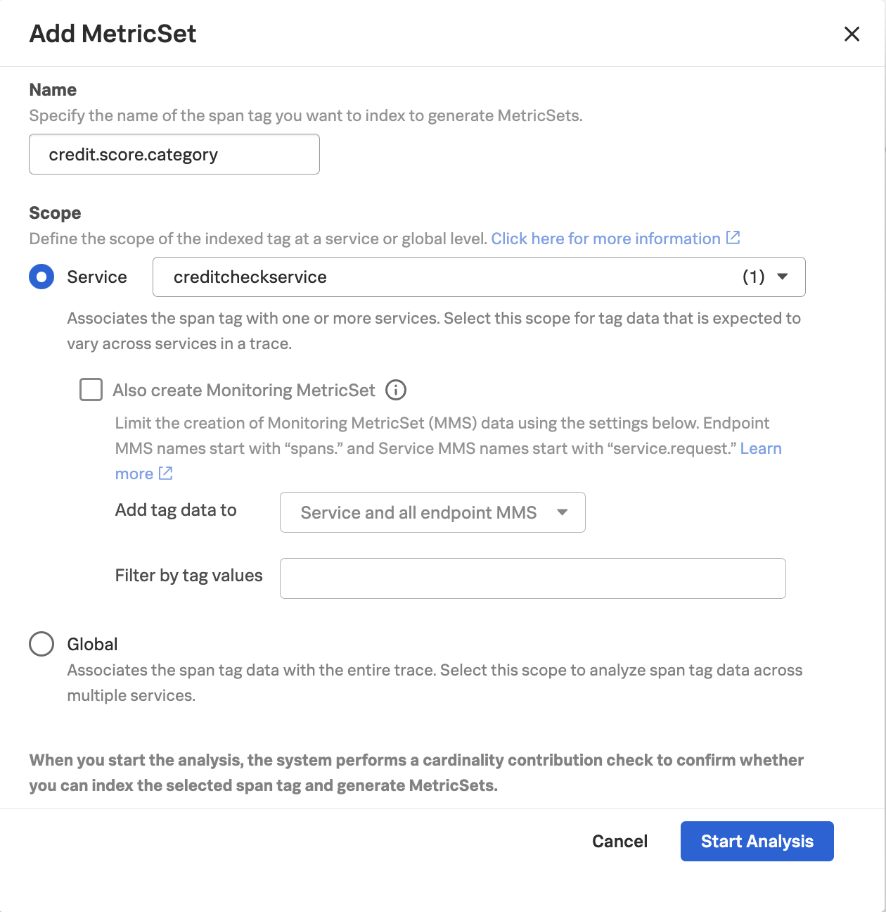
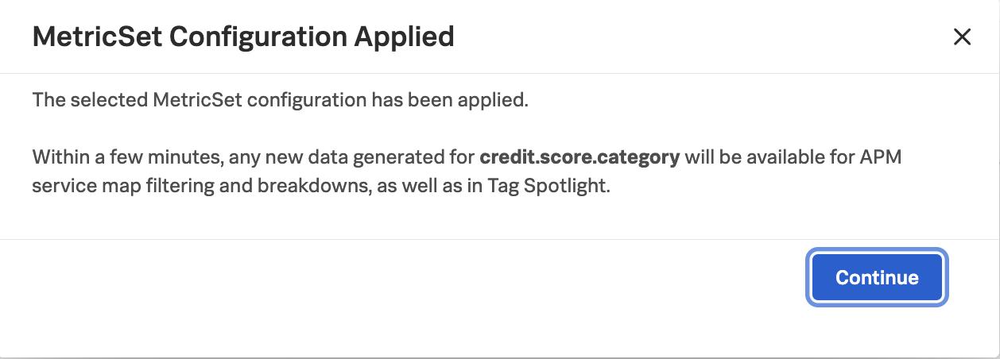

## Index Tags
To use advanced features in **Splunk Observability Cloud** such as **Tag Spotlight**, we'll need to index our tags. 

To do this, navigate to Settings -> APM Metric Sets.  Then click the **+ New MetricSet** button.  

Let's index the **credit.score.category** tag to start with, by filling in the following details: 

Click **Start Analysis** to proceed. 

The tag will appear in the list of **Pending MetricSets** while analysis is performed.  

Once analysis is complete, click on the checkbox in the **Actions** column.

## Troubleshooting vs. Monitoring Metric Sets 

