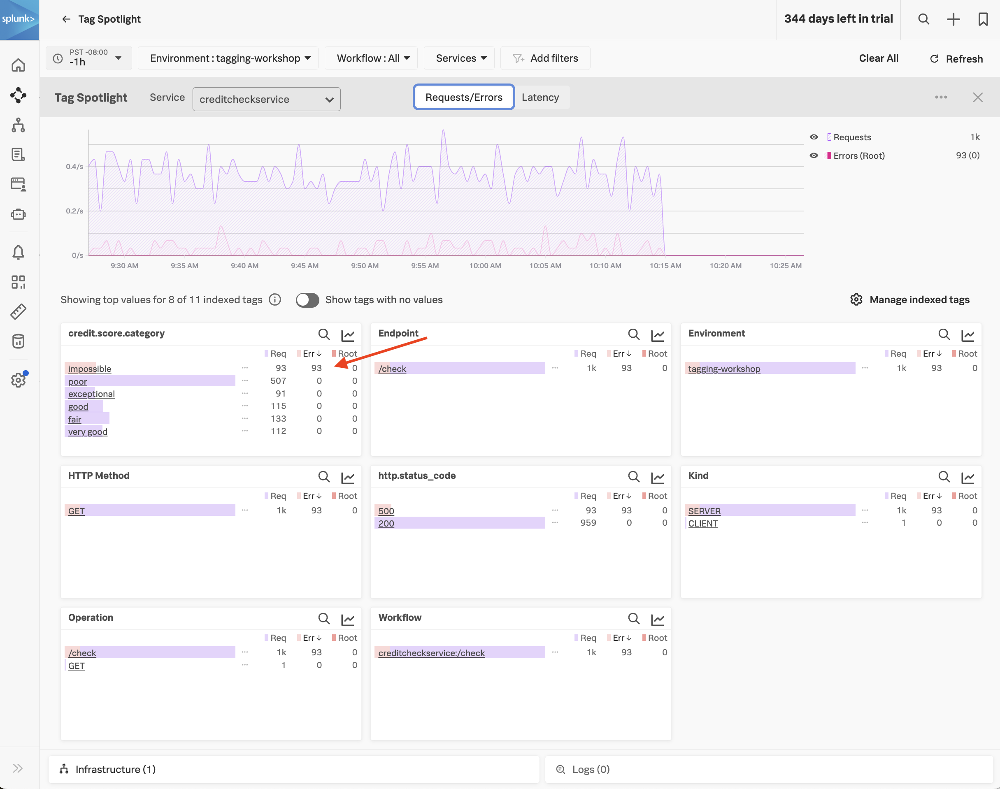
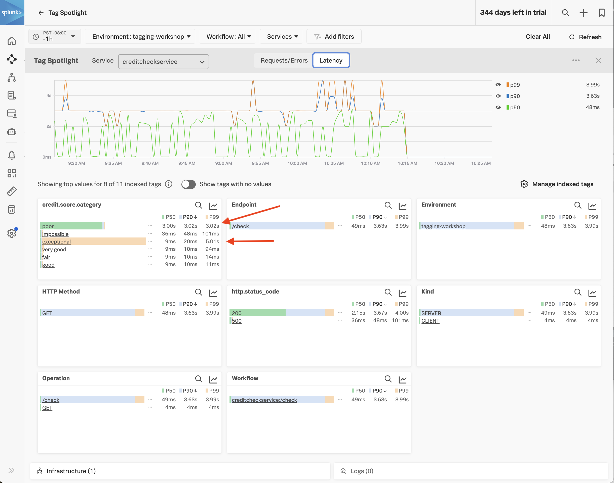

## Using Tag Spotlight

Now that we've indexed the **credit.score.category** tag, we can use it with Tag Spotlight to troubleshoot our application. 

Navigate to **APM** then click on **Tag Spotlight** on the right-hand side. 

Ensure the **creditcheckservice** service is selected from the **Service** drop-down (if not already selected).

With **Tag Spotlight**, we can see 100% of credit score requests that result in a score of "impossible" have an error, yet requests for all other credit score types have no errors at all! 

****

This illustrates the power of Tag Spotlight! Finding this pattern would be time consuming without it, as we'd have to manually look through hundreds of traces to identify the pattern (and even then, there's no guarantee we'd find it). 

We've look at errors, but what about latency? Let's click on **Latency** near the top of the screen. 

Here, we can see that the requests with a "poor" credit score request are running slowly, with P50, P90, and P99 times of around 3 seconds, which is too long for our users to wait, and much slower than other requests. 

We can also see that some requests with an "exceptional" credit score request are running slowly, with P99 times of around 5 seconds, though the P50 and P90 response times are relatively quick.

****

In summary, Tag Spotlight has uncovered several interesting patterns that we need to explore further. 

* Why are all the "impossible" credit score requests resulting in error?
* Why are all the "poor" credit score requests running slowly?
* Why do some of the "exceptional" requests run slowly?

As an SRE, providing this context to the service owner to investigate would be extremely helpful, and would allow them to track down the issue much more quickly than if we only told them that the service was "sometimes slow". 

If you're curious, have a look at the source code for the creditprocessorservice. You'll see that requests with impossible, poor, and exceptional credit scores are handled differently, thus resulting in the differences in error rates and latency that we uncovered.  