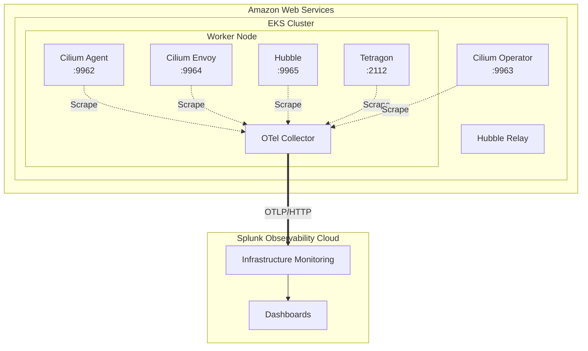

## What is Isovalent Enterprise Platform?

The Isovalent Enterprise Platform consists of three core components built on eBPF (Extended Berkeley Packet Filter) technology:

### Cilium
**Cloud Native CNI and Network Security**

- eBPF-based networking and security for Kubernetes
- Replaces kube-proxy with high-performance eBPF datapath
- Native support for AWS ENI mode (pods get VPC IP addresses)
- Network policy enforcement at L3-L7
- Transparent encryption and load balancing

### Hubble
**Network Observability**

- Built on top of Cilium's eBPF visibility
- Real-time network flow monitoring
- L7 protocol visibility (HTTP, DNS, gRPC, Kafka)
- Flow export and historical data storage (Timescape)
- Metrics exposed on port 9965

### Tetragon
**Runtime Security and Observability**

- eBPF-based runtime security
- Process execution monitoring
- System call tracing
- File access tracking
- Security event metrics on port 2112

## Architecture

## Key Components

| Component | Service Name | Port | Purpose |
|-----------|-------------|------|---------|
| Cilium Agent | cilium-agent | 9962 | CNI, network policies, eBPF programs |
| Cilium Envoy | cilium-envoy | 9964 | L7 proxy for HTTP, gRPC |
| Cilium Operator | cilium-operator | 9963 | Cluster-wide operations |
| Hubble | hubble-metrics | 9965 | Network flow metrics |
| Tetragon | tetragon | 2112 | Runtime security metrics |

## Benefits of eBPF

- **High Performance**: Runs in the Linux kernel with minimal overhead
- **Safety**: Verifier ensures programs are safe to run
- **Flexibility**: Dynamic instrumentation without kernel modules
- **Visibility**: Deep insights into network and system behavior

{}
This integration provides visibility into Kubernetes networking at a level not possible with traditional CNI plugins.
{}
