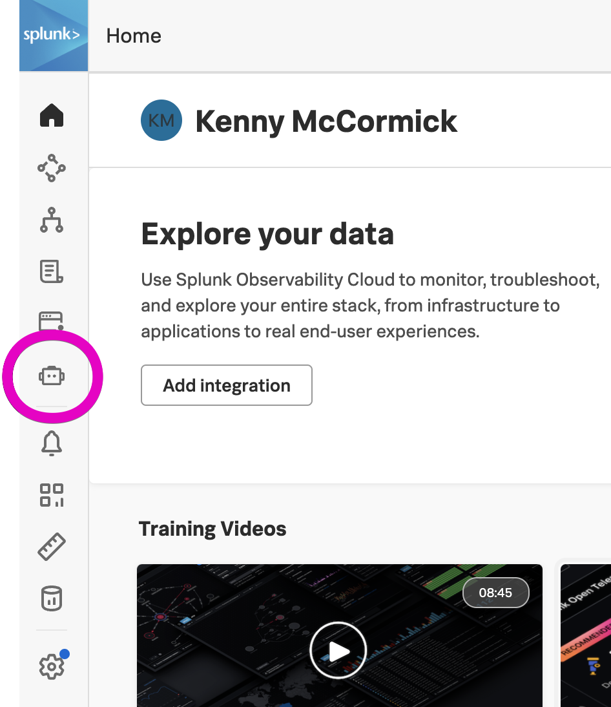

1. Open Synthetics

1. Click the {}Add new test{} button on the right side of the screen, then select Uptime and HTTP test.

1. Name your test with your **team name** (provided by your workshop instructor), your initials, and any other details you'd like to include, like geographic region.

1. For now let's test a **GET** request. Fill in the URL field. You can use one of your own, or one of ours like [https://frontend-eu.splunko11y.com](https://frontend-eu.splunko11y.com), [https://frontend-us.splunko11y.com](https://frontend-us.splunko11y.com), or [https://www.splunk.com](https://www.splunk.com).

1. Click {}Try now{} to validate that the endpoint is accessible before the selected location before saving the test. {}Try now{} does not count against your subscription usage, so this is a good practice to make sure you're not wasting real test runs on a misconfigured test.

{}A common reason for {}Try now{} to fail is that there is a non-2xx response code. If that is expected, add a Validation for the correct response code.{}

1. Add any additional validations needed, for example: response code, response header, and response size.

1. Add and remove any locations you'd like. Keep in mind where you expect your endpoint to be available.

1. Change the frequency to test your more critical endpoints more often, up to one minute.

1. Make sure "Round-robin" is on so the test will run from one location at a time, rather than from all locations at once. 
   - If an endpoint is **highly** critical, think about if it is worth it to have all locations tested at the same time every single minute. If you have automations built in with a webhook from a detector, or if you have strict SLAs you need to track, this *could* be worth it to have as much coverage as possible. But if you are doing more manual investigation, or if this is a less critical endpoint, you could be wasting test runs that are executing while an issue is being investigated.
   - Remember that your license is based on the number of test runs per month. Turning Round-robin off will multiply the number of test runs by the number of locations you have selected.

1. When you are ready for the test to start running, make sure "Active" is on, then scroll down and click {}Submit{} to save the test configuration. 

Now the test will start running with your saved configuration. Take a water break, then we'll look at the results!
