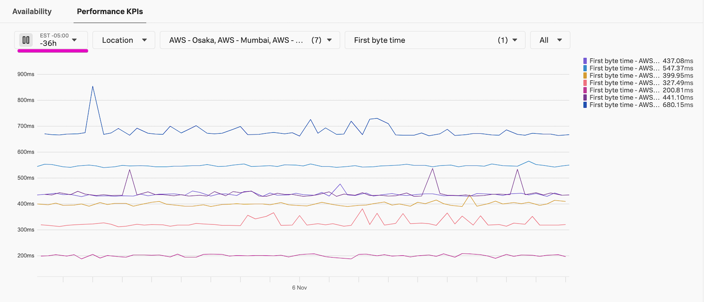

1. Click into a test summary view and play with the [Performance KPIs chart](https://docs.splunk.com/observability/en/synthetics/uptime-test/uptime-test-results.html#customize-the-performance-kpis-chart) filters to see how you can slice and dice your data. This is a good place to get started understanding trends. Later, we will see what custom charts look like, so you can tailor dashboards to the KPIs you care about most.

{}
What metrics are available? Is your data consistent across time and locations? Do certain locations run slower than others? Are there any spikes or failures?
{}

1. Click into a recent run either in the chart or in the table below. 

1. If there are failures, look at the response to see if you need to add a response code assertion (302 is a common one), if there is some authorization needed, or different request headers added. Here we have information about this particular test run including if it succeeded or failed, the location, timestamp, and duration in addition to the other Uptime test metrics. Click through to see the response, request, and connection info as well.

If you need to edit the test for it to run successfully, click the test name in the top left breadcrumb on this run result page, then click {}Edit test{} on the top right of the test overview page. Remember to scroll down and click {}Submit{} to save your changes after editing the test configuration.

1. In addition to the test running successfully, there are other metrics to measure the health of your endpoints. For example, [Time to First Byte](https://web.dev/articles/ttfb)(TTFB) is a great indicator of performance, and you can [optimize TTFB](https://web.dev/articles/optimize-ttfb) to improve end user experience.

1. Go back to the test overview page and change the Performance KPIs chart to display First Byte time, and change the interval if needed to better see trends in the data. 

In the example above, we can see that TTFB varies consistently between locations. Knowing this, we can keep location in mind when reporting on metrics. We could also improve the experience, for example by serving users in those locations an endpoint hosted closer to them, which should reduce network latency. We can also see some slight variations in the results over time, but overall we already have a good idea of our baseline for this endpoint's KPIs. When we have a baseline, we can alert on worsening metrics as well as visualize improvements.
{}
We are not setting a detector on this test yet, to make sure it is running consistently and successfully. If you are testing a highly critical endpoint and want to be alerted on it ASAP (and have tolerance for potential alert noise), jump to **[Single Test Detectors](../../5-detectors/1-test-detector.md)**.
{}

Once you have your Uptime test running successfully, let's move on to the next test type.