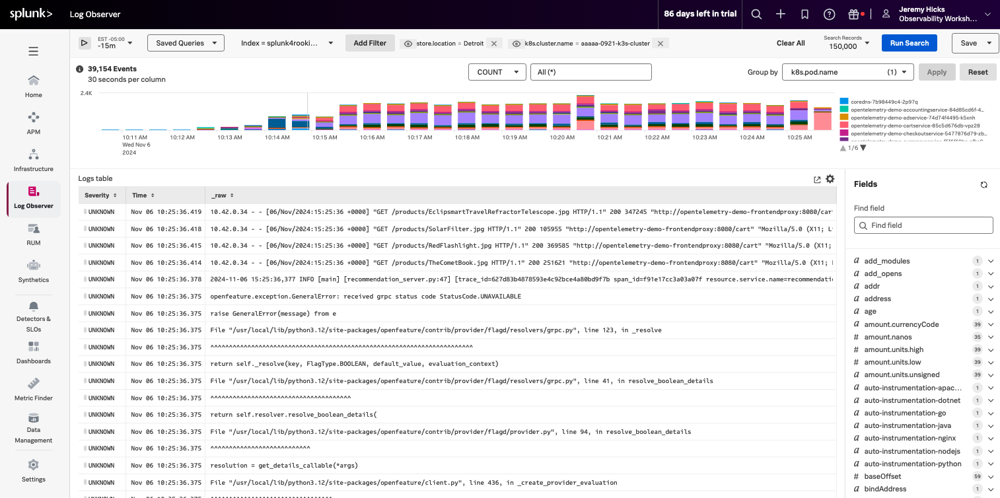

Correlating infrastructure metrics and logs is often a challenging task, primarily due to inconsistencies in naming conventions across various data sources, including hosts operating on different systems. However, leveraging the capabilities of **OpenTelemetry** can significantly simplify this process. With OpenTelemetry's robust framework, which offers rich metadata and attribution, metrics, traces, and logs can seamlessly correlate using standardized field names. This automated correlation not only alleviates the burden of manual effort but also enhances the overall observability of the system. 

By aligning metrics and logs based on common field names, teams gain deeper insights into system performance, enabling more efficient troubleshooting, proactive monitoring, and optimization of resources. In this workshop section, we'll explore the importance of correlating metrics with logs and demonstrate how Splunk **Observability Cloud** empowers teams to unlock additional value from their observability data.

