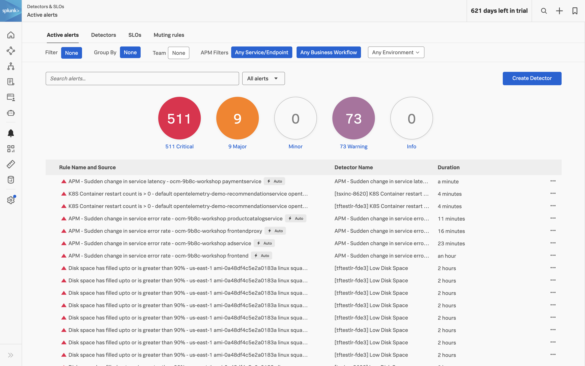

When monitoring hybrid and cloud environments, ensuring timely alerts for critical infrastructure and applications poses a significant challenge. Typically, this involves crafting intricate queries, meticulously scheduling searches, and managing alerts across various monitoring solutions. Moreover, the proliferation of disparate alerts generated from identical data sources often results in unnecessary duplication, contributing to alert fatigue and noise within the monitoring ecosystem.

In this section, we'll explore how Splunk Observability Cloud addresses these challenges by enabling the effortless creation of alert criteria. Leveraging its 10-second default data collection capability, alerts can be triggered swiftly, surpassing the timeliness achieved by traditional monitoring tools. This enhanced responsiveness not only reduces Mean Time to Detect (MTTD) but also accelerates Mean Time to Resolve (MTTR), ensuring that critical issues are promptly identified and remediated.

