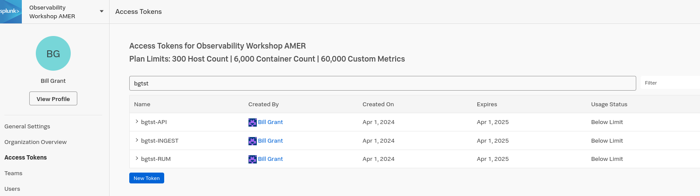

## Introduction

Managing Observability costs is a huge challenge. Users can send in data at will, change data, turn on new integrations, and incur costs that are hard to detect before the surprise overage at the end of the month. Exactly the kind of thing that’s likely to happen to this new team as they set up their new application.

Let's walk through some ways we can mitigate those challenges, while still making 
the platform easy for teams to send the data they need to.

### Tokens

In the last section we selected our workshop token to use, which is very similar to the token we would be provided as a team.

Let's navigate to **Settings > Access Tokens**. As admins we will be able to see all of the tokens in the environment. However we can also limit who can see tokens -- either a specific set of users or teams, or everyone.

Still making the product 

    A way to measure and monitor utilization by team
    A way to mitigate unexpected utilization
    A license model that is forgiving

Let’s walk through how Splunk delivers each of these.