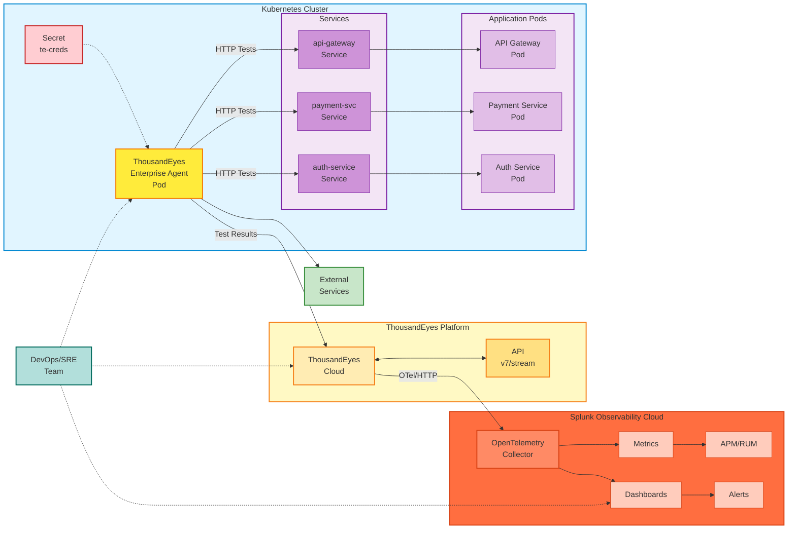

## ThousandEyes Agent Types

### Enterprise Agents

Enterprise Agents are software-based monitoring agents that you deploy within your own infrastructure. They provide:

- **Inside-out visibility**: Monitor and test from your internal network to external services
- **Customizable placement**: Deploy where your users and applications are
- **Full test capabilities**: HTTP, network, DNS, voice, and other test types
- **Persistent monitoring**: Continuously running agents that execute scheduled tests

In this workshop, we're deploying an Enterprise Agent as a containerized workload inside a Kubernetes cluster.

### Endpoint Agents

Endpoint Agents are lightweight agents installed on end-user devices (laptops, desktops) that provide:

- **Real user perspective**: Monitor from actual user endpoints
- **Browser-based monitoring**: Capture real user experience metrics
- **Session data**: Detailed insights into application performance from the user's viewpoint

This workshop focuses on **Enterprise Agent** deployment only.

## Architecture

## Architecture Components

### 1. Kubernetes Cluster

- **Secret (te-creds)**: Stores the base64-encoded `TEAGENT_ACCOUNT_TOKEN` for authentication
- **ThousandEyes Enterprise Agent Pod**:
  - Container image: `thousandeyes/enterprise-agent:latest`
  - Hostname: `te-agent-aleccham` (customizable)
  - Security capabilities: `NET_ADMIN`, `SYS_ADMIN` (required for network testing)
  - Memory allocation: 2GB request, 3.5GB limit
  - Network mode: IPv4 only (configured via `TEAGENT_INET: "4"` environment variable)
  - Image pull policy: `Always` (ensures latest image is pulled)
  - Init command: `/sbin/my_init` (required for proper agent initialization)
- **Internal Services**: Kubernetes workloads including REST APIs, microservices, databases, and gRPC services

### 2. Test Targets

- **Internal Services**: Monitor services within the Kubernetes cluster
- **External Services**: Test external dependencies such as:
  - Payment gateways (Stripe, PayPal)
  - Third-party APIs
  - SaaS applications
  - CDN endpoints
  - Public websites

### 3. ThousandEyes Platform

- **ThousandEyes Cloud**: Central platform for:
  - Agent registration and management
  - Test configuration and scheduling
  - Metrics collection and aggregation
  - Built-in alerting engine
- **ThousandEyes API**: RESTful API (v7/stream endpoint) for programmatic access

### 4. Test Types & Metrics

The Enterprise Agent performs:

- **HTTP/HTTPS tests**: Web page availability, response times, status codes
- **DNS tests**: Resolution time, record validation
- **Network layer tests**: Latency, packet loss, path visualization
- **Voice/RTP tests**: Quality metrics for voice traffic

Metrics collected include:

- HTTP server availability (%)
- Throughput (bytes/s)
- Request duration (seconds)
- Page load completion (%)
- Error codes and failure reasons

### 5. Splunk Observability Cloud Integration

- **OpenTelemetry Collector**: 
  - Endpoint: `https://ingest.{realm}.signalfx.com/v2/datapoint/otlp`
  - Protocol: HTTP or gRPC
  - Format: Protobuf
  - Authentication: `X-SF-Token` header
  - Signal type: Metrics (OpenTelemetry v2)
- **Observability Features**:
  - **Metrics**: Real-time visualization of ThousandEyes data
  - **Dashboards**: Pre-built ThousandEyes dashboard with unified views
  - **APM/RUM Integration**: Correlate synthetic tests with application traces and real user monitoring
  - **Alerting**: Centralized alert management with correlation rules

### 6. Data Flow

1. Agent authenticates using token from Kubernetes Secret
2. Agent runs scheduled tests against internal and external targets
3. Test results sent to ThousandEyes Cloud
4. ThousandEyes streams metrics to Splunk via OpenTelemetry protocol
5. Splunk ingests, processes, and visualizes data in dashboards
6. DevOps/SRE teams monitor dashboards and respond to alerts

## Testing Capabilities

With this deployment, you can:

- ✅ **Test internal services**: Monitor Kubernetes services, APIs, and microservices from within the cluster
- ✅ **Test external dependencies**: Validate connectivity to payment gateways, third-party APIs, and SaaS platforms
- ✅ **Measure performance**: Capture latency, availability, and performance metrics from your cluster's perspective
- ✅ **Troubleshoot issues**: Identify whether problems originate from your infrastructure or external dependencies

{}
This is **not an officially supported** ThousandEyes agent deployment configuration. However, it has been tested and works very well in production-like environments.
{}
