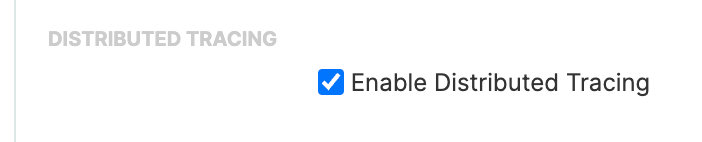
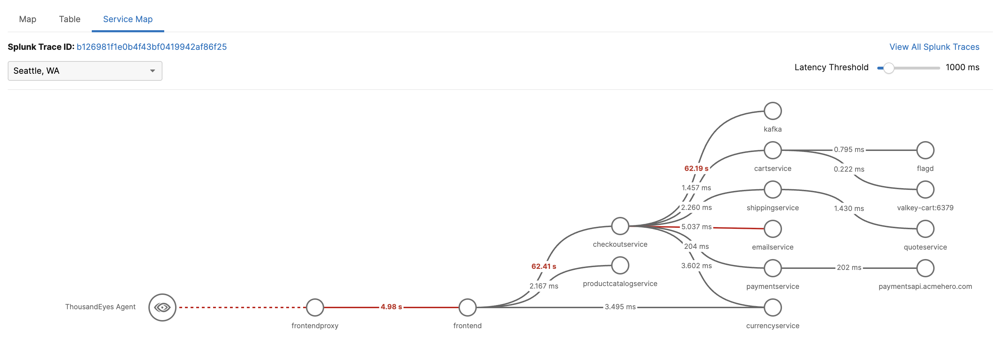
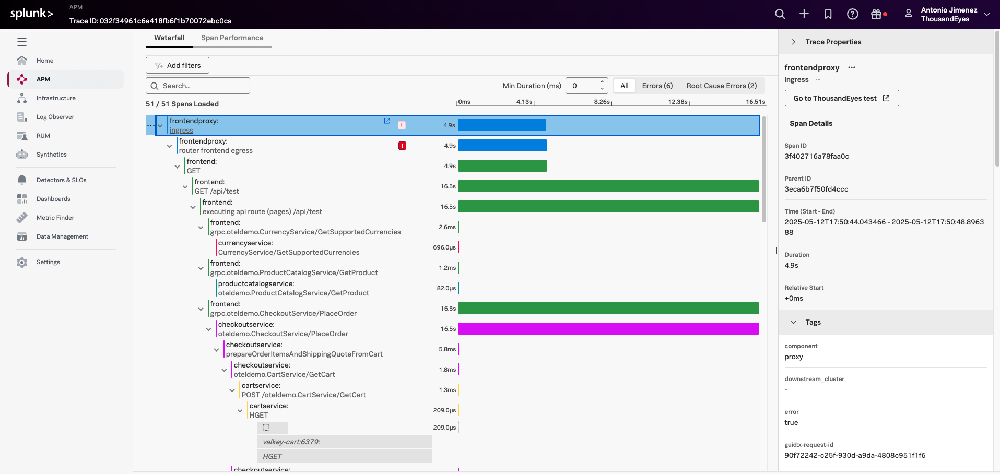

This is content that needs to find a home:

We are going to use this URL for the trace-enabled ThousandEyes **HTTP Server** or **API** tests from the TE agent:

```text
http://api-gateway.default.svc.cluster.local:82/api/customer/owners
```

## Validate That Traces Exist

1. Wait for the deployment rollout to finish:

   ```bash
   kubectl rollout status deployment/api-gateway
   ```

2. Generate a few requests against the PetClinic API gateway:

   ```text
   http://api-gateway.default.svc.cluster.local:82/api/customer/owners
   ```

   This request enters through the PetClinic API gateway, routes to `customers-service`, and queries the PetClinic database. It produces a more useful trace than a simple health check.

3. Confirm that traces are arriving in **Splunk APM** before you continue.

{}
Use a business transaction, not a pure `/health` endpoint, for the tracing exercise. A multi-service request gives you a far better Service Map in ThousandEyes and a more useful trace in Splunk APM.
{}

### Step 3: Configure Distributed Tracing on the ThousandEyes Test

Create or edit an **API** test that targets the instrumented backend endpoint from Step 1.

1. In ThousandEyes, go to create an **Network&App Synthetics > Test Settings**.
2. Click **Add New Test** and then select **API**
3. Enter the URL (i.e. `http://api-gateway.default.svc.cluster.local:82/api/customer/owners`)
4. Where test runs from: `Select your agent` and **close**
5. Set the name to `Your name - API`
6. Under **API Performance (Optional)**, enable **Distributed Tracing**
7. Click **Next**
8. Name the step **Test Kubernetes** and set the URL to `http://api-gateway.default.svc.cluster.local:82/api/customer/owners`
9. Click **Deploy**, and then check the test results. You can run a test without changes.



After the test runs, ThousandEyes injects the trace headers and captures the trace context for that request.

It may take some time for the trace to show up. You can go to the service map (in ThousandEyes) and copy the trace id to find in Observability Cloud. You will see the trace is likely still in progress.

### Step 4: Validate the Bi-Directional Investigation Loop

Once the test is running and the connector is enabled, validate the workflow in both directions.

### Start in ThousandEyes

1. Open the test in ThousandEyes.
2. Navigate to the **Service Map** tab.
3. Confirm that you can see the trace path, service latency, and any downstream errors.
4. Use the ThousandEyes link into **Splunk APM** to inspect the full trace.



#### Continue in Splunk APM

Inside Splunk APM, verify that the trace contains ThousandEyes metadata such as:

- `thousandeyes.account.id`
- `thousandeyes.test.id`
- `thousandeyes.permalink`
- `thousandeyes.source.agent.id`

Use either the `thousandeyes.permalink` field or the **Go to ThousandEyes test** button in the trace waterfall view to navigate back to the originating ThousandEyes test.



## Suggested Learning Scenario

Try now creating a web test, using a cloud agent and your url (for example `http://i-0cedf3429f9192aaa.splunk.show:81/#!/owners`, replace with your own instance).

## Need to recheck this section

Use the following flow during a workshop:

1. Create a ThousandEyes test against an internal API route that calls multiple services.
2. Let ThousandEyes surface the issue first, so the class starts from the network and synthetic-monitoring perspective.
3. Open the **Service Map** in ThousandEyes and identify where latency or errors begin.
4. Jump into **Splunk APM** for span-level analysis.
5. Jump back to **ThousandEyes** to inspect the test, agent, and network path again.

This is a strong teaching loop because it mirrors how different teams actually work:

- Network and edge teams often start in ThousandEyes.
- SRE and platform teams often start in Splunk dashboards or alerts.
- Application teams usually want the trace in Splunk APM.

With this integration in place, everyone can pivot without losing context.

## Common Pitfalls

- A test might be visible in Splunk dashboards but still have no trace correlation. That usually means only the **metrics** stream is configured, not the **Splunk APM Generic Connector**.
- A trace might exist in Splunk APM but not show up in ThousandEyes if the monitored endpoint does not propagate the trace headers downstream.
- A shallow endpoint such as `/health` often produces limited trace value even when the configuration is correct.

## References

- [ThousandEyes Distributed Tracing](https://docs.thousandeyes.com/product-documentation/integration-guides/custom-built-integrations/distributed-tracing)
- [ThousandEyes Distributed Tracing with Splunk Observability APM](https://docs.thousandeyes.com/product-documentation/integration-guides/custom-built-integrations/distributed-tracing/distributed-tracing-splunk-apm)
- [Splunk APM: View traces with Cisco ThousandEyes integration](https://help.splunk.com/en/splunk-observability-cloud/monitor-application-performance/manage-services-spans-and-traces-in-splunk-apm/view-and-filter-for-spans-within-a-trace)
- [Splunk OTel Collector zero-code instrumentation for Kubernetes language runtimes](https://help.splunk.com/en/splunk-observability-cloud/manage-data/splunk-distribution-of-the-opentelemetry-collector/get-started-with-the-splunk-distribution-of-the-opentelemetry-collector/automatic-discovery-of-apps-and-services/kubernetes/language-runtimes)
