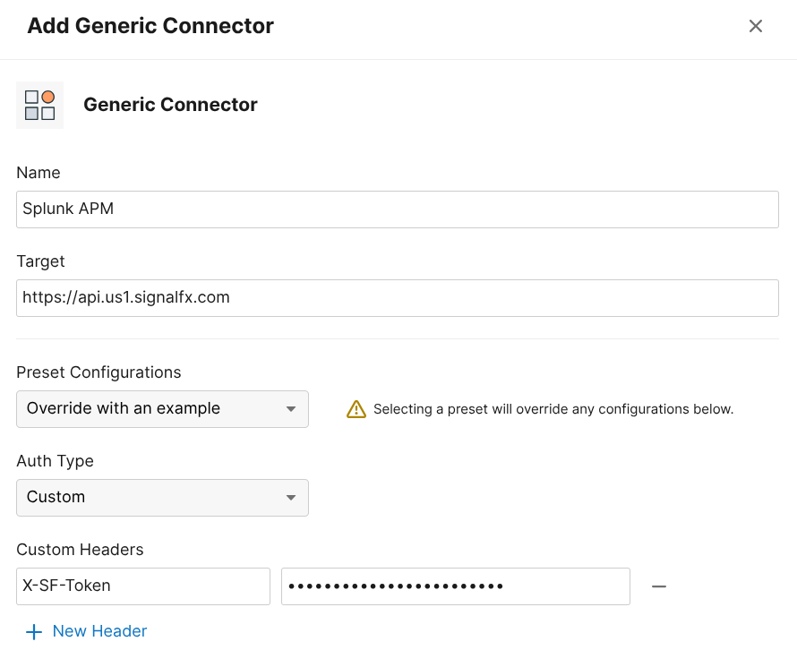
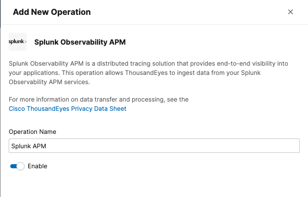

This section turns the ThousandEyes and Splunk integration into a true investigation workflow. In the previous section, ThousandEyes streamed synthetic metrics into Splunk Observability Cloud. In this section, you will enable the supported **ThousandEyes <-> Splunk APM distributed tracing integration** so network, platform, and application teams can pivot between both tools while looking at the same request.

{}
This is the piece that gives you **bi-directional access** between the two environments. ThousandEyes can open the related trace in Splunk APM, and Splunk APM can take you back to the originating ThousandEyes test.
{}

## What You Will Learn

By the end of this section, you will be able to:

- Deploy and use the included Spring PetClinic Kubernetes application as a trace target
- Instrument an internal service so it sends traces to Splunk APM
- Enable distributed tracing on a ThousandEyes **HTTP Server** or **API** test
- Configure the ThousandEyes **Generic Connector** for Splunk APM
- Open the ThousandEyes **Service Map** and jump directly into the corresponding Splunk trace
- Use the ThousandEyes metadata in Splunk APM to jump back to the original ThousandEyes test

## Supported Workflow

This learning scenario follows the supported workflow documented by ThousandEyes and Splunk:

- ThousandEyes automatically injects `b3`, `traceparent`, and `tracestate` headers into **HTTP Server** and **API** tests when distributed tracing is enabled.
- The monitored endpoint must accept headers, be instrumented with OpenTelemetry, propagate trace context, and send traces to your observability backend.
- For Splunk APM, ThousandEyes uses a **Generic Connector** that points at `https://api.<REALM>.signalfx.com` and authenticates with an **API-scope** Splunk token.
- Splunk APM enriches matching traces with ThousandEyes attributes such as `thousandeyes.test.id` and `thousandeyes.permalink`, which enables the reverse jump back to ThousandEyes.

## What Those Headers Actually Mean

This part is easy to gloss over and it should not be. The trace correlation only works if the service understands the headers ThousandEyes injects and continues the trace correctly.

- `traceparent` and `tracestate` are the W3C Trace Context headers.
- `b3` is the Zipkin B3 single-header format.
- ThousandEyes injects both because real environments often contain a mix of proxies, meshes, gateways, and app runtimes that do not all prefer the same propagation format.

In OpenTelemetry terms, the important setting is the propagator list:

```text
OTEL_PROPAGATORS=baggage,b3,tracecontext
```

That does two things:

1. It allows the service to extract either **B3** or **W3C** context from the inbound ThousandEyes request.
2. It preserves the W3C `tracestate` by keeping `tracecontext` enabled.

{}
You do **not** add `tracestate` as a separate OpenTelemetry propagator. The `tracecontext` propagator handles both `traceparent` and `tracestate`.
{}

## What "Properly Done" Looks Like

The collector is only one part of this setup. A correct ThousandEyes tracing deployment in Kubernetes has **three layers**:

1. **Deployment annotation** so the OpenTelemetry Operator injects the runtime-specific instrumentation.
2. **Instrumentation resource** so the injected SDK knows where to send traces and which propagators to use.
3. **Collector trace pipeline** so OTLP traces are actually received and exported to Splunk APM.

The most common mistake is to focus only on the collector. The collector never sees raw `b3`, `traceparent`, or `tracestate` request headers directly. Your application or auto-instrumentation library must extract those headers first, continue the span context, and then emit spans over OTLP to the collector.

## PetClinic Configuration Pattern

The examples below use the Spring PetClinic application included with this workshop. They show the Kubernetes annotation, `Instrumentation` resource, and pod-level settings that ThousandEyes needs for trace correlation.

### 1. Deployment Annotation

In this guide, the PetClinic Java deployments point at the `default/splunk-otel-collector` Instrumentation resource:

```yaml
apiVersion: apps/v1
kind: Deployment
metadata:
  name: api-gateway
spec:
  template:
    metadata:
      annotations:
        instrumentation.opentelemetry.io/inject-java: default/splunk-otel-collector
```

This is the first place to verify when ThousandEyes requests are not turning into traces.

### 2. Instrumentation Resource

This is the PetClinic `Instrumentation` object, trimmed to the fields that matter for ThousandEyes:

```yaml
apiVersion: opentelemetry.io/v1alpha1
kind: Instrumentation
metadata:
  name: splunk-otel-collector
spec:
  exporter:
    endpoint: http://splunk-otel-collector-agent.otel-splunk.svc:4317
  propagators:
    - baggage
    - b3
    - tracecontext
  sampler:
    type: parentbased_always_on
  env:
    - name: OTEL_RESOURCE_ATTRIBUTES
      value: deployment.environment=thousandeyes-petclinic
```

This is the critical part for the ThousandEyes scenario:

- `endpoint` sends spans to the cluster-local OTel agent service.
- `b3` allows extraction of ThousandEyes B3 headers.
- `tracecontext` preserves `traceparent` and `tracestate`.
- `parentbased_always_on` ensures the trace continues once ThousandEyes starts the request.

### 3. What The Injected Pod Actually Gets

On the running PetClinic `api-gateway` pod, validate that the operator injected the expected OpenTelemetry settings:

```bash
kubectl exec deploy/api-gateway -- printenv | \
  grep -E 'OTEL_EXPORTER_OTLP_ENDPOINT|OTEL_PROPAGATORS|OTEL_TRACES_SAMPLER|OTEL_RESOURCE_ATTRIBUTES'
```

You should see values like these:

```yaml
- name: OTEL_EXPORTER_OTLP_ENDPOINT
  value: http://splunk-otel-collector-agent.otel-splunk.svc:4317
- name: OTEL_PROPAGATORS
  value: baggage,b3,tracecontext
- name: OTEL_TRACES_SAMPLER
  value: parentbased_always_on
- name: OTEL_RESOURCE_ATTRIBUTES
  value: deployment.environment=thousandeyes-petclinic
```

This is a useful validation checkpoint because it proves the propagators are being applied to the workload, not just declared in an abstract config object.

### 4. Agent Collector Trace Pipeline

The live agent collector in `otel-splunk` is receiving OTLP, Jaeger, and Zipkin traffic and forwarding traces upstream. This is a trimmed excerpt from the running ConfigMap:

```yaml
receivers:
  otlp:
    protocols:
      grpc:
        endpoint: 0.0.0.0:4317
      http:
        endpoint: 0.0.0.0:4318
  jaeger:
    protocols:
      grpc:
        endpoint: 0.0.0.0:14250
      thrift_http:
        endpoint: 0.0.0.0:14268
  zipkin:
    endpoint: 0.0.0.0:9411

service:
  pipelines:
    traces:
      receivers: [otlp, jaeger, zipkin]
      processors:
        [memory_limiter, k8sattributes, batch, resourcedetection, resource, resource/add_environment]
      exporters: [otlp, signalfx]
```

For ThousandEyes, the important part is not a special B3 option in the collector. The important part is simply that the collector exposes OTLP on `4317` and `4318`, and that your services are exporting their spans there.

{}
The PetClinic `Instrumentation` resource is the pattern to follow for ThousandEyes because it explicitly includes `b3` together with `tracecontext`. That is the configuration you want for this scenario.
{}

{}
Do **not** use a browser page URL for this section. ThousandEyes documents that browsers do not accept the custom trace headers required for this workflow. Use an instrumented backend endpoint behind an **HTTP Server** or **API** test instead.
{}

## Step 1: Make Sure the Workload Emits Traces to Splunk APM

If your application is already instrumented and traces are visible in Splunk APM, you can skip to Step 2. Otherwise, the fastest learning path in Kubernetes is to use the Splunk OpenTelemetry Collector with the Operator enabled for zero-code instrumentation.

### Install the Splunk OpenTelemetry Collector with the Operator

```bash
helm repo add splunk-otel-collector-chart https://signalfx.github.io/splunk-otel-collector-chart

helm repo update

helm install splunk-otel-collector splunk-otel-collector-chart/splunk-otel-collector \
  --set splunkObservability.realm=$REALM \
  --set splunkObservability.accessToken=$ACCESS_TOKEN \
  --set clusterName=$CLUSTER_NAME \
  --set environment="thousandeyes-$INSTANCE" \
  --set operator.enabled=true \
  --set operatorcrds.install=true \
  --set agent.service.enabled=true
```

Your cluster name is:
```bash
export | grep CLUSTER_NAME
```

Check if your Cluster is in Splunk Observability Cloud:
* Go to Infrastructure > Kubernetes Entities
* You should see your cluster in the list
  * It may take several minutes for it to show up

### Deploy Spring PetClinic as the Workshop Trace Target

This project already contains a Kubernetes deployment for the Spring PetClinic microservices application at `workshop/petclinic/deployment.yaml`.

To deploy the app:

```bash
kubectl apply -f ~/workshop/petclinic/deployment.yaml
```

You can check that your app is deployed, along with all the other pods:

```bash
kubectl get pods
```


We are going to patch every PetClinic Java deployment to two things:
* The Java injection (which instruments the service)
* The OTEL Propagators (to ensure all 3 are set)

```bash
kubectl get deployments -l app.kubernetes.io/part-of=spring-petclinic -o name | xargs -I % kubectl patch % -p "{\"spec\": {\"template\":{\"metadata\":{\"annotations\":{\"instrumentation.opentelemetry.io/inject-java\":\"default/splunk-otel-collector\"}}}}}"
```

For other runtimes, use the annotation that matches the language:
- `instrumentation.opentelemetry.io/inject-nodejs`
- `instrumentation.opentelemetry.io/inject-python`
- `instrumentation.opentelemetry.io/inject-dotnet`

Let's check to see what happened with the instrumentation:
```bash
kubectl describe pod api-gateway
```

You can see that this pod now has the Java instrumentation enabled. In fact you can also see that the propagators are already including `baggage`, `b3` and `tracecontext`.

If they weren't we could patch with that environment variable, like:
```bash
kubectl get deployments -l app.kubernetes.io/part-of=spring-petclinic -o name | xargs -I % kubectl patch % --type=json -p '[{"op":"add","path":"/spec/template/spec/containers/0/env/-","value":{"name":"OTEL_PROPAGATORS","value":"baggage, b3, tracecontext"}}]'
```

Validate the in-cluster API path from the namespace where the ThousandEyes Enterprise Agent runs:

```bash
kubectl run te-petclinic-curl \
  --rm -it \
  --restart=Never \
  --image=curlimages/curl \
  --command -- curl -sS http://api-gateway.default.svc.cluster.local:82/api/customer/owners
```

We are going to use this URL for the trace-enabled ThousandEyes **HTTP Server** or **API** tests from the TE agent:

```text
http://api-gateway.default.svc.cluster.local:82/api/customer/owners
```

### Validate That Traces Exist

1. Wait for the deployment rollout to finish:

   ```bash
   kubectl rollout status deployment/api-gateway
   ```

2. Generate a few requests against the PetClinic API gateway:

   ```text
   http://api-gateway.default.svc.cluster.local:82/api/customer/owners
   ```

   This request enters through the PetClinic API gateway, routes to `customers-service`, and queries the PetClinic database. It produces a more useful trace than a simple health check.

3. Confirm that traces are arriving in **Splunk APM** before you continue.

{}
Use a business transaction, not a pure `/health` endpoint, for the tracing exercise. A multi-service request gives you a far better Service Map in ThousandEyes and a more useful trace in Splunk APM.
{}

## Step 2: Create the Splunk APM Connector in ThousandEyes

{}
Rather than having each workshop attendee set this up, watch your instructor perform the following steps.

You will continue on Step 3 (Configure Distributed Tracing on the ThousandEyes Test).
{}

The metric streaming integration from the previous section uses an **Ingest** token. This step is different: ThousandEyes needs to query Splunk APM and build trace links, so it uses a Splunk **API** token instead.

1. In Splunk Observability Cloud, create an access token with the **API** scope.
2. In ThousandEyes, go to **Manage > Integrations > Integrations 2.0**, and change to the **Connectors** tab.
3. Create a **Generic Connector**. You can select the Preset as **Splunk Observability APM**:
  - **Name**: `Splunk APM`
  - **Target URL**: `https://api.<REALM>.signalfx.com`
  - **Header**: `X-SF-Token: <your-api-scope-token>`
4. **Save and Assign Operation**



5. Create a **New Operation** and select **Splunk Observability APM**.
6. Name it `Splunk APM`.
7. **Save & Assign Connector** to enable the operation and save the integration.
8. Select the connector and click **Save**.



## Step 3: Configure Distributed Tracing on the ThousandEyes Test

Create or edit an **API** test that targets the instrumented backend endpoint from Step 1.

1. In ThousandEyes, go to create an **Network&App Synthetics > Test Settings**.
2. Click **Add New Test** and then select **API**
3. Enter the URL (i.e. `http://api-gateway.default.svc.cluster.local:82/api/customer/owners`)
4. Where test runs from: `Select your agent` and **close**
5. Set the name to `Your name - API`
6. Under **API Performance (Optional)**, enable **Distributed Tracing**
7. Click **Next**
8. Name the step **Test Kubernetes** and set the URL to `http://api-gateway.default.svc.cluster.local:82/api/customer/owners`
9. Click **Deploy**, and then check the test results. You can run a test without changes.


After the test runs, ThousandEyes injects the trace headers and captures the trace context for that request.

It may take some time for the trace to show up. You can go to the service map (in ThousandEyes) and copy the trace id to find in Observability Cloud. You will see the trace is likely still in progress.

## Step 4: Validate the Bi-Directional Investigation Loop

Once the test is running and the connector is enabled, validate the workflow in both directions.

### Start in ThousandEyes

1. Open the test in ThousandEyes.
2. Navigate to the **Service Map** tab.
3. Confirm that you can see the trace path, service latency, and any downstream errors.
4. Use the ThousandEyes link into **Splunk APM** to inspect the full trace.


### Continue in Splunk APM

Inside Splunk APM, verify that the trace contains ThousandEyes metadata such as:

- `thousandeyes.account.id`
- `thousandeyes.test.id`
- `thousandeyes.permalink`
- `thousandeyes.source.agent.id`

Use either the `thousandeyes.permalink` field or the **Go to ThousandEyes test** button in the trace waterfall view to navigate back to the originating ThousandEyes test.


## Suggested Learning Scenario

Try now creating a web test, using a cloud agent and your url (for example `http://i-0cedf3429f9192aaa.splunk.show:81/#!/owners/details/1`, replace with your own instance).


## Need to recheck this section

Use the following flow during a workshop:

1. Create a ThousandEyes test against an internal API route that calls multiple services.
2. Let ThousandEyes surface the issue first, so the class starts from the network and synthetic-monitoring perspective.
3. Open the **Service Map** in ThousandEyes and identify where latency or errors begin.
4. Jump into **Splunk APM** for span-level analysis.
5. Jump back to **ThousandEyes** to inspect the test, agent, and network path again.

This is a strong teaching loop because it mirrors how different teams actually work:

- Network and edge teams often start in ThousandEyes.
- SRE and platform teams often start in Splunk dashboards or alerts.
- Application teams usually want the trace in Splunk APM.

With this integration in place, everyone can pivot without losing context.

## Common Pitfalls

- A test might be visible in Splunk dashboards but still have no trace correlation. That usually means only the **metrics** stream is configured, not the **Splunk APM Generic Connector**.
- A trace might exist in Splunk APM but not show up in ThousandEyes if the monitored endpoint does not propagate the trace headers downstream.
- A shallow endpoint such as `/health` often produces limited trace value even when the configuration is correct.

## References

- [ThousandEyes Distributed Tracing](https://docs.thousandeyes.com/product-documentation/integration-guides/custom-built-integrations/distributed-tracing)
- [ThousandEyes Distributed Tracing with Splunk Observability APM](https://docs.thousandeyes.com/product-documentation/integration-guides/custom-built-integrations/distributed-tracing/distributed-tracing-splunk-apm)
- [Splunk APM: View traces with Cisco ThousandEyes integration](https://help.splunk.com/en/splunk-observability-cloud/monitor-application-performance/manage-services-spans-and-traces-in-splunk-apm/view-and-filter-for-spans-within-a-trace)
- [Splunk OTel Collector zero-code instrumentation for Kubernetes language runtimes](https://help.splunk.com/en/splunk-observability-cloud/manage-data/splunk-distribution-of-the-opentelemetry-collector/get-started-with-the-splunk-distribution-of-the-opentelemetry-collector/automatic-discovery-of-apps-and-services/kubernetes/language-runtimes)
