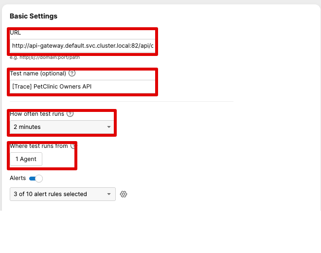
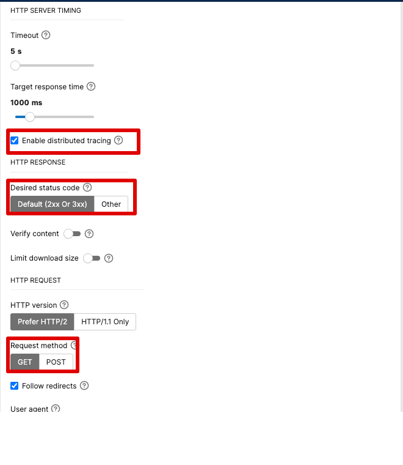

## Replicating AppDynamics Test Recommendations

AppDynamics offers a feature called "Test Recommendations" that automatically suggests synthetic tests for your application endpoints. With ThousandEyes deployed inside your Kubernetes cluster, you can replicate this capability by leveraging Kubernetes service discovery combined with Splunk Observability Cloud's unified view.

Since the ThousandEyes Enterprise Agent runs **inside the cluster**, it can directly test internal Kubernetes services using their service names as hostnames. This provides a powerful way to monitor backend services that may not be exposed externally.

## How It Works

1. **Service Discovery**: Use `kubectl get svc` to enumerate services in your cluster
2. **Hostname Construction**: Build test URLs using Kubernetes DNS naming convention: `<service-name>.<namespace>.svc.cluster.local`
3. **Test Creation**: Create both availability tests and trace-enabled transaction tests for internal services
4. **Correlation in Splunk**: View synthetic test results alongside APM traces and infrastructure metrics

## Benefits of In-Cluster Testing

- **Internal Service Monitoring**: Test backend services not exposed to the internet
- **Service Mesh Awareness**: Monitor services behind Istio, Linkerd, or other service meshes
- **DNS Resolution Testing**: Validate Kubernetes DNS and service discovery
- **Network Policy Validation**: Ensure network policies allow proper communication
- **Latency Baseline**: Measure cluster-internal network performance
- **Pre-Production Testing**: Test services before exposing them via Ingress/LoadBalancer

## Workshop Target: Spring PetClinic

This repository already includes a Spring PetClinic microservices application that is useful as a known Kubernetes target for this ThousandEyes guide. The deployment manifest lives at `workshop/petclinic/deployment.yaml`; in the workshop VM it is available at `~/workshop/petclinic/deployment.yaml`.

The manifest deploys the PetClinic frontend/API gateway, backend services, MySQL database, and load generator. It also creates:

- `api-gateway` as a `ClusterIP` service on port `82`
- `api-gateway-external` as a `LoadBalancer` service on port `81`
- `customers-service`, `vets-service`, and `visits-service` as internal backend services

{}
If you already installed the Splunk OpenTelemetry Operator and plan to use PetClinic for trace correlation, complete the PetClinic instrumentation setup in the Distributed Tracing section before applying this manifest. The PetClinic manifest includes Java injection annotations on some services, and those annotations need a matching `Instrumentation` resource when the operator webhook is active.
{}

Deploy PetClinic into the selected namespace:

```bash
PETCLINIC_NAMESPACE=default

kubectl create namespace $PETCLINIC_NAMESPACE --dry-run=client -o yaml | kubectl apply -f -

kubectl create secret generic workshop-secret \
  -n $PETCLINIC_NAMESPACE \
  --from-literal=app=${INSTANCE:-thousandeyes}-petclinic-service \
  --from-literal=env=${INSTANCE:-thousandeyes}-petclinic \
  --from-literal=realm=${REALM:-us1} \
  --from-literal=rum_token=${RUM_TOKEN:-not-used} \
  --from-literal=url=http://api-gateway:82 \
  --dry-run=client -o yaml | kubectl apply -f -

kubectl apply -n $PETCLINIC_NAMESPACE -f ~/workshop/petclinic/deployment.yaml
```

The examples below assume PetClinic is deployed in the `default` namespace. If you deploy it into another namespace, replace `default` in the service DNS names with your namespace.

Verify the application resources:

```bash
kubectl get pods -n $PETCLINIC_NAMESPACE
kubectl get svc -n $PETCLINIC_NAMESPACE api-gateway api-gateway-external customers-service vets-service visits-service
```

Validate cluster-internal reachability from the same namespace where the ThousandEyes agent runs:

```bash
kubectl run te-petclinic-curl \
  -n te-demo \
  --rm -it \
  --restart=Never \
  --image=curlimages/curl \
  --command -- curl -sS http://api-gateway.$PETCLINIC_NAMESPACE.svc.cluster.local:82/api/customer/owners
```

Use these PetClinic URLs for ThousandEyes tests:

```text
Availability test:
http://api-gateway.default.svc.cluster.local:82/

Trace-enabled API test:
http://api-gateway.default.svc.cluster.local:82/api/customer/owners

Additional API test targets:
http://api-gateway.default.svc.cluster.local:82/api/vet/vets
http://api-gateway.default.svc.cluster.local:82/api/visit/owners/1/pets/1/visits
```

{}
The ThousandEyes Enterprise Agent can run in `te-demo` while PetClinic runs in `default`. Use the full Kubernetes DNS name, such as `api-gateway.default.svc.cluster.local`, when the agent and target application are in different namespaces.
{}

## Configure ThousandEyes Tests for PetClinic

Create at least two PetClinic tests: one simple availability test for the frontend and one trace-enabled API test for APM correlation. Use the same Kubernetes Enterprise Agent for both tests so the measurements come from inside the cluster.

Set a shell variable for the target URL while you validate the endpoints:

```bash
kubectl run te-petclinic-curl \
  --rm -it \
  --restart=Never \
  --image=curlimages/curl \
  --command -- curl -sS "http://api-gateway.default.svc.cluster.local:82/api/customer/owners"
```

### Test 1: PetClinic Frontend Availability

Use this test to prove the application frontend is reachable from the ThousandEyes Enterprise Agent.

1. In ThousandEyes, go to **Cloud & Enterprise Agents > Test Settings**.
2. Click **Add New Test** and choose **HTTP Server**.
3. Configure the test:
   - **Test Name**: `[PetClinic] Frontend Availability`
   - **URL**: `http://api-gateway.default.svc.cluster.local:82/`
   - **Interval**: `2 minutes`
   - **Agents**: Select the Kubernetes Enterprise Agent deployed earlier in this guide
   - **HTTP Response Code**: `200`
   - **Verify Content**: Optional, use `PetClinic` if you want to validate the returned page content
4. Save the test.

### Test 2: PetClinic Owners API With Distributed Tracing

Use this test for the ThousandEyes and Splunk APM drilldown workflow. It targets the API gateway and routes to `customers-service`, which gives you a more useful trace than a shallow health check.

1. In ThousandEyes, go to **Cloud & Enterprise Agents > Test Settings**.
2. Click **Add New Test** and choose **HTTP Server** or **API**.
3. Configure the test:
   - **Test Name**: `[Trace] PetClinic Owners API`
   - **URL**: `http://api-gateway.default.svc.cluster.local:82/api/customer/owners`
   - **Method**: `GET`
   - **Interval**: `2 minutes`
   - **Agents**: Select the same Kubernetes Enterprise Agent
   - **HTTP Response Code**: `200`
   - **Advanced Settings > Distributed Tracing**: Enabled

The highlighted fields in **Basic Settings** should match the PetClinic API target and the in-cluster Enterprise Agent:



In **HTTP Communication and Performance**, enable distributed tracing and keep the API request as a `GET` with the default `2xx` or `3xx` response validation:



4. Save the test and let it run for a few intervals.

{}
Use an **HTTP Server** or **API** test for the distributed tracing exercise. Browser-style page load and transaction tests are useful for end-user monitoring, but they are not the right test type for injecting the trace headers required by the ThousandEyes and Splunk APM workflow.
{}

### Optional PetClinic API Tests

After the first two tests are working, add more API tests to cover other PetClinic services:

```text
[Trace] PetClinic Vets API
http://api-gateway.default.svc.cluster.local:82/api/vet/vets

[Trace] PetClinic Owner Visits API
http://api-gateway.default.svc.cluster.local:82/api/visit/owners/1/pets/1/visits
```

Use the same baseline settings:

- **Test Type**: HTTP Server or API
- **Method**: `GET`
- **Interval**: `2 minutes`
- **Agent**: Kubernetes Enterprise Agent
- **Expected Response Code**: `200`
- **Distributed Tracing**: Enabled when you want Splunk APM correlation

If you deployed PetClinic outside the `default` namespace, replace `default` in each URL with your PetClinic namespace.
