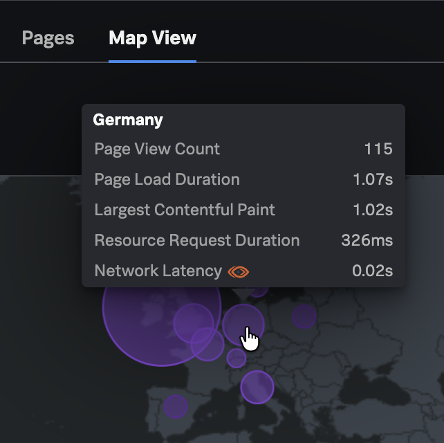
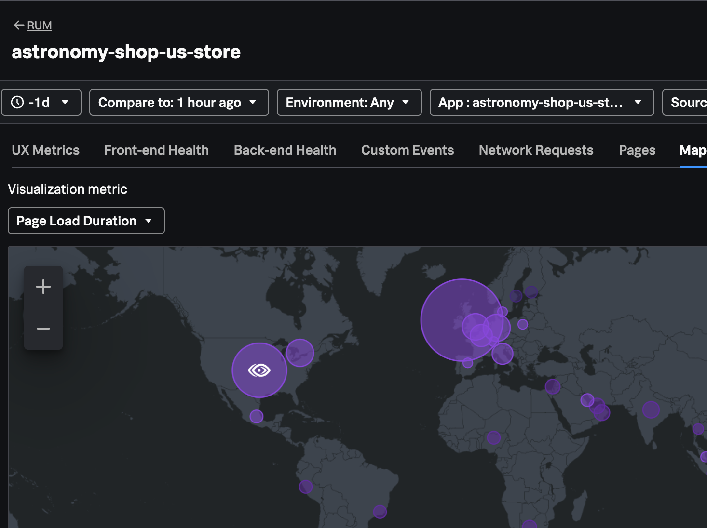
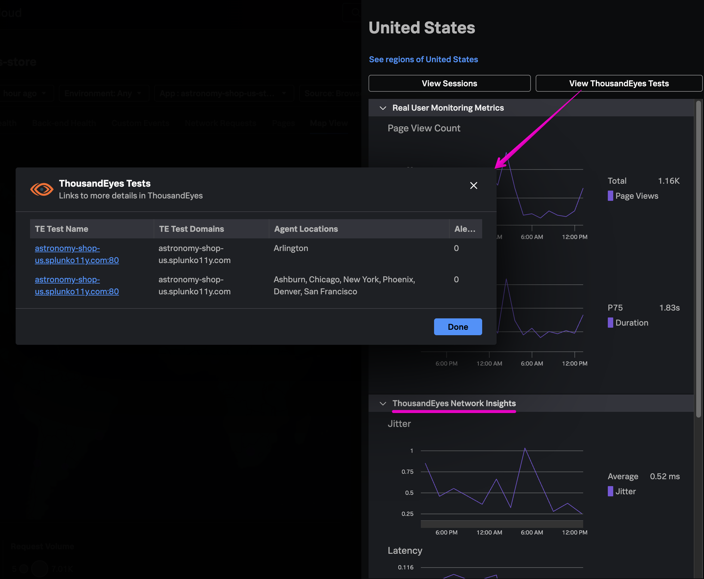

Integrate ThousandEyes with Splunk RUM to understand if network issues correlate to end user issues.

## Requirements
1. Admin privilege to both Splunk Observability Cloud and ThousandEyes
1. At least one application sending data into Splunk RUM
1. At least one test of these types running in ThousandEyes, on the **same domain** as the app in Splunk RUM: 
    - [agent-to-server](https://docs.thousandeyes.com/product-documentation/tests/network-tests#agent-to-server-tests)
    - [HTTP server](https://docs.thousandeyes.com/product-documentation/tests/http-server-tests)
    - [page load](https://docs.thousandeyes.com/product-documentation/tests/web-layer-tests#page-load-test)
    - [transaction](https://docs.thousandeyes.com/product-documentation/tests/web-layer-tests#transaction-test)

## Steps to integrate
1. In ThousandEyes, create an OAuth Bearer token:
    - Select your username on the top-right corner, and then select `Profile`.
    - Under User API Tokens, select `Create` to generate an OAuth Bearer Token.
    - Copy or make a note of the token to use in the Observability Cloud data integration wizard
1. In Splunk Observability Cloud, open Data Management > Available Integrations > ThousandEyes Integration with RUM
    - Use the same `Ingest` token from the [previous Splunk Integration](/observability-workshop/en/scenarios/thousandeyes-integration/3-splunk-integration/index.html#step-1-create-a-splunk-observability-cloud-access-token), or create and select a dedicated `Ingest` token to better track the data usage of your RUM integration.
    - Enter the OAuth Bearer token from ThousandEyes
    - Review the test matches, change selections as desired, and review the estimated data ingestion before selecting `Done`

## View the integration

Go to the RUM application where your ThousandEyes tests are running, and view the Map.
Hover over the locations where you also have ThousandEyes test running to see the preview of ThousandEyes metrics:

If you have active alerts in ThousandEyes, you will see the ThousandEyes icon over the relevant location bubble in RUM:

Click into a relevant region to see the Network metrics alongside other metrics from RUM, and open `View ThousandEyes Tests` to go to the relevant tests in ThousandEyes:

## See RUM and ThousandEyes metrics in a custom dashboard
Now you can correlate other Observability Cloud KPIs with signals from your relevant ThousandEyes tests!
1. Go to Dashboards > search for "RUM" > click into one of the out-of-the-box RUM dashboards in the `RUM applications` group
1. Either copy charts with RUM KPIs that interest you, or open a dashboard's action menu on the top right and `Save As` to create a copy in your own dashboard group.
1. On the new dashboard, create a new chart with the signal `network.latency`
    - change the extrapolation policy to `Last value`
    - change the unit of measurement to Time > `Millisecond`
    - in Chart Options, select `Show on-chart legend` with the value `thousandeyes.source.agent.name`. This will segment the chart by agent location from ThousandEyes.
1. Name and save the new chart, then copy it to create similar charts for `network.jitter` and `network.loss` by changing the metric in the copied charts signal, and adjusting the units of measure and visualization options as needed.

See the [Dashboard Workshop](/en/ninja-workshops/7-dashboards-detectors/) for more in-depth guidance on creating custom dashboards and charts.

{}
Think about other metrics in Observability Cloud that might be handy to view side-by-side with ThousandEyes test metrics.

For example, if you have API tests running in Synthetics, consider adding a heatmap of API test success by location.

  {}
