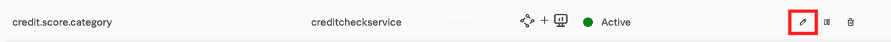
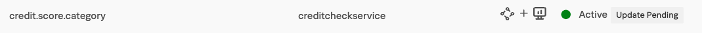

Earlier, we created a **Troubleshooting Metric Set** on the `credit.score.category` tag, which allowed us to use **Tag Spotlight** with that tag and identify a pattern to explain why some users received a poor experience.

In this section of the workshop, we'll explore a related concept:  **Monitoring MetricSets**.

## What are Monitoring MetricSets?

**Monitoring MetricSets** go beyond troubleshooting and allow us to use tags for alerting, dashboards and SLOs.

## Create a Monitoring MetricSet

(**note**: *your workshop instructor will do the following for you, but observe the steps*)

Let's navigate to **Settings** -> **APM MetricSets**, and click the edit button (i.e. the little pencil) beside the MetricSet for `credit.score.category`.

Check the box beside **Also create Monitoring MetricSet** then click **Start Analysis** 

The `credit.score.category` tag appears again as a **Pending MetricSet**. After a few moments, a checkmark should appear.  Click this checkmark to enable the **Pending MetricSet**.

## Using Monitoring MetricSets

This mechanism creates a new dimension from the tag on a bunch of metrics that can be used to filter these metrics based on the values of that new dimension. **Important**: To differentiate between the original and the copy, the dots in the tag name are replaced by underscores for the new dimension. With that the metrics become a dimension named `credit_score_category` and not `credit.score.category`.

Next, let's explore how we can use this **Monitoring MetricSet**.