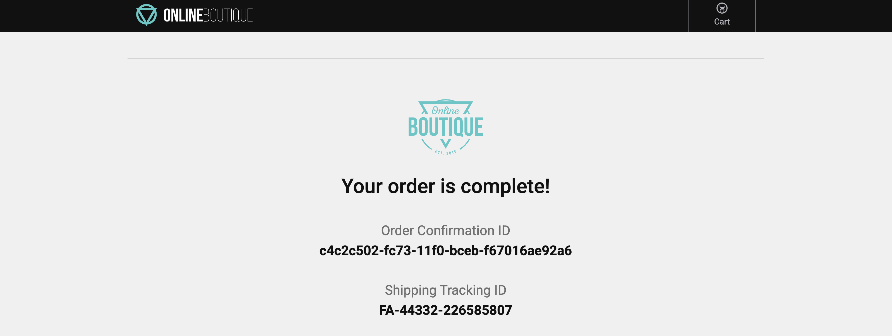

{}

You are a **hip urban professional**, longing to buy your next novelty items in the famous Online Boutique shop. You have heard that the Online Boutique is the place to go for all your hipster needs.

{}

The purpose of this exercise is for you to interact with the Online Boutique web application. This is a sample application that is used to demonstrate the capabilities of Splunk Observability Cloud. The application is a simple e-commerce site that allows you to browse items, add them to your cart, and then checkout. You will experience some issues and use the data you generate to identify the root cause of that issue.

{}
* Please visit the famous Online Boutique shop by going to **https://labobs-1037.splunko11y.com/**
* Once you have access to the Online Boutique, have a browse through a few items, add them to your cart and then, finally, do a checkout.
* Repeat this exercise a few times and if possible use different browsers, mobile devices or tablets as this will generate more data for you to explore. 
* Did you notice anything about the checkout process? Did it seem to take a while to complete, but it did ultimately complete? When this happens please copy the **Order Confirmation ID** and save it locally somewhere as we will need it later.
* Close the browser sessions you used to shop.

{}

This is what a poor user experience can feel like and since this is a potential customer satisfaction issue we had better jump on this and troubleshoot.

Let’s goto the next page where we will start using Splunk Observability Cloud and take a look at what the data looks like in **Splunk RUM**.
