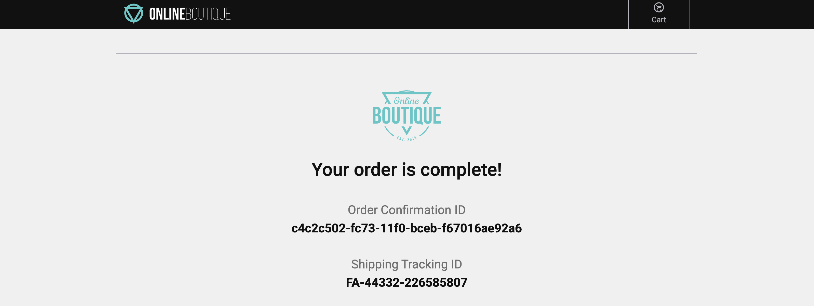

{}

You are a **hip urban professional**, longing to buy your next novelty items in the famous Online Boutique shop. You have heard that the Online Boutique is the place to go for all your hipster needs.

> [!splunk] The purpose of this exercise is for you to interact with the Online Boutique web application. This is a sample application that is used to demonstrate the capabilities of Splunk Observability Cloud. The application is a simple e-commerce site that allows you to browse items, add them to your cart, and then checkout. You will experience some issues and use the data you generate to identify the root cause of that issue.

{}

{}

* Please visit the famous Online Boutique shop by going to **[https://labobs-1037.splunko11y.com/](https://labobs-1037.splunko11y.com/?target=_blank)**
* Once you are on the Online Boutique web shop, have a browse through a few items, add them to your cart and then, finally, do a checkout/place order.
* We recommend you do at least 3-5 complete shopping sessions in order to catch the performance issues we have deliberately introduced into the application.

---


{}

**The whole checkout process is only supposed to take milliseconds. Did you notice anything about the checkout process?**

{}
{}

**Slow!** 🐌

{}


* When the checkout process is slow, it creates a frustrating user experience. Because this directly impacts customer satisfaction, we should prioritise investigating and resolving the issue.

{}

Let's go to the next page where we will start using Splunk Observability Cloud and take a look at what the data looks like in **Splunk Real User Monitoring (RUM)**.
