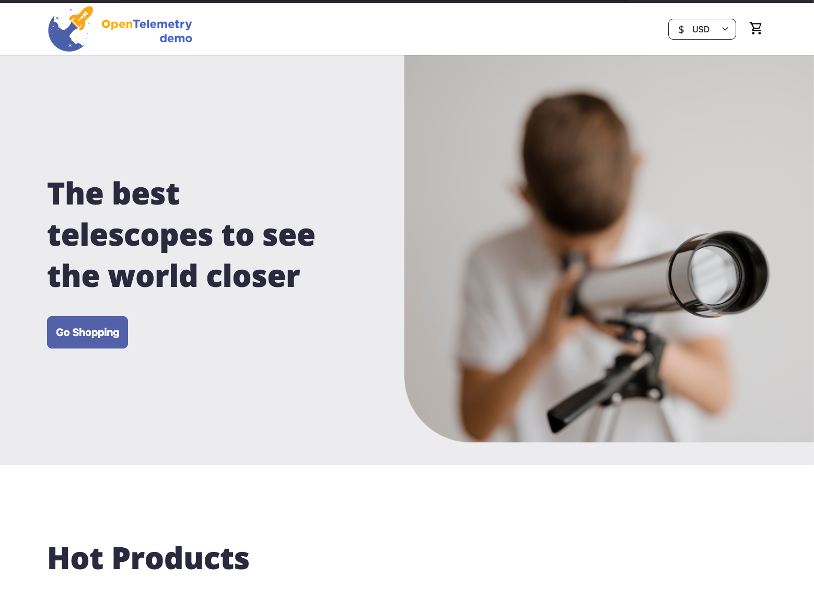

{}

You are a **curious astronomer**, browsing the Astronomy Shop for telescopes, star charts, and accessories.

{}

> [!IMPORTANT]
> The **Astronomy Shop** is the Splunk version of the OpenTelemetry Demo — a microservices e-commerce application fully instrumented with OpenTelemetry. It generates metrics, traces, and logs across multiple services written in different languages. The telemetry data you generate here will be used in whichever modules your trainer selects.

{}
Your instructor will provide the URL for the Astronomy Shop.
Explore and interact with the shop as a real customer would:

* Browse the catalog and open several products to view their details and descriptions.
* Add a variety of items to your cart.
* Proceed to checkout and complete a purchase.
* Repeat this process **three to five times**, purchasing different items each time. These interactions will generate the telemetry data used throughout the workshop.
* If possible, also access the shop using a mobile phone or tablet. Using different devices helps generate more varied and interesting telemetry data.


{}
**Did everything work smoothly, or did you notice anything unusual during checkout?**
{}
{}
Some services in the Astronomy Shop have deliberately injected issues. You may have noticed slow responses or errors during checkout — this is intentional and will be investigated in the workshop modules.
{}


{}
