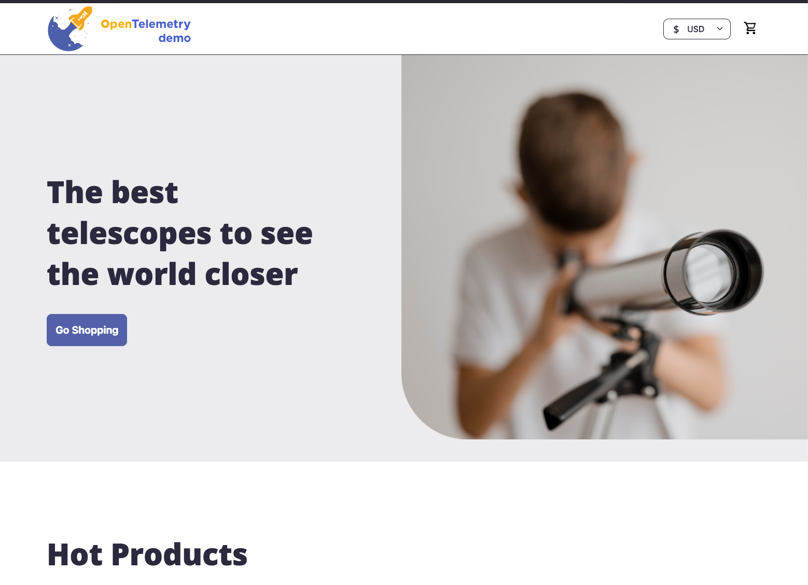

{}

You are a **curious astronomer**, browsing the Astronomy Shop for telescopes, star charts, and accessories.

{}

> >[!IMPORTANT]
> The **Astronomy Shop** is the Splunk version of the OpenTelemetry Demo — a microservices e-commerce application fully instrumented with OpenTelemetry. It generates metrics, traces, and logs across multiple services written in different languages. The telemetry data you generate here will be used in whichever modules your trainer selects.

{}

* Your instructor will provide the URL to the Astronomy Shop.
* Browse the catalog — view product details, read descriptions.
* Add several items to your cart.
* Proceed to checkout and complete a purchase.
* **Repeat 3-5 times** to generate enough telemetry data.
* If possible, try the astronomy shop via a mobile device, or tablet 


{}
**Did everything work smoothly, or did you notice anything unusual during checkout?**
{}
{}
Some services in the Astronomy Shop have deliberately injected issues. You may have noticed slow responses or errors during checkout — this is intentional and will be investigated in the workshop modules.
{}


{}
