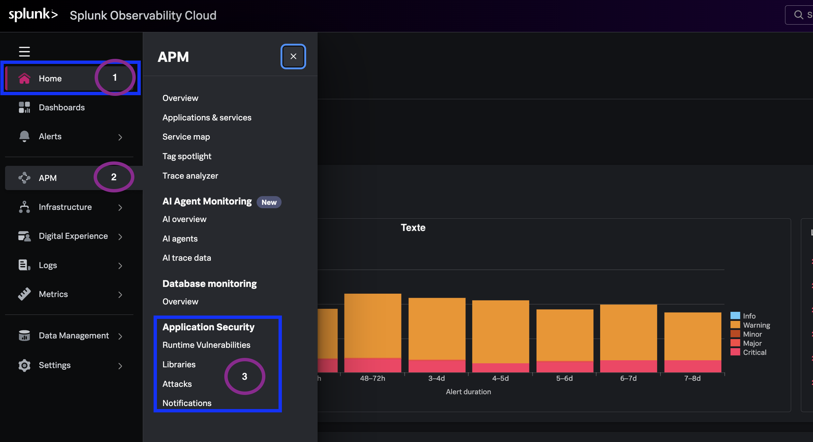

During this workshop, we'll explore:

- How to navigate Application Security entry points.
- How to inventory runtime vulnerabilities and correlate security posture with application health.
- How to prioritize findings using threat-informed risk scoring.
- How to guide remediation, manage vulnerability status, and review library hygiene.
- How to investigate runtime attacks and integrate notifications with SecOps.

For the workshop, a shared tenant is provided that contains Application Security telemetry (runtime vulnerabilities, library inventory, and attack events). 

> *"The tenant has been pre-configured with APM-instrumented microservices — without requiring to deploy additional agents beyond existing Observability instrumentation."* 

---

## 1.1 Access Splunk Observability Cloud

1. Open your browser and sign in to **Splunk Workshop Realm** (credentials provided by your workshop facilitator).
2. Confirm you land on the **Splunk Observability Cloud** home experience.
3. From the left navigation, expand **APM** - you will see the Application Security menu option.
4. Note the workshop **environment** & **service** filters you will use: `astronomy-shop-*` & 'shipping-api'

---

## What you learned

- How to access the workshop tenant and confirm Application Security entitlements.
- Which core capabilities you will exercise across the remaining modules.
- Which environment and service anchor the workshop walkthrough.

---
