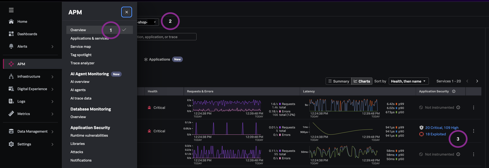
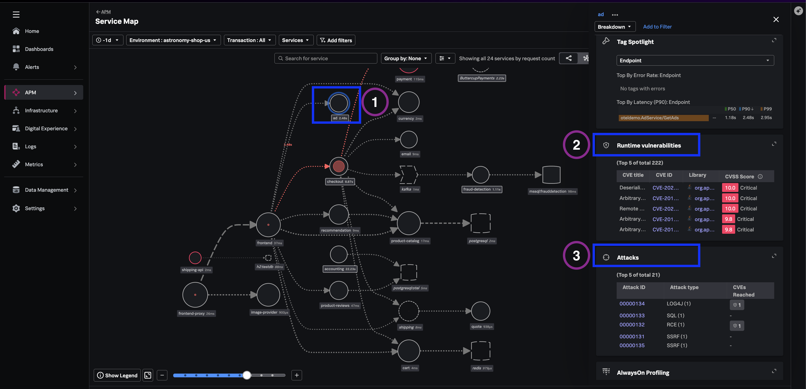

## Why unified visibility matters

When reliability and security live in separate tools, prioritization conversations stall. SREs ask *what broke?* while AppSec asks *what is exploitable?* — and neither view shows services that are simultaneously unhealthy and high-risk.

Splunk Secure Application surfaces vulnerability and attack summaries alongside golden signals on **APM Overview**, **Service Map**, and the **per-service Application Security** workspace. Engineering, application security, and SecOps can share one runtime view without a duplicate agent or workflow.

---

## 2.1 Security posture on APM Overview

1. Navigate to **APM → Overview**.
2. Set the **environment** filter to `astronomy-shop-*`.
3. Scroll to the **Services** tab.

Observe each service row: alongside standard health metrics, you should see runtime vulnerability and threat profile summaries for instrumented services- counts of critical and high CVEs and attacks.

> *"We are bringing security together with reliability - allowing teams to review Application Security risks in the same place they understand application performance and behavior."*

---

## 2.2 Service Map runtime security widgets

1. Navigate to **APM → Service Map**.
2. Open the **Services** filter and select **`ad`**.
3. Click the **`ad`** node in the service map.
4. Scroll to the **Runtime Vulnerabilities** and **Attacks** widgets (right-hand side of screen).

The widgets summarize the top vulnerabilities (CVE title, ID, score, libraries) and any attack activity (type and outcome).

(Optional) - Drill into a vulnerability or attack detail (from the relevant widget) to review the navigation path.

> *"This view highlights Blast-radius thinking - where issues framed next to dependencies and traffic."*
---

## What you learned

- How to correlate service health with vulnerability and threat profiles on APM Overview.
- How Service Map widgets frame security issues in topology context.
- How per-service Application Security keeps triage inside the APM workspace.

---
