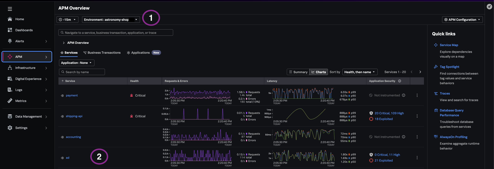
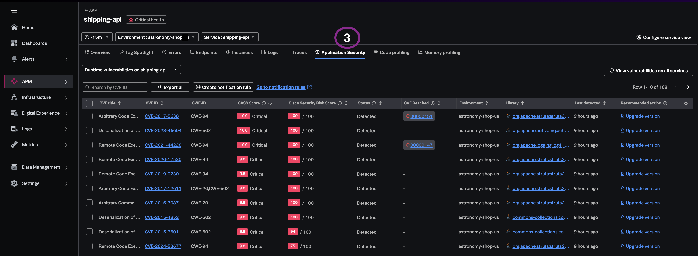

## Why a single inventory view matters

Standalone vulnerability scanners often report theoretical findings against code repositories or container images — not what is actually loaded in running JVMs and services. Teams export spreadsheets, cross-reference CMDB entries, and still lack confidence in production exposure.

Splunk Secure Application discovers vulnerabilities **at runtime**, correlated to deployed applications and the same APM context teams use for performance troubleshooting. A consolidated inventory answers the executive question: *what is our application security risk exposure right now?*

---

## 3.1 Accessing Vulnerabilities 

### a. Open from service-scoped vulnerabilities

1. From the **APM → Overview** page.
2. Set environment to `astronomy-shop-*`.
3. Scroll to the services list and click on a service with security insights data e.g **`ad`** service.
4. Open the **Application Security** tab to view associated security risks scoped to the service.

### Optional. Open from alternative views

1. **Sevice-Map** → **Vulnerabilities Widget** OR 
2. From the left navigation, **APM → Application Security** → **Runtime Vulnerabilities** (Filter **environment** : `astronomy-shop-*` to and select **service** : e.g `ad`'') - To view the full vulnerability inventory across all instrumented applications in the environment

---

## 3.2 Stakeholder views

You will now see a list of vulnerabilities across the instrumented applications with the following details.

- [ ] **CVE ID** - Standard vulnerability identifier
- [ ] **CVSS** - Theoretical severity score
- [ ] **Library** - vulnerabile library identifier
- [ ] **Status** column shows triage states (e.g., Detected, Fixed, Ignored)
- [ ] **Security Risk Score** - Threat-informed score combining CVSS with exploit and activity telemetry
- [ ] **Recommended action** - remediation option for resolving the identified vulnerability

> *"You can sort or filter the list of vulnerabilities to review **Critical**, **High** and **Low** severity findings.."*

---

## What you learned

- How to access the service-level and org-wide runtime vulnerability inventory.
- How CVE, CVSS, status, and Security Risk Score appear in one view.
- How contextualized runtime inventory reduces context switching versus standalone scanning tools.

---

