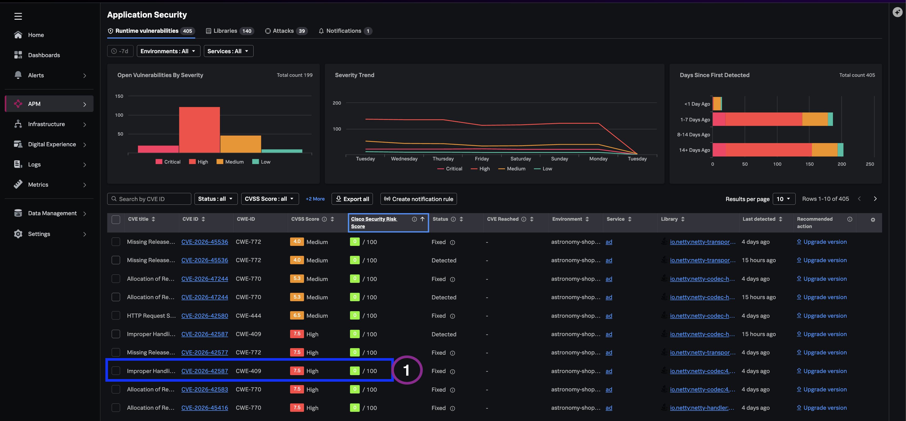
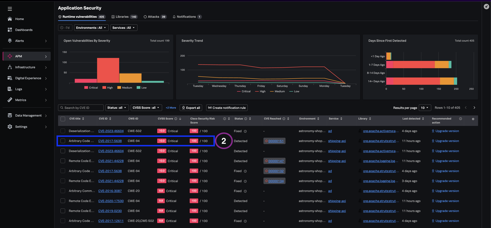

## Why CVSS alone is insufficient

CVSS describes theoretical severity — how bad a vulnerability could be in the abstract. It does not tell you whether a public exploit exists, whether malicious activity has been observed, or whether the weakness is reachable in your running services.

Splunk Secure Application adds **Security Risk Score** — threat telemetry combining base CVSS with real-world signals such as exploit availability and observed activity. Operational risk assessment & triage should use both scores, not CVSS alone.

---

## 4.1 Open service-scoped vulnerabilities

1. Navigate to **APM → Overview**.
2. Set environment to `astronomy-shop-*`.
3. Click the vulnerable  **`ad`** service.
4. Open the **Application Security** tab (or **Runtime Vulnerabilities** scoped to the service).

---

## 4.2 Compare high CVSS, low risk score

1. Locate a vulnerability with a **high CVSS** score and a **low Security Risk Score**.
2. Review any indicators suggesting whether or not there has been any active exploit context.

### Knowledge Check

Why might a team safely deprioritize this item despite high theoretical severity?


The Risk Score is low, indicating no active exploits. The team can safely deprioritize and focus on higher business risks first.


---

## 4.3 Compare high CVSS, high risk score

1. Locate a vulnerability with **high CVSS** and **high Security Risk Score**.
2. Check for a **"vulnerability reached"** or similar indicator showing an exploit against this CVE.

### Knowledge Check

Why does this item warrant prioritize-first treatment?


This reflects a real-world risk grounded in threat intelligence across known exploits against this vulnerability andcorrelated with Observability context for additional risk profiling of risk based on the impacted service and business risk of any exploit against it.


---

## What you learned

- How CVSS and Security Risk Score differ in operational triage.
- How to identify deprioritize-safe versus prioritize-first findings.
- How exploit-reach indicators connect cataloged CVEs to active risk.

---
