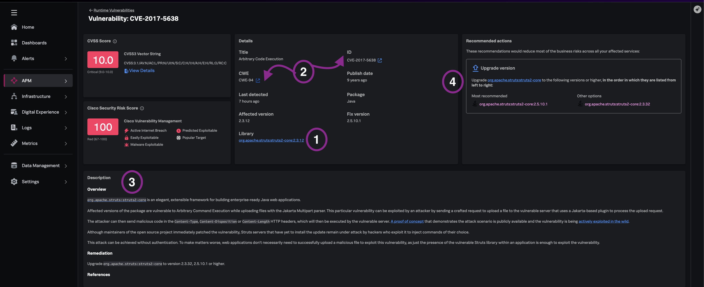
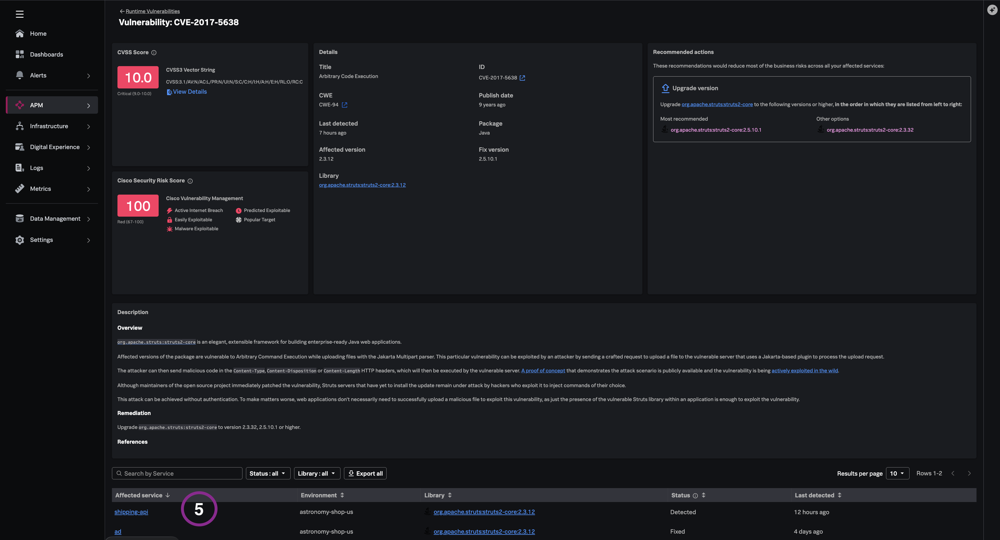

## Why remediation needs runtime context

Patching without blast-radius analysis leaves opportunities for exploit: engineering upgrades libraries that only affect one service while the same CVE spans critical paths elsewhere — or teams over-escalate isolated findings.

Splunk Secure Application consolidates **library names and versions**, **remediation guidance**, and **affected-service enumeration** in one detail view so upgrade decisions are grounded in what is actually deployed.

---

## 5.1 Guided vulnerability troubleshooting

1. From the **`ad`** service Application Security view, click the **high CVSS / high risk score** vulnerability you identified in the previous module.
2. Review the vulnerability detail panel:

| Field | What to look for |
|-------|------------------|
| **Impacted libraries** | Package names and pinned versions |
| **External references** | Links to advisories and vendor guidance |
| **Description** | Comprehensive details about the vulnerability |
| **Recommended actions** | Workarounds and remediation options |

> *"No tedious research across multiple portals - context is in the same place."*

---

## 5.2 Assess affected services (blast radius)

1. Scroll to the **Affected services** section at the bottom of the vulnerability detail.
2. Determine whether the same CVE spans additional critical services or is isolated to `ad`.

> [!NOTE]
> You can also navitage to the affected service and review other related vulnerable libraries foe the
> impacted service. Reviewing other deployed packages that may need attention beyond the single CVE under
> investigation.

> *"Before engaging application teams, you can review all available resources and external references to understand extended risk exposure across the stack. "*

---

## What you learned

- How to access consolidated remediation guidance with library version context.
- How affected-service enumeration informs upgrade prioritization.
- How service-scoped library inventory strengthens engineering handoffs.

---
