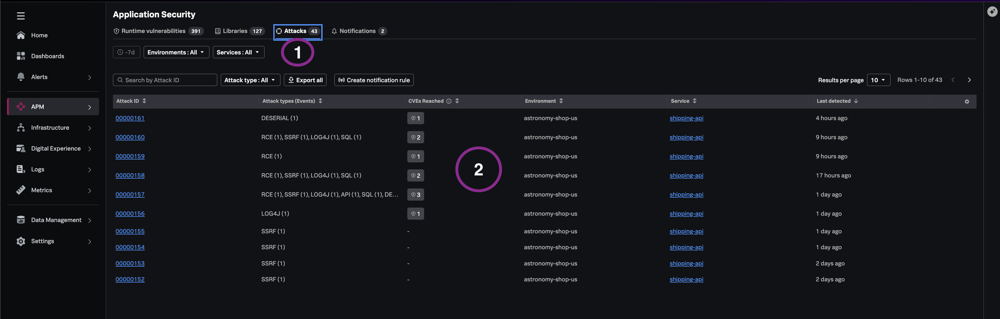
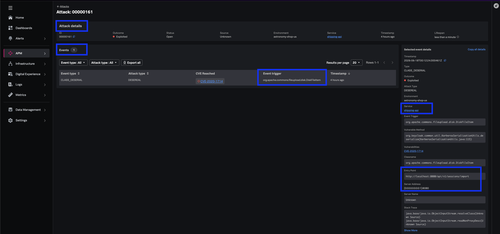
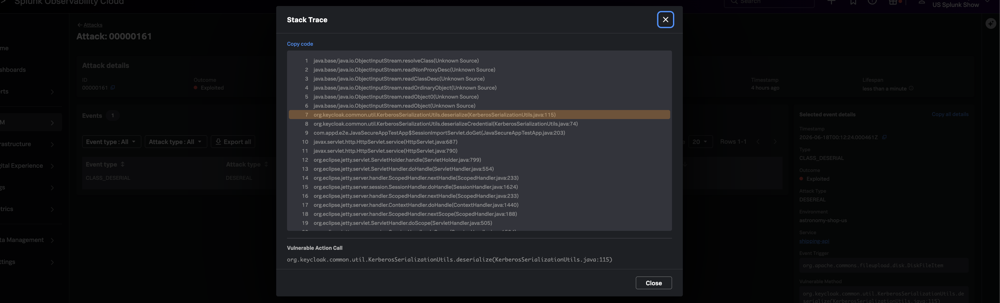

## Why runtime attacks change the conversation

Periodic scanning tells you what *could* be wrong. Runtime attack detection tells you what *is happening* —
exploit attempts against known weaknesses, with forensic context for immediate investigation and mitigation.

Splunk Secure Application correlates attack telemetry to vulnerabilities already cataloged, keeping SOC-style
investigations inside Observability Cloud.

---

## 7.1 Open the Attacks view

1. From **APM → Application Security**, select the **Attacks** tab.
   - Alternatively, pivot from a **"vulnerability reached"** indicator on a high-priority CVE.
2. Review the attacks list. For each row, note:

| Field | Purpose |
|-------|---------|
| **Exploit indicators** | Whether an active or historical exploit occurred |
| **Attack type** | Classification of the exploit attempt |
| **CVE breadth** | How many weaknesses are implicated |

> *"Shift from periodic scanning to runtime-aware threat detection."*

---

## 7.2 Investigate attack detail

1. Select one attack activity to open the detailed view.
2. Review forensic fields:

- Attacked **host**, **environment**, and **service**
- **Sequence of events** and actions performed
- Impacted **business context**
- **Client IP** and **HTTP method**
- Specific **event** and **trigger**
- **Code executed** during the exploit

---

## 7.3 Code-level forensics

1. Scroll to the **Stack Trace** attribute at the bottom of the attack detail.
2. Expand the stack trace.
3. Identify the frame and line reference for code accessed during the exploit.

> *"Identify exactly which line of code was accessed during this exploit — shorter loop from alert to remediation."*

---

## What you learned

- How the Attacks tab surfaces exploit activity correlated to cataloged CVEs.
- How attack detail provides SOC-ready forensic context inside Observability.
- How stack traces bridge security alerts to developer-ready remediation.

---
