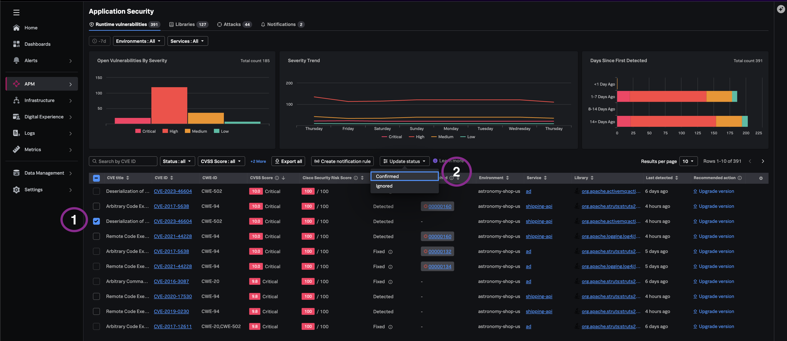
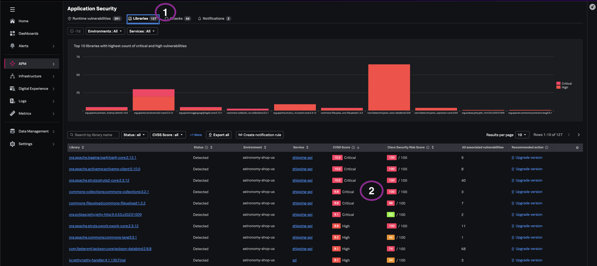
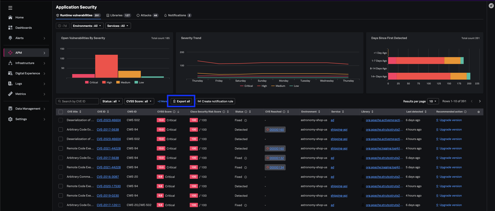

## Why queue hygiene matters

Unmanaged vulnerability backlogs create risk, noise, stale detections, and confirmed work items.
Teams spend remediation capacity on some CVSS resolutions while long-tail legacy library sprawl
accumulates tech debt.

> *"Having governance of vulnerability status transitions and org-wide library inventory, turns an overwhelming list into an actionable, trackable queue — eliminating debt in the triage process."*

---

## 6.1 Vulnerability status lifecycle management

1. Navigate to **APM → Application Security → Runtime Vulnerabilities**.
   - Alternatively, pivot from the **"attack"** view | tab to the **"Runtime Vulnerabilities"** Tab.
2. Review vulnerabilities against your organization's risk policies i.e risk assessment guidelines.
3. Select one vulnerability with **current status** of 'Detected' using the row checkmark.
4. Click **Update Status** and choose **Ignored** or **Confirmed**.

> *"This helps qualify noise and calibrated low risk vulnerabilities versus confirmed work items that require attention - with audit-friendly state transitions."*

---

## 6.2 Organization-wide library inventory

1. Navigate to **APM → Application Security → Libraries**.
   - Alternatively, pivot from current view to the **"Libraries"** Tab.
2. Here, you will have a comprehensive catalog of all packages deployed across the instrumented application environments.
3. Observe libraries for vulnerability posture, CVSS, Security Risk Score, and services.

> *"This gives you the complete picture of what is running in your environment, who owns it and the risk level. It is also a useful view of legacy | unused libraries that still exist within your code-base that may need to be retired"*
---

## 6.3 Filter and export for collaboration

1. Open the **Status** dropdown and select **Not Vulnerable**.
2. Observe which libraries may show no known CVE data — which means that they are healthy relative to known and existing risk. 
3. Select **Export** (or equivalent) to produce a shareable subset for a mock engineering or SecOps handoff.

> [!NOTE]
> The risk profile changes as new vulnerabilities are discovered. So while some of these may have no
> known vulnerabilities at this time, the status may change and hence it is critical to have real-time active 
> detection in place to track these shifts including `Zero Day Vulnerabilities` - across all your active workloads

---

## What you learned

- How bulk status updates govern vulnerability queue debt.
- How org-wide library inventory exposes supply-chain hygiene beyond a single CVE.
- How filters and export support cross-team collaboration without duplicate workflows.

---
