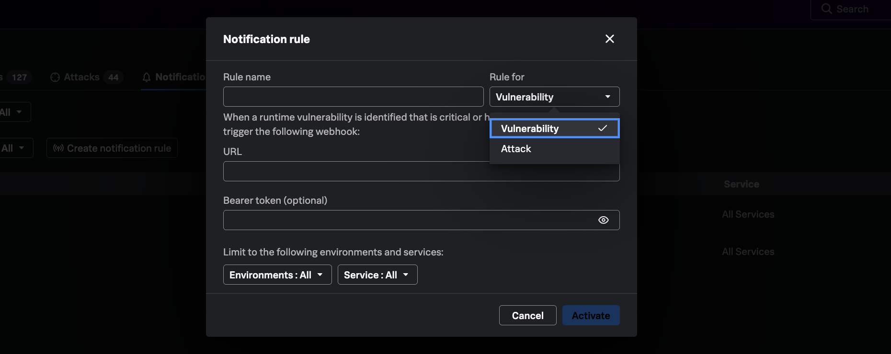

## Why integration completes the enterprise defense story

Detecting vulnerabilities and attacks inside Observability is only part the security journey. SecOps teams are also part of the equation, from an enterprise-level defense scale & typically live in SIEM workflows — if vulnerability and attack events & findings do not reach those tools, it creates gaps in security management and often reverts to duplicate ticketing and stale exports.

Splunk Secure Application closes the loop with **notification rules** that stream findings to SIEM solutions like Splunk Enterprise Security.

---

## 7.4 Connect to SecOps via SIEM integration

Notification integrations are configured to send vulnerability and attack events to the selected SIEM solution, giving the SecOps teams visibility into runtime risks in real-time.

1. Navigate to **APM → Application Security → Notifications**.
2. Review any existing notification rules (the demo tenant may have a pre-provisioned Splunk ES integration).
3. Click **Create Notification Rule** to walk through the configuration flow:

| Step | Action |
|------|--------|
| **Trigger** | Select vulnerability or exploit event types |
| **Destination** | Choose supported integration (e.g., Splunk ES HTTP Event Collector) |
| **Credentials** | Reference vault-managed secrets |

> *"Single pipeline from runtime findings to SOC visibility - SecOps gets these events with full context — no duplicate workflow."*

---

## What you learned

- How notification rules feed Observability-native findings into Splunk ES and other SOC tools.
- How to discuss the block-attacks roadmap without overstating current availability.
- How modernized defenses combine runtime detection with existing SecOps workflows.

---
