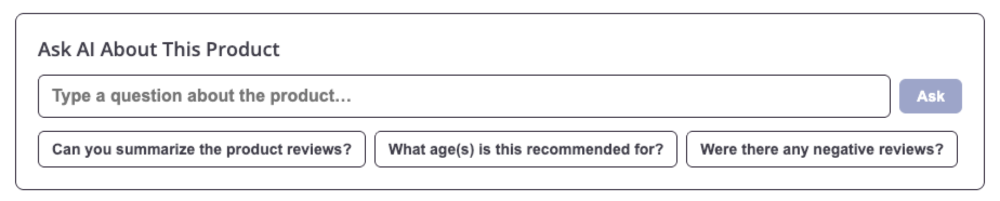

Before diving into DXA, you need real user sessions to analyze. The browsing you do now becomes the data you explore in the rest of this module.

{}

* The Astronomy Shop URL is provided by your instructor in the Splunk Show workshop event instance details.
* In a private or incognito browser window, open the Astronomy Shop and:
    - Browse products and open a few product detail pages
    - Interact with the **Ask AI** feature and try the quick prompts below the text input
    - Click **Show All Reviews** on a product page — if nothing happens, click it a few more times
    - Add items to your cart and attempt checkout
    - Close the browser window when finished
* **Repeat 2–3 times** to generate more user sessions.
* If possible, also visit the Astronomy Shop from a mobile device or tablet.


{}
Did everything work perfectly, or did you notice anything unusual when interacting with the application?
{}
{}
Some elements and services in the Astronomy Shop have deliberately injected issues. You may have noticed slow responses, a non-responsive **Show All Reviews** button, or errors during checkout — this is intentional and will be investigated using DXA in the pages ahead.
{}


{}

Your sessions are now flowing into Splunk RUM — and DXA is ready to turn that data into insights.
