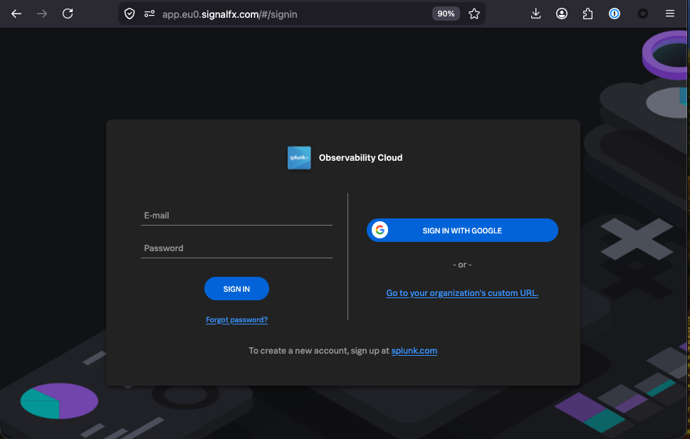
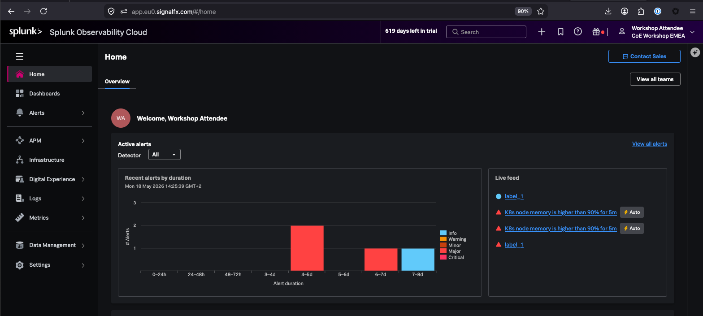

{}

* You should have received an e-mail from Splunk inviting you to the Workshop Org. If you cannot find it, please check your Spam/Junk folders or inform your Instructor.
* To proceed click the **Join Now** button or click on the link provided in the e-mail.
* If you have already completed the registration process you can skip the rest and proceed directly to Splunk Observability Cloud and log in:
  * **[https://app.eu0.signalfx.com](https://app.eu0.signalfx.com)** (EMEA)
  * **[https://app.us1.signalfx.com](https://app.us1.signalfx.com)** (APAC/AMER)

* You will land on the home page of Splunk Observability Cloud.  

{}
