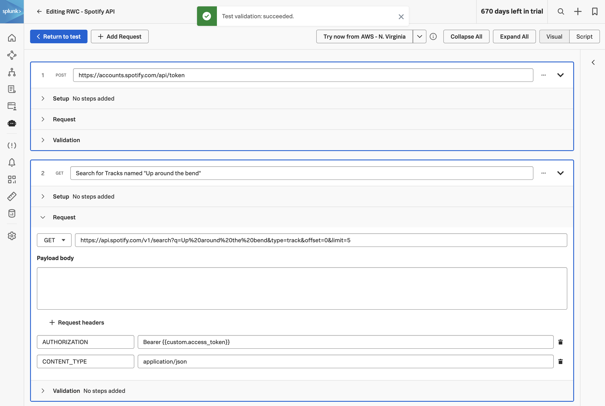

The API Check provides a flexible way to check the functionality and performance of API endpoints. The shift toward API-first development has magnified the necessity to monitor the back-end services that provide your core front-end functionality. Whether you're interested in testing the multi-step API interactions or you want to gain visibility into the performance of your endpoints, the API Check can help you accomplish your goals.

## 1. View Global Variables

View the global variable that we'll use to perform our API check. Click on **Global Variables** under the cog. The global variable named `env.encoded_auth` will be the one that we'll use to build the spotify API transaction.


## 2. Create a new API Check

Create a new API Check and name it `<your initials>` followed by Splunk REST API Check for example: **AP - Spotify API**


## 3. Add Authentication Request

Click on + Add requests and enter the request step name e.g. **Authenticate with Spotify API**.


Expand the Request section, from the drop down change the request method to **POST** and enter the following URL:

``` text
https://accounts.spotify.com/api/token
```

Next add two request headers with the following key/value pairings:

- **CONTENT-TYPE: application/x-www-form-urlencoded**
- **AUTHORIZATION: Basic {{env.encoded_auth}}**

Expand the **Validation** section and add the following extraction:

- **Extract** from **Response body** **JSON** **$.access_token** **as** **access_token**. 

This will parse the JSON payload that is received from the Spotify API and extract the access token and store it as a custom variable.


## 4. Add Search Request

Click on + Add Request to add the next step. Name the step **Search for Tracks named "Up around the bend"**.

## 5. Save and view results

Expand the **Request** section and change the request method to **GET** and enter the following URL:

``` text
https://api.spotify.com/v1/search?q=Up%20around%20the%20bend&type=track&offset=0&limit=5
```

Next add two request headers with the following key/value pairings:

- **CONTENT-TYPE: application/json**
- **AUTHORIZATION: Bearer {{custom.access_token}}**



Expand the **Validation** section and add the following extraction:

- **Extract** from **Response body** **JSON** **$.tracks.items[0].id** **as** **track_id**.


Click on < Return to test to return to the test configuration page. And then click Save to save the API Check.

Wait for a few minutes for the test to provision and run. Once you see the test has run successfully, click on the run to view the test results:


## 6. Resources

- [How to Create an API Check](https://docs.splunk.com/Observability/synthetics/api-test/set-up-api-test.html)

- [API Check Overview](https://docs.splunk.com/Observability/synthetics/api-test/api-test.html)
