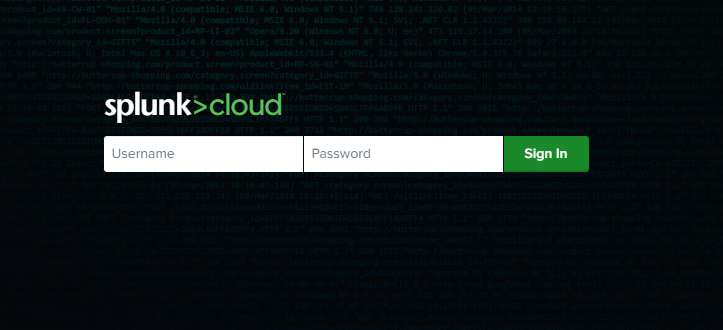
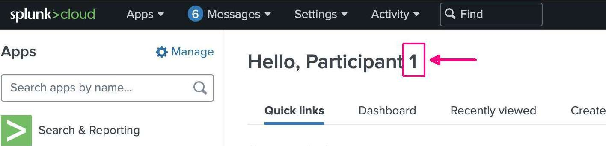

#

## Lab Connection Info

Your workshop instance URL and credentials will be provided by your workshop runner. Please refer to those details on how to access the workshop.

## Sample Data

Sample data for this workshop can be downloaded below. Both links point to the same sample file and are provided for ease of access:

Direct Link: **[cisco_logs_small.sample](https://drive.google.com/file/d/1Z4naz7aW3jx87SIRjhDMxa6mNVBKW0sQ/view?usp=drive_link)**

## Accessing Your Environment

1.  Connect to the lab environment as described in the section above. Labs with unique components may provide specific access instructions for those components.

2.  Log into your assigned Splunk Cloud instance via the URL provided. After logging in, you may see a Terms of Service screen. If so, click the “Accept” checkbox as appropriate and continue.

3.  Once logged into your Splunk Cloud instance, you’ll see this screen.

1.  The highlighted number corresponds to the sourcetypes you will use throughout the labs. In the example image above, your number would be **1,** so you would use the following sourcetypes through the lab:

    1.  Ingest Actions lab uses the `cisco:asa:ia:1` sourcetype.

    2.  Edge Processor lab uses the `cisco:asa:ep:1` sourcetype.

    3.  Ingest Processor lab uses the `cisco:asa:ip:1` sourcetype.

4.  The lab is set up this way so lab participants don’t interfere with each other.

5.  **Write your participant number down, as you will need it for all labs.**

