## Description

In this lab, you will filter, mask, and route Cisco ASA logs using Ingest Actions ingest-time transformation and routing rules. You will implement the [*Base Use Case*][Base Use Case 4] described at the beginning of this guide.

## Accessing Ingest Actions

1.  Be sure you’ve read and followed instructions from the [*Lab Connection Info*](../01-accessing-your-environment/_index.md#lab-connection-info) and [*Accessing Your Environment*](../01-accessing-your-environment/_index.md#accessing-your-environment) in the previous section.

> Log in to your Splunk Cloud environment. Browse to the **Settings** menu at the top of your screen and choose **Ingest Actions** in the upper right area of the menu, as shown in the image below.  
> 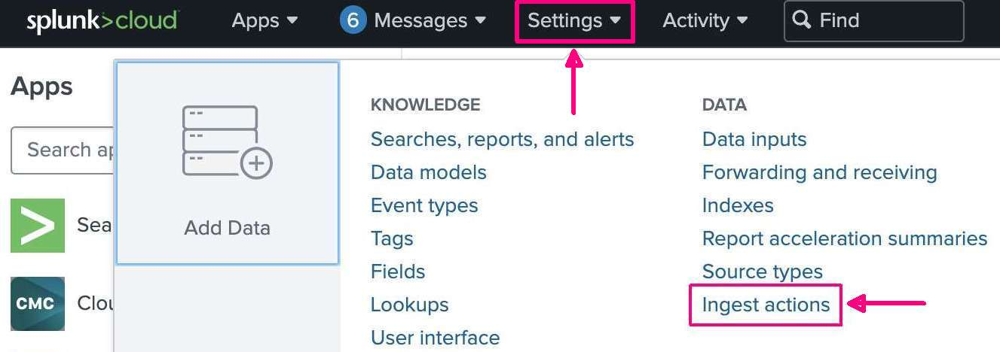

2.  This will take you to the main Ingest Actions configuration page. Click on the **New Ruleset** button near the bottom of your screen.  
      
    

## Creating a Ruleset

3.  You’re now on the *Create New Ruleset* configuration screen. The first thing to do is name your ruleset where you see **Enter Ruleset Name**. Since multiple people are using the same host as you, simply use **`Participant_#`**, **REPLACING `#` WITH YOUR PARTICIPANT NUMBER** 
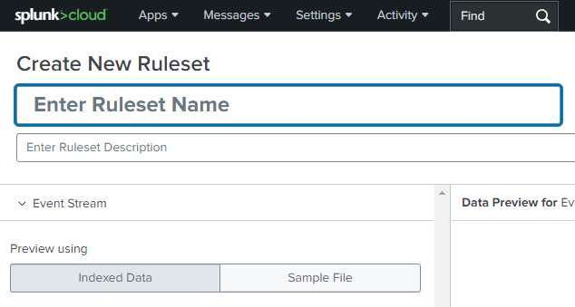

## Select Sample Data

4.  Looking down this screen, find the **Sourcetype** pull-down menu, as shown in the image below.
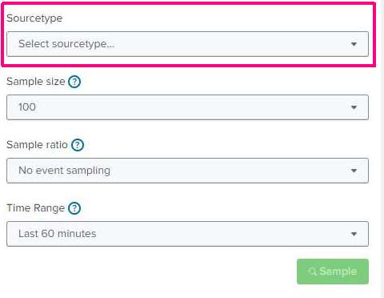

5.  Expand the **Select sourcetype** menu by clicking on it. You will see several sourcetype categories. In the filter text box at the top, type in **`cisco:asa:ia:#`** , **REPLACING `#` WITH YOUR PARTICIPANT NUMBER**.  
Finally, click on **`cisco:asa:ia:#`** in the pull-down to select it for use. See the image below for an example.  
      
    

6.  Now, set the **Sample size** to *5000* and the **Time Range** to *Last 7 days* so you get a good sample of data. Finally, click the **Sample** button to bring in data to work with. You should see data populated on the right side of the screen.  
      
    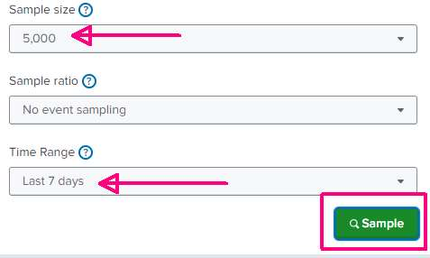

##  

## Route Data to S3

7.  Now, we can add rules to our ruleset. You'll see several choices when you click the **Add Rule** dropdown, as shown below. Remember, the first thing you want to do is send low-level information events to S3. This means you want to **Route to Destination**.  
      
    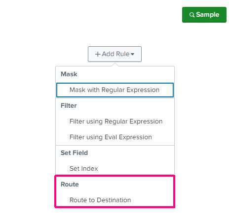

8.  Selecting **Route to Destination** will add a new rule to your ruleset, as shown in the image below.  
      
    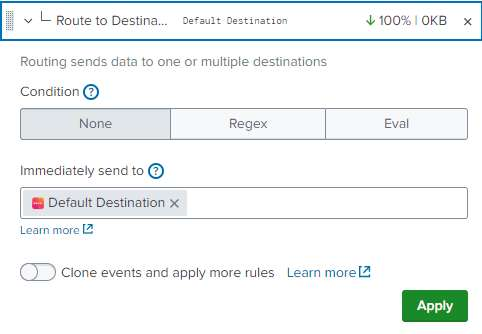

9.  Since we want to filter out events with various text, let’s use a Regex to do that. Click the Regex button to show a textbox where you can enter a regular expression to target specific events  
      
    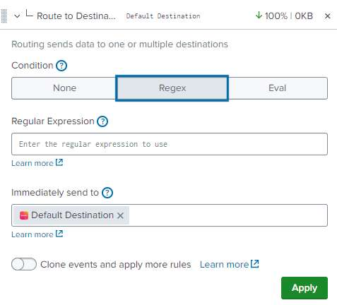

10. Refer back to the [*Base Use Case*][Base Use Case 4] in the “*Remove events with lower-level information*” section on what events you need to target. Create a regular expression to match all of them and put it in the **Regular Expression** text field.

| **NOTE:** If you need help creating a regular expression, you can use this one: 
|----|
    `(Built inbound (UDP\|TCP) connection\|Teardown (UDP\|TCP) connection\|Disallowing new connections)`

11. Next, you’ll choose the destination to send events to and make sure to “clone” events so you can apply more rules.

    1.  For the destination, you will choose the S3 location called **s3-dmx-ia-lab** and ensure you toggle the **Clone events and apply more rule**s. If you don’t toggle cloning, any rules after this point won’t apply.

    2.  Also, remove the **Default Destination** so events don’t get sent to a Splunk index.

    3.  See the image below for how your configuration should look.


| **NOTE**: Make sure you click the “Apply” button after configuring each rule. Otherwise, Ingest Actions will not save the configuration when you move on to the next rule. |
|----|

12. Once you click the “Apply” button, look to the upper right of the events view on the right side. You will see three buttons: *All Events*, *Affected Events*, and *Unaffected Events*. These can help you ensure your rules are working properly.

    1.  **All Events** shows all events being sampled.

    2.  **Affected Events** shows which events are affected by the current rule.

    3.  **Unaffected Events** shows which events are not affected by the current rule.

    4.  The numbers you see next to these will likely not match the screenshot below, which is OK. In the image, we can see that out of 500 events, the S3 destination routing regex affected 44 events and did not affect 456 events. This means we’ll get those 44 events in our S3 bucket.  
          
        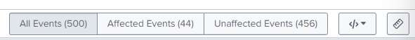

## Filter Data

13. Now that events are properly routed to S3, let's add the next rule. Since you only routed the events to S3 and didn’t filter them, they will still pass through the event cloning and end up in a Splunk index, which you don’t want. This means you need to filter them out.

    1.  Click **Add Rule** and choose **Filter using Regular Expression** to prevent them from being indexed in Splunk. The great part is that you already created the regular expression you need in the routing rule.

    2.  Put the same regular expression in the **Drop Events Matching Regular Expression** text box and click the *Apply* button.

    3.  You should see the same number of Affected and Unaffected events as before since you’re filtering the same events you routed to S3.

    4.  In the upper-right corner of the below image, you can also see the 10% reduction in sample data after we filter events.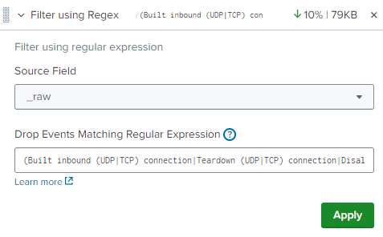

| **NOTE:** Use the same regular expression as you did in the route to S3 rule: 
|----|
    `(Built inbound (UDP\|TCP) connection\|Teardown (UDP\|TCP) connection\|Disallowing new connections)`

##  

## Mask Data

14. Now that you’ve sent the low-value data to S3 **and** filtered those events out of the data stream, you need to mask the username value in the events before indexing the data to Splunk. There are several places where a username value exists, so you will use three rules to target them. For this, we will replace the user name with a value of \<REDACTED\>.

15. Add another rule, this time choosing **Mask with Regular Expression**. You will see this rule has two inputs - one for the match and one for the replacement. Create a regular expression to match the username. Then, enter in the replacement. Remember, you want to replace the username value with **\<REDACTED\>**.

16. Remember to click the “Apply” button after configuring the rule.

| **NOTE:** These events look like this: 
|----|
    `Authorization denied (acl=acmetechinbound) for user 'admin' from`

| **NOTE:** If you need help creating a regular expression, you can use this one: 
|----|
    Match Regular Expression: `for user '.+?'`
    Replace Expression: `for user '<REDACTED>'`

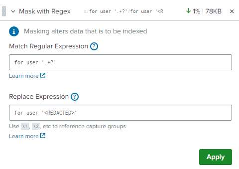

17. Add another **Mask with Regular Expression** rule to target the next username value events.

| **NOTE:** These events look like this:
|----|
    ```Group = Acme_Techcde, Username = practical_lovelace, IP = 10.11.36.23,```

| **NOTE:** If you need help creating a regular expression, you can use this one: 
|----|
    Match Regular Expression: `Username = .+?,`
    Replace Expression: `Username = <REDACTED>,`

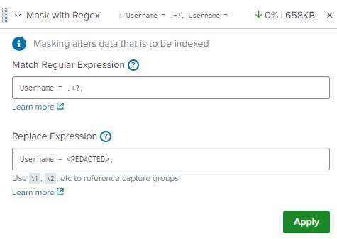

18. Add another **Mask with Regular Expression** rule to target the next username value events.
| **NOTE:** These events look like this:
|----|
    `local database : user = focused_euclid`
    And this:
    `between 10.11.36.18 and 10.11.36.13 (user= intelligent_haslett) has been created.`

| **NOTE:** If you need help creating a regular expression, you can use this one:
|----|
    Match Regular Expression: `(user\s?= ).+?(\)\|$)`
    Replace Expression: `\1<REDACTED>\2`

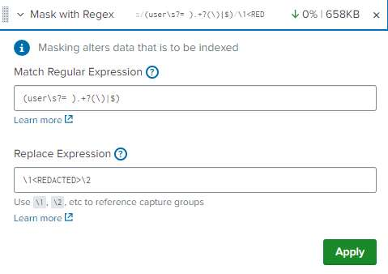

##  

## Send Data to a Splunk Index

19. Now, you can send the filtered and masked data to a Splunk index. For this, set the index to **dmx-ia-lab** and route the data there. You do this by adding a **Set Index** rule to the ruleset.

    1.  Since you are setting the index name to a static value, you can leave the rule configurations to default settings and put the index name in the text box.

    2.  Since you didn’t do a *Regex* or *Eval*, this affects 100% of the remaining events.

20. Almost there - you just need to route the remaining data to Splunk. This is done similar to how you routed data to S3. Add a new rule and choose **Route to Destination**. You’ll see the destination as **Default Destination**. This means that the events will get re-inserted into Splunk’s normal pipeline at the indexing stage. Since you set the index to **dmx-ia-lab**, that’s where the data will get indexed.  
      
    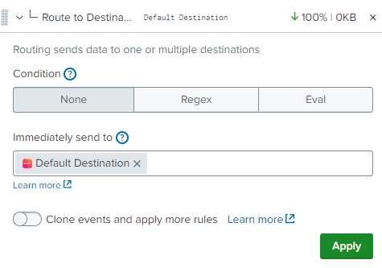

| **NOTE**: Make sure you click the “Apply” button. |
|---------------------------------------------------|

##  

## Save and Check Your Work

21. Now that the ruleset is complete, in the upper-right corner of the screen, click the **Save** button.  
      
    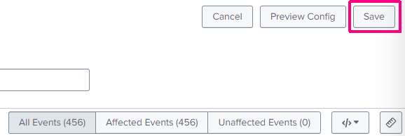

22. A modal window may open, as shown below. If it does, click the green **Deploy** button to send your changes to the indexers. Once set, you can check your work.  
      
    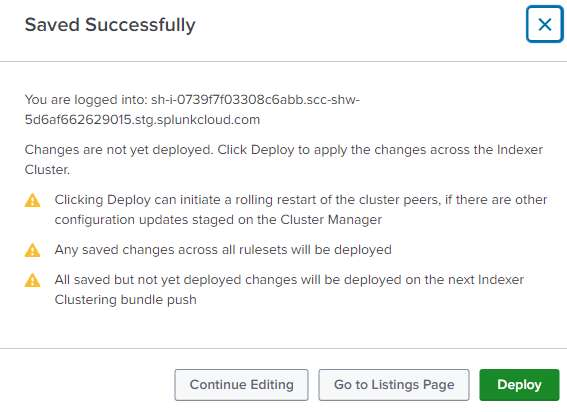

| **NOTE**: Depending on the Splunk Cloud experience and version, the modal window may not appear, and rulesets will be deployed upon saving. |
|----|

23. In the upper-left corner of the screen, select **Apps** menu and then select the **Search & Reporting** app. This will take you to a search bar where you can ensure the correct data ended up in the correct index.  
      
    

| **NOTE**: You may see a modal window pop up to take a tour of Splunk. In the lower-right corner of the pop-up, click the “Skip tour” link if this happens. |
|----|

24. Use the search below, replacing the sourcetype ***\#*** portion highlighted in yellow **WITH YOUR ASSIGNED NUMBER**. You will see all **user** field values are set to **\<REDACTED\>**.

**`index=dmx-ia-lab sourcetype=cisco:asa:ia:# earliest=-7d@d`**

## Splunk Federated Search for Amazon S3

Federated search for Amazon S3 lets you search data in your Amazon S3 buckets from your Splunk Cloud Platform deployment.

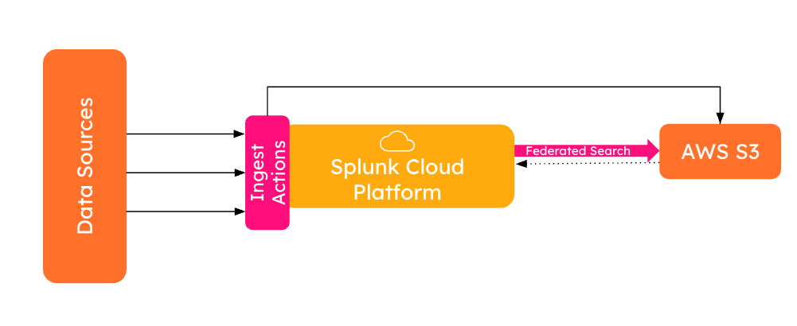

25. Use the S3 federated search below, replacing the sourcetype ***\#*** portion highlighted in yellow **WITH YOUR ASSIGNED NUMBER**, to see the data you sent to the S3 bucket.

**`| sdselect * FROM federated:s3-ia-lab-index WHERE sourcetype="cisco:asa:ia:#"`**
