## Description

In this lab, you will filter, mask, and route Cisco ASA logs using Edge Processor. You will implement the [*Base Use Case*][Base Use Case 4] described at the beginning of this guide. Additionally, the lab guide will demonstrate the ability to enrich log events using lookup commands.

An environment and an Edge Processor have been set up, and you have been provided with the credentials. In case you are interested in architectural background, today’s lab environment consists of the following:

**Splunk Cloud** - Your data will be indexed here once it has been processed by Edge Processor.

**Edge Processor Service** - Hosted in Splunk Cloud Platform, this is the cloud-based console through which you will set up, configure, and manage Edge Processors, including creating pipelines for data processing (more on this later)!

**EC2 Instance** (with demo data) - An Edge Processor node has been installed for you prior to this exercise in an EC2 instance. The edge processor is configurable via the cloud-based Edge Processor service. Processed data will be forwarded to Splunk Cloud. In the lab environment, this is referred to as ‘EP - Edge Node’.

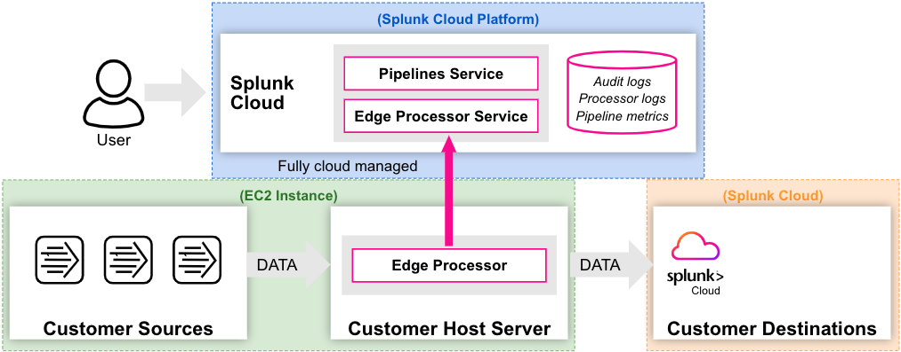

## 

## 

## 

## 

## 

##  

## Access Your Splunk Cloud Instance

1.  As part of the exercise, You will be given credentials to the EP that has been set up. Use the admin credentials provided here to log in to your account.  
      
    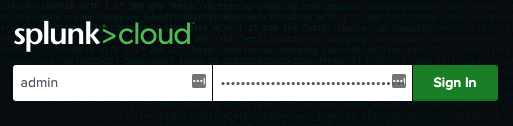

2.  Accept the Terms of Service and click on **OK**.  
      
    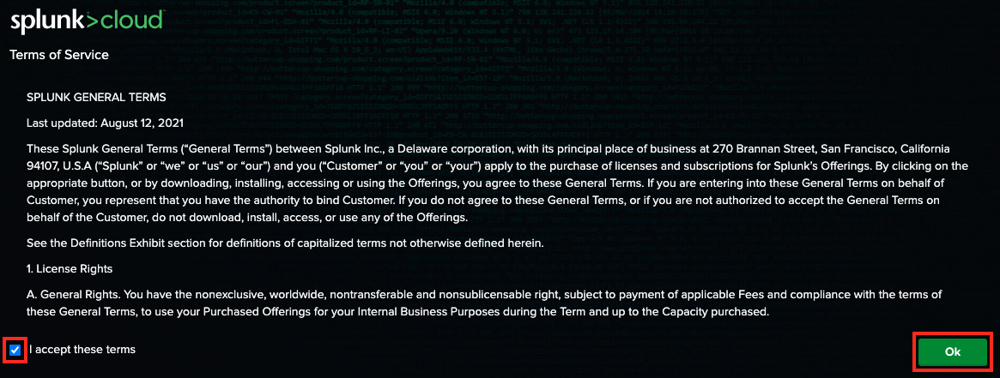

3.  On the welcome page, click on **Launch** under **Splunk Cloud Platform**.  
      
      
      
    You will now be taken to the data management environment.

## Create a Workspace

4.  Enter the shared workspace by clicking on the Shared Workspaces button on the left side.  
      
    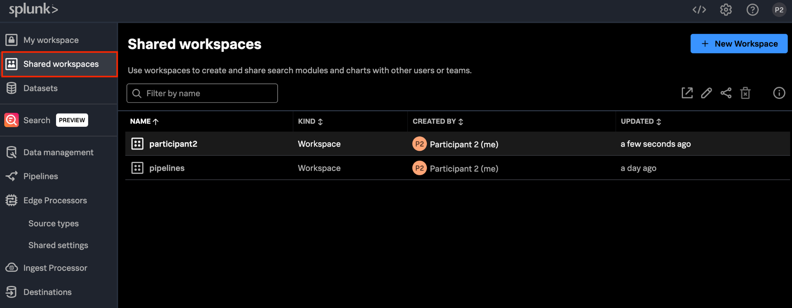

5.  Create a new workspace for your participant by pressing the **New Workspace** button in the upper right. Name the workspace **participant#** **(REPLACE \# WITH YOUR NUMBER)**. Select the **Create** button. You can skip this step if you have already created this workspace in the past.  
      
    

6.  Double-click the workspace you created to enter into the workspace.  
      
    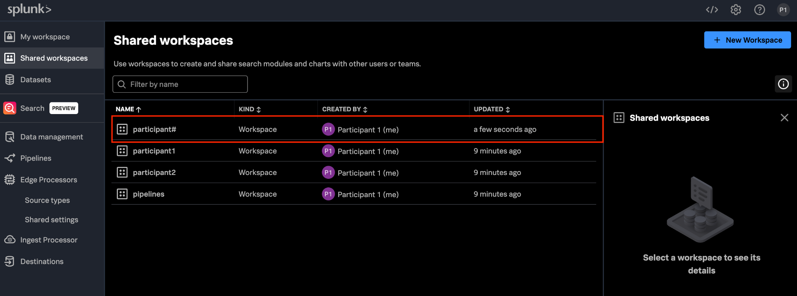

## Add a new Edge Processor

7.  In your home page, from the menu on the left of the page click on **Edge Processors**.
    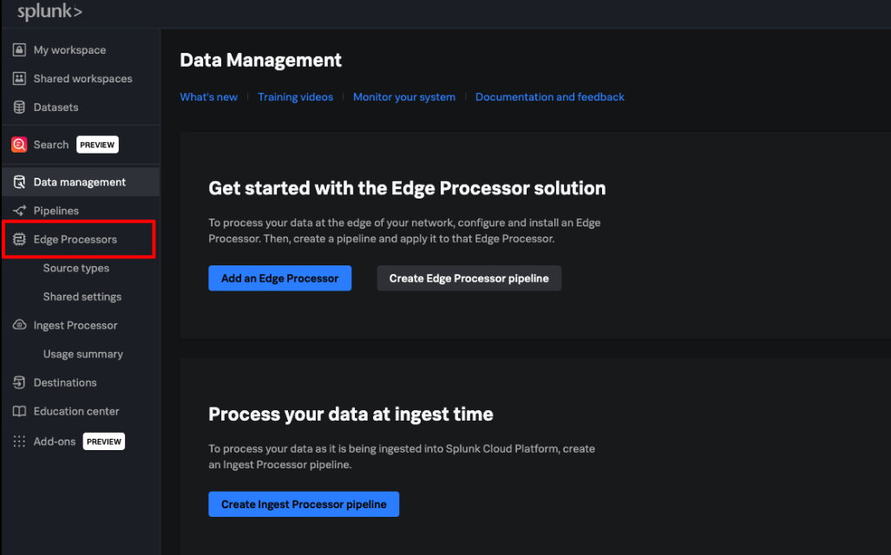

8.  In the middle of the **Edge Processors** page click on **+ New Edge Processor**.
    

9.  The **Add an Edge Processor** window will appear. Give your Edge Processor a name. Since each environment is shared among multiple people, use the name ‘**edge\_**’ followed by your own name to help identify this as your Edge Processor. For example: *edge_jsmith*
    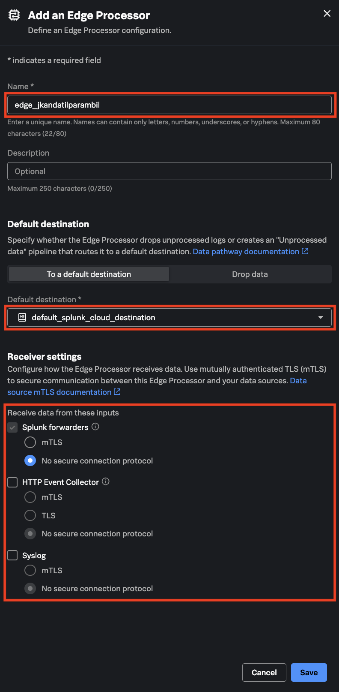

For Default destination select ‘**default_splunk_cloud_destination**’.

To help simplify our setup for this workshop, disable TLS for Splunk forwarders by checking the **No secure connection protocol option** (this will remove the checks against the options below). Uncheck the HTTP Event Collector and Syslog options.  
  
Click **Save** to create your Edge Processor.

10. You will now see a pane detailing information about your Edge Processor on the right hand side of the page. We also see configuration information about our Edge Processor and can see “**Instances (0)**”, meaning that there are currently no Edge Processor instances installed.

    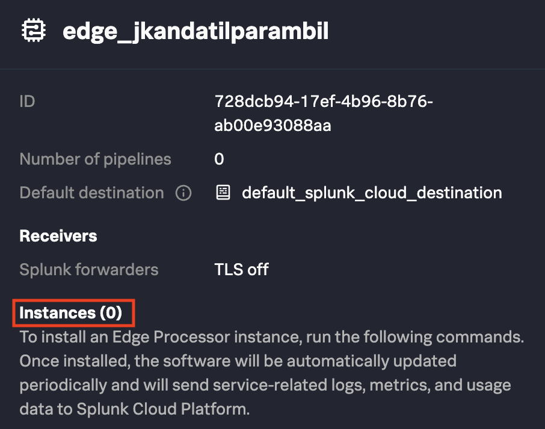

11. Under “**Instances**” information, you will see a clipboard containing the installation commands, which we can use to install an Edge Processor instance onto a Linux server.
Copy this command by clicking on this icon. 
    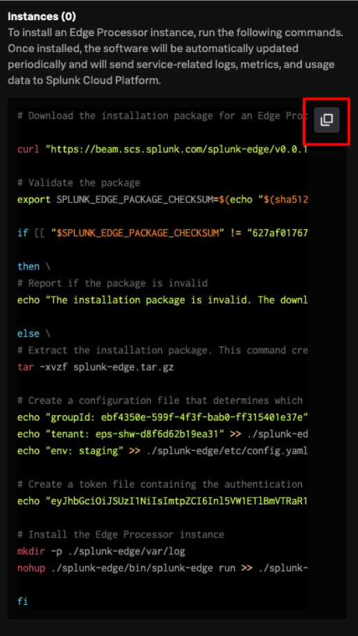


#### **Install a New Edge Processor Instance**

12. With your installation command already copied to your clipboard, open your SSH connection to your Edge Processor Node EC2 instance (**Provided by your workshop runner**) and paste the command. The command will run automatically.

Due to the way the command is formatted, you will need to *hit enter a second time* after the initial command has run. You should now see a green prompt like before.
    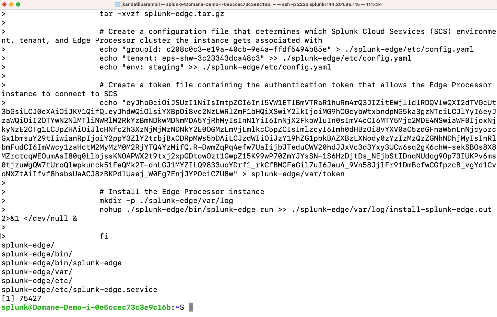

13. After a brief moment (it could take a couple of minutes in today’s shared environment) you should see the number of instances associated with your Edge Processor turn to **(1)** with the status of 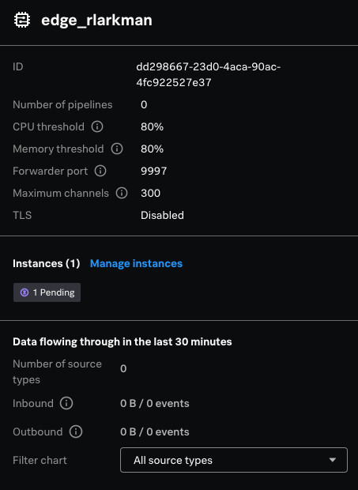 This will eventually change to 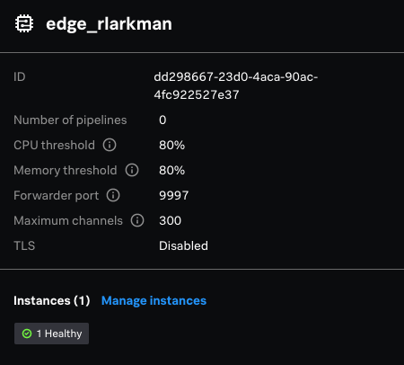 You may need to refresh your browser page to see the status update
    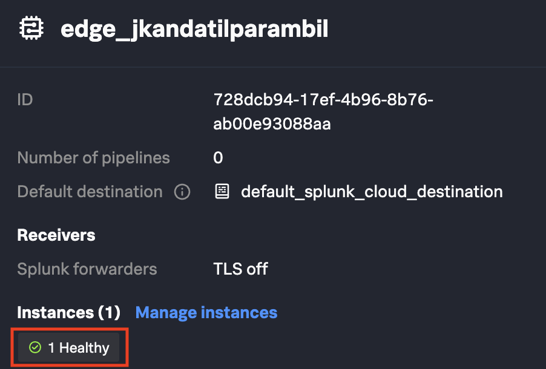

If you click on the blue **Manage instances** link you will see a list of instances, including the one you just installed. A green tick means the instance is healthy.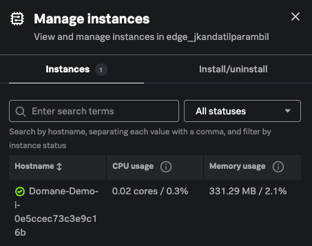

> ℹ️ **Source types and Destinations**
>
>In a real world environment you would also need to configure source types and destinations (i.e. destinations where your data can be sent to) for your Edge Processor but to simplify today’s workshop these have been pre-configured for you.

#### **Restart Your Splunk Heavy Forwarder (Manual Step for Today’s Environment)**

14. For today’s lab you will need to manually restart the Splunk Heavy Forwarder that is running on your EC2 instance. Note that you would not need to do this in a production environment.

Run the following command in the SSH session on your EC2 instance:
> `sudo /opt/splunk/bin/splunk restart`

Confirm that Splunk restarts successfully:
    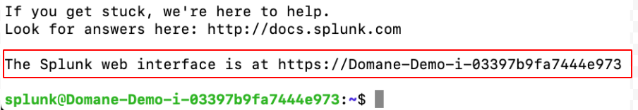

#### **Verify Edge Processor is Receiving Data**

15. Browse to the Edge Processor page and double-click on your Edge Processor.
    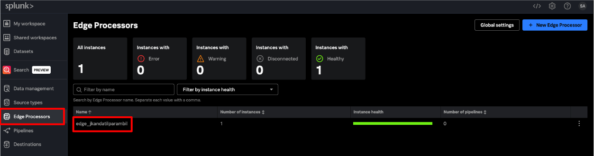

16. Under the **Data sources** pane on the left side of the page, click on **Received data** and verify that your Edge Processor is receiving inbound **cisco:asa:ep:#** source type data.
    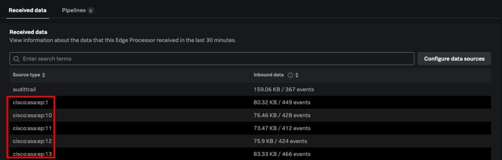

## Create a Pipeline

17. In your participant workspace, create a new EP pipeline by selecting **New → Edge Processor Pipeline** in the upper right.  
      
    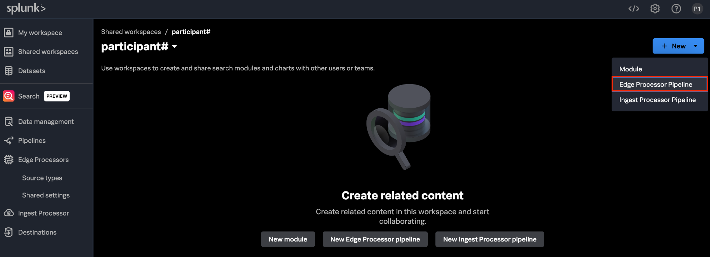

18. On the Get Started screen, you can choose from several templates, including Cisco ASA. For the purposes of this workshop, we will select the **Blank pipeline** and choose **Next**.  
      
    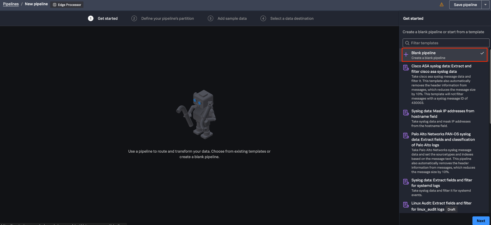

19. The pipeline’s partition allows us to select which sourcetype is being ingested into Edge Processor that we want to process. Select **Partition by sourcetype** and enter the Cisco ASA sourcetype corresponding to your participant number. The format is **cisco:asa:ep:#**. Click **Apply**.

> **Reminder**: Your sourcetype should be your participant number. For example, if your participant number is 2, your sourcetype is **cisco:asa:ep:2**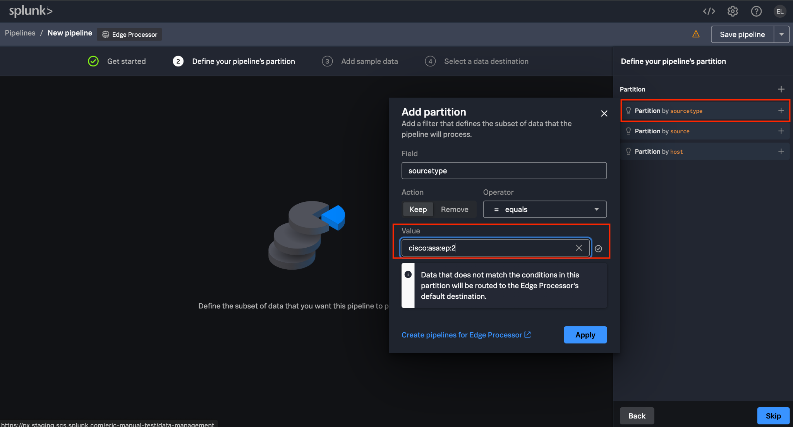

20. Note the partition information now shows the entered sourcetype. Choose **Next**.  
      
    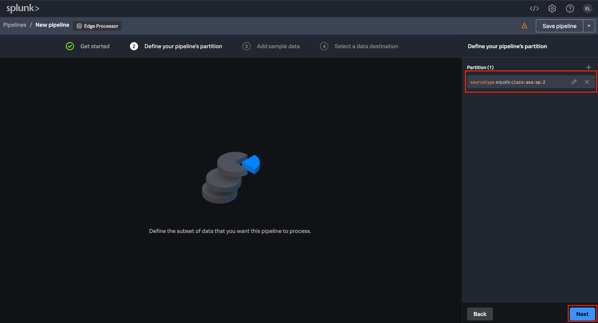

21. Choose to **Add sample data**. Download and use the data found in the following sample file:   

>Direct Link: **[cisco_logs_small.sample](https://drive.google.com/file/d/1Z4naz7aW3jx87SIRjhDMxa6mNVBKW0sQ/view?usp=drive_link)**

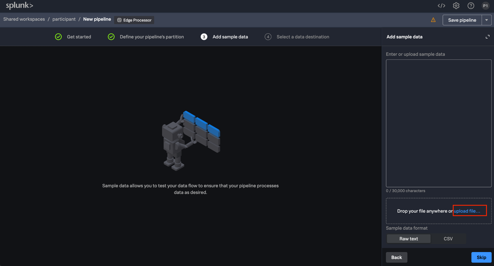

22. After uploading the sample data, press next  
      
    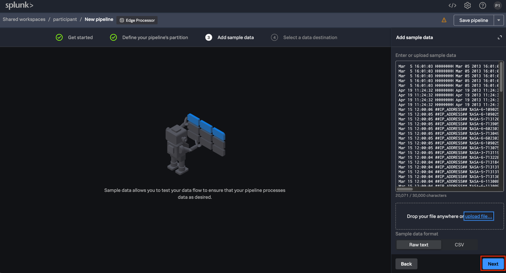

23. Select a data destination. For this exercise, let’s use the pre-configured destination “**default_splunk_cloud_destination**”
    

24. After selecting **default_splunk_cloud_destination,** press **Next**.
    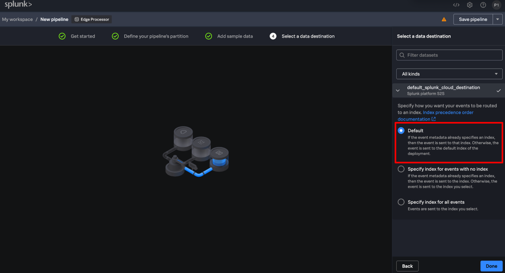

25. For this exercise, we will not select a target index. Press **Done  
    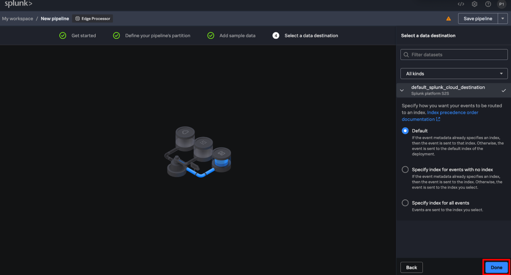

26. A screen similar to the one below will appear:  
      
    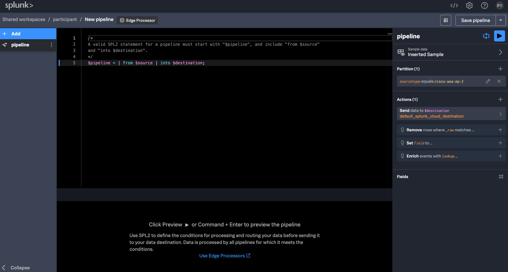

27. Test your pipeline by first clicking on the \$pipeline SPL. The blue Preview pipeline button should appear in the top right corner of the screen. When you click it, you should see a preview of the sample events you uploaded earlier.  
      
    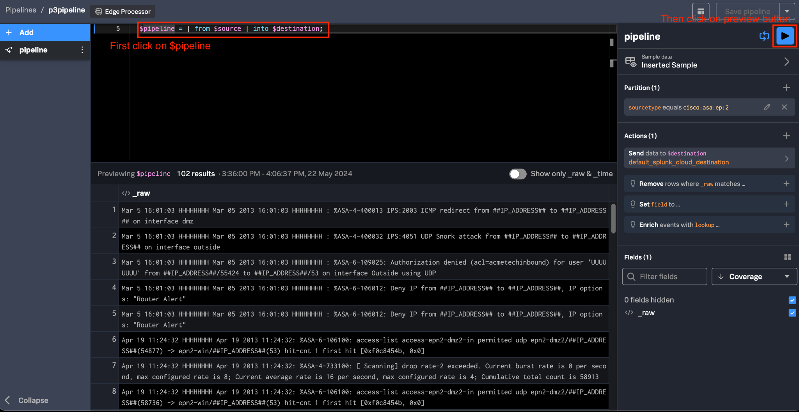

## Save Your Pipeline Progress

28. We can inspect the data in the table to understand the fields and sample values that were captured. To save our progress thus far before we start editing the SPL2, choose the **Save Pipeline** button on the top right.  
      
    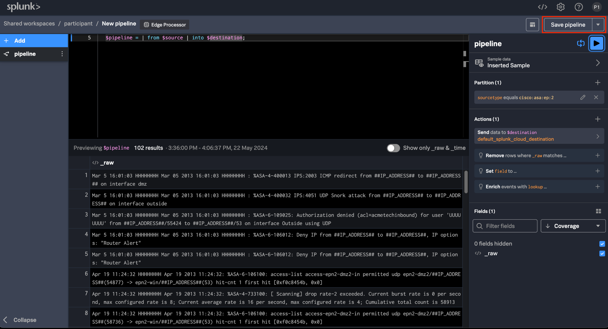

29. In the Save Pipeline modal that appears, name the pipeline **p#-ep-pipeline** **REPLACING \# WITH YOUR NUMBER FROM PARTICIPANT NUMBER** and select **Save**.

    1.  For example, if your **participant number is 2**, name your pipeline **p2-ep-pipeline**
        

30. After saving, we will be prompted in another window to Apply the pipeline. The Apply step will push out the pipeline configuration and begin transforming the data according to the SPL2 we wrote. Since we haven’t written any SPL2 yet, we will select **No**.

> Note: If you accidentally selected “Yes”, don’t worry. We will overwrite the pipeline when we apply our Cisco ASA SPL2 later.  

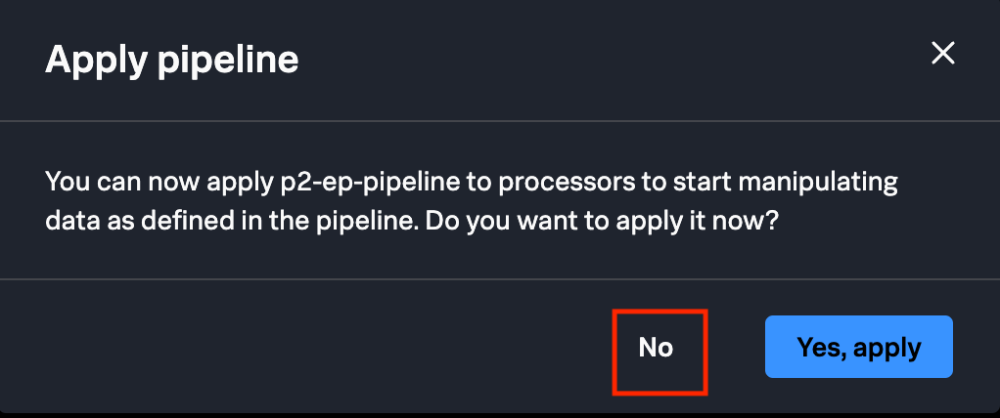

##  

## Author Your Pipeline

31. Now that we have our pipeline setup, we can start writing some SPL2! The first task will be to extract useful fields out of \_raw. To do this, we will create an SPL2 function to extract the fields we care about. Copy/paste the following text into the SPL2 editor, replacing what was there before:

```
function extract_useful_fields($source) {
   return | from $source
   /* Extracted message matches with ASA or FTD */
   | rex field=_raw /(?P<_raw>(%ASA|%FTD).*)/
   /* Extract message number */
   | rex field=_raw /(%ASA|%FTD)-\d+-(?P<message_id>\d+)/
   /* Extract username */
   | rex field=_raw /^[^'\n]*'(?P<username>[^']+)/
}


$pipeline = | from $source
   // extract the useful fields
   | extract_useful_fields
   | into $destination;
```

> The rex functions inside of extract_useful_fields will do the following:
> - Ensure that all \_raw fields start with either ASA or FTD
> - Extract the message ID and store it in the message_id field
> - Extract the username (if present) and store it in the username field

Pressing the preview button again will show that the fields have been extracted. Note that sometimes the field list can get quite long, so we have unchecked several fields on the bottom right to reduce the size of the preview results table. You can also rearrange the columns however you want.  
    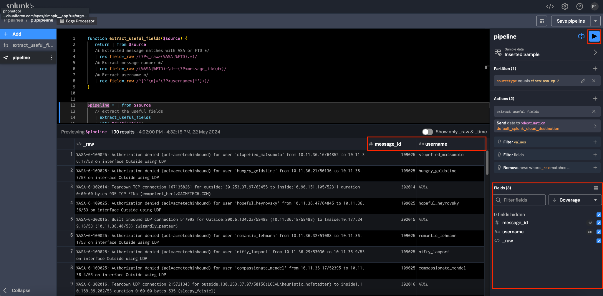

##  

## Filtering

- Next up, we are going to filter certain message IDs related to security that are noisy. Add the drop_security_noise SPL2 function to our editor, then pipe the parsed logs into our new function.

The new function to add in is:  
```
function drop_security_noise($source) { 
   return | from $source
   | where message_id != "302013"
   | where message_id != "302015"  
}
```

Update your previous pipeline SPL to:  
```
$pipeline = | from $source
   // extract the useful fields
   | extract_useful_fields
   // Filter "302013", "302015" message ID number
   | drop_security_noise
   | into $destination;
   ```
- Preview again and notice the 302013 and 302015 message IDs have been filtered.  
    
  

##  

## Masking

- When we send this data to the index, we’ve decided to mask the usernames to maintain compliance. Here’s the `mask_usernames` function to replace usernames found in _raw:

```
function mask_usernames($source) {
    return | from $source
    | eval _raw=if(isnull(username), _raw, replace(_raw, username, "[NAME_REDACTED]"))
}
```

Don’t forget to invoke `mask_usernames` in your pipeline:

```
$pipeline = | from $source
   // extract the useful fields
   | extract_useful_fields
   // Filter "302013", "302015" message ID number
   | drop_security_noise
   // Mask usernames to protect PII
   | mask_usernames
   | into $destination;
   ```

When previewing your results, you will see the username has been redacted in \_raw. Note that the username is still present in the username field.
    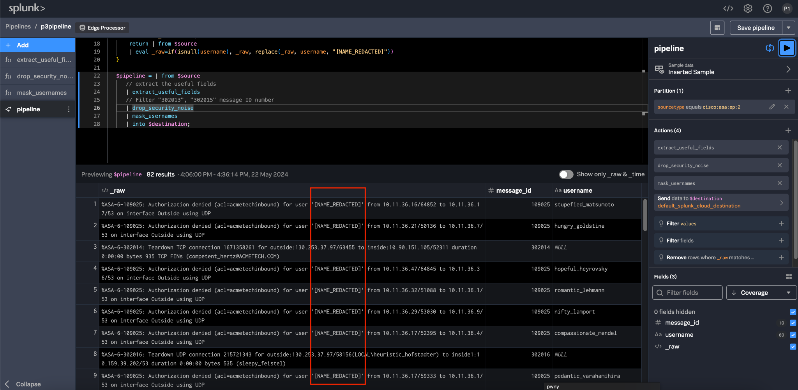

## Enrichment Via Lookup

- Next, we can enrich our log events by looking up the message ID with some explanations via a pre-uploaded lookup file.

For lookup import, everyone would have a different path. Your import path is `/envs.splunk.'[insert your demo tenant]'.lookups`

Tenant information can be found at your URL. For example, if your URL starts with `https://px.staging.scs.splunk.com/eps-shw-0899d525c30f3f/`, your tenant is `eps-shw-0899d525c30f3f`. Then your import path would be `/envs.splunk.'eps-shw-0899d525c30f3f'.lookups`

```
// import statement should be on the top of the file
import 'cisco_msg_id.csv' from /envs.splunk.'eps-shw-0899d525c30f3f'.lookups

function enrich_with_explanation($source) {
   return | from $source |
   lookup 'cisco_msg_id.csv' message_id AS message_id OUTPUT explanation AS explanation
}
```

Then, we can apply this function in our pipeline:
```
$pipeline = | from $source
  // extract the useful fields
  | extract_useful_fields
  // Filter "302013", "302015" message ID number
  | drop_security_noise
  // Mask usernames to protect PII
  | mask_usernames
  // enrich log events with explanations based on message ID
  | enrich_with_explanation
  | into $destination;
```

You will now see a new column with an explanation for each log event:
    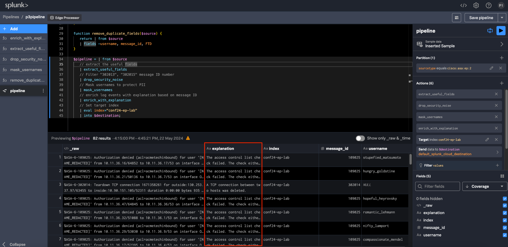

##  

## Drop Fields & Set Index

- Finally, we can remove the parsed fields as they are no longer needed, and we don’t want them sent to the indexer. Create the `remove_duplicate_fields` function:

```
function remove_duplicate_fields($source) {
   return | from $source
   | fields -username, message_id, FTD
}
```

Add the `remove_duplicate_fields` function to your pipeline definition and set the index to `dmx-ep-lab`.

```
$pipeline = | from $source
  // extract the useful fields
  | extract_useful_fields
  // Filter "302013", "302015" message ID number
  | drop_security_noise
  // Mask usernames to protect PII
  | mask_usernames
  // enrich log events with explanations based on message ID
  | enrich_with_explanation
  // Remove duplicate fields
  | remove_duplicate_fields
  // Set target index
  | eval index="dmx-ep-lab"
  | into $destination;
```

Preview now shows the results without these fields along with the index field set:
    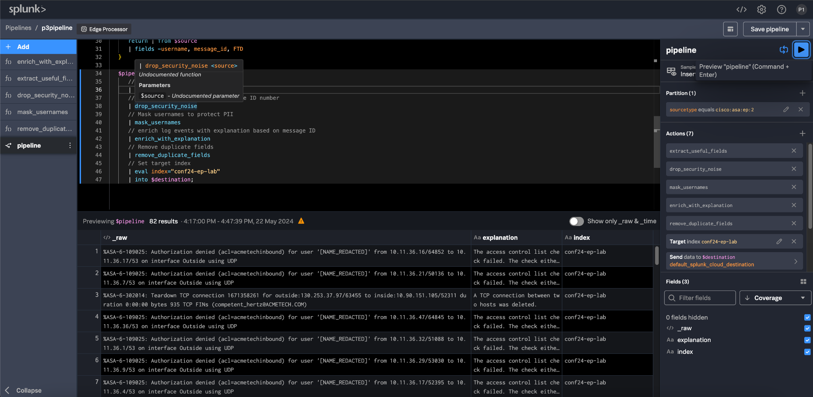

##  

## Apply the Pipeline to your Edge Processor

- Being satisfied with the results of our pipeline, we will now apply the pipeline. As we did previously, select the **Save pipeline** button on the top right.  
    
  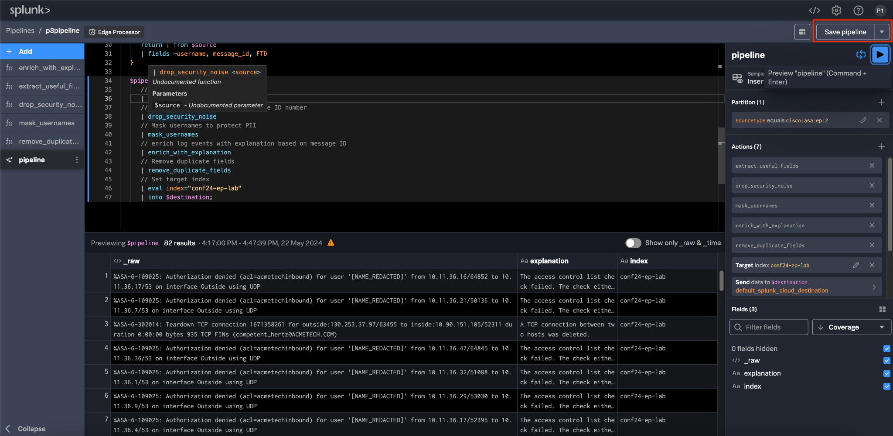

If prompted, select **Yes, apply** to apply the pipeline. If you are not prompted, the pipeline will be automatically applied on save.
    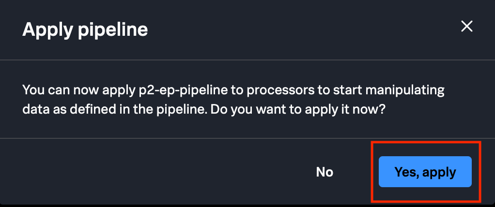
Search and select the edge processor instance that is assigned to you. Then press **Save**
    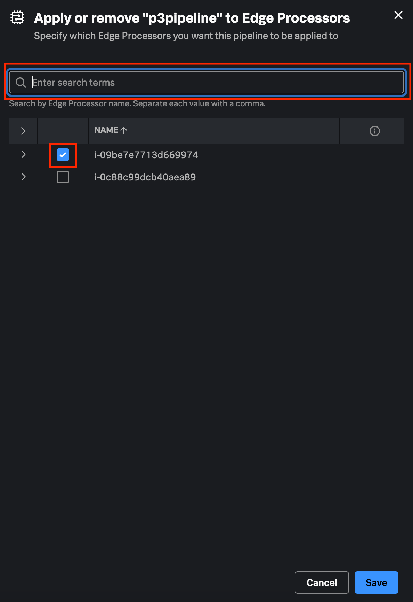

##  

## Verify Edge Processor is Receiving Data

- After applying your pipeline successfully, click the Splunk logo on the top left to navigate back to the home page. Then click **Edge Processors** on the left panel  
    
  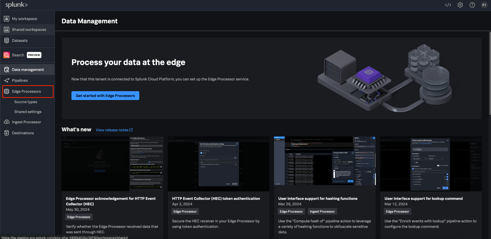

- Search for the instance that is assigned to you and double-click on it  
    
  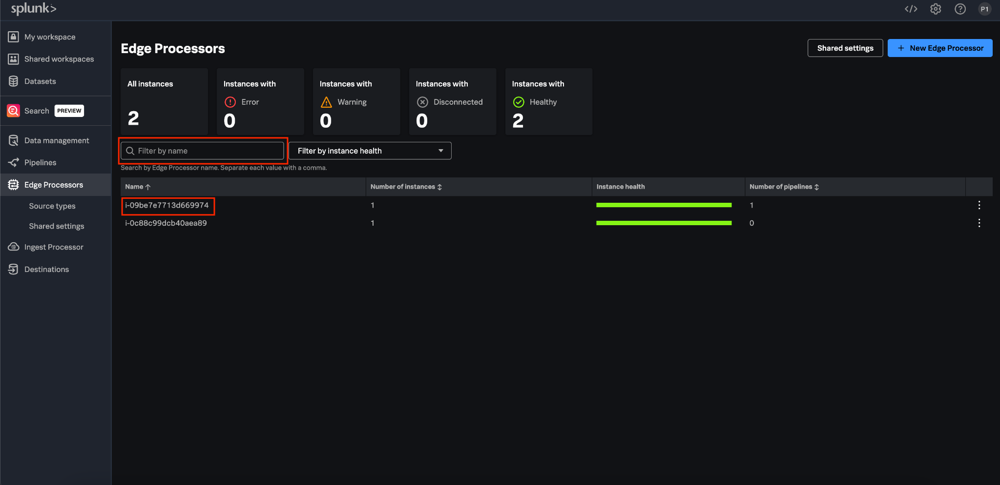

- Under the **Data sources** pane on the left side of the page, click on **Received data** and verify that your Edge Processor is receiving inbound **cisco:asa:ep:#** sourcetype data. You will notice multiple sourcetypes with a different suffix number. This is to allow each participant to experiment with their data without interfering with other participants.

> **Reminder**: if your **participant number** is **2**, please ensure your pipeline is set up to process data with sourcetype **cisco:asa:ep:2** in step 9.  
>   
> 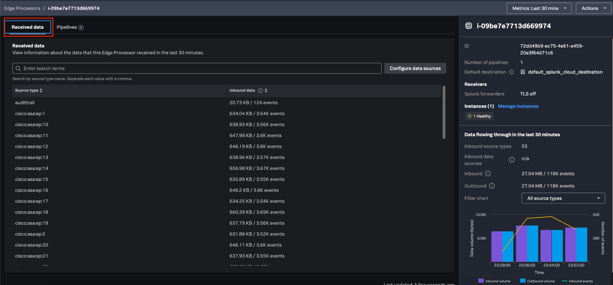

- In the pipelines panel, you should be able to see the pipeline you just applied to your Edge Processor.  
    
  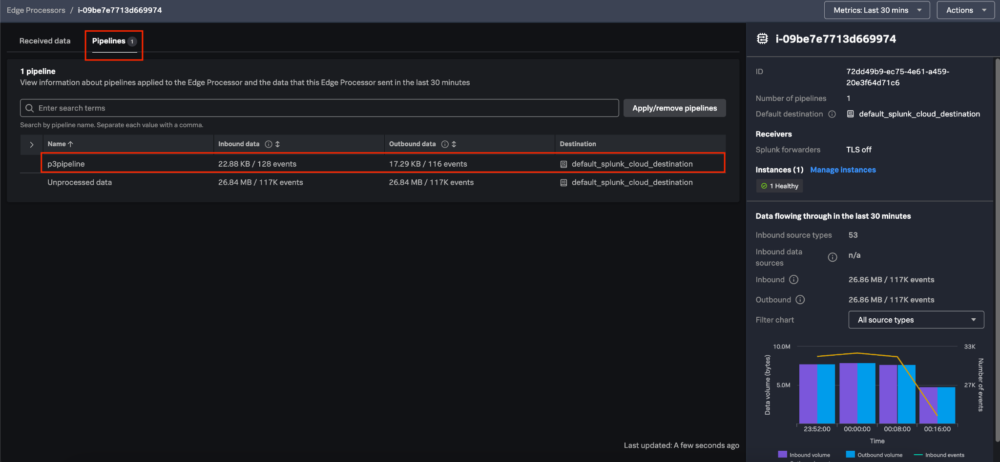

## Check Your Data in Splunk Cloud

- Log in to Splunk Cloud and open up the **Search & Reporting** app. Run the following search over the **last 15 minutes** and verify that you now see the redacted events:

> **Reminder**: Your sourcetype should be your participant number. For example, if your participant number is 2, your sourcetype is **cisco:asa:ep:2**
>
> **index=dmx-ep-lab sourcetype=cisco:asa:ep:#**


#
