## Description

In this lab, you will filter, mask, and route Cisco ASA logs using Ingest Processor. The transformation pipelines you write will execute immediately prior to indexing. You will implement the **[Base Use Case](../_index.md#base-use-cases)** described at the beginning of this guide. You will also implement a basic Logs To Metrics conversion and send metrics to [Splunk Observability](https://www.splunk.com/en_us/products/observability.html) (aka O11y).

## Access Your Ingest Processor Console

1.  Log into the Splunk Cloud Ingest Processor UI. Refer to [*Lab Connection Info*](../01-accessing-your-environment/_index.md#lab-connection-info) to find your login URL and credentials.


2.  On the welcome page, click on **Launch** under **Splunk Cloud Platform**.  
      
    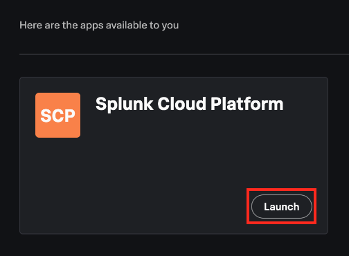

You will now be taken to the Ingest Processor management environment.

##  

## Create a Workspace

*Note: You can skip this step if you have already created this workspace in the past.*

3.  Enter the shared workspace by clicking on the Shared Workspaces button on the left side.  
      
    

4.  Create a new workspace for your participant. Name the workspace **participant#** **(REPLACE \# WITH YOUR PARTICIPANT NUMBER)**. Select the **Create** button.  
      
    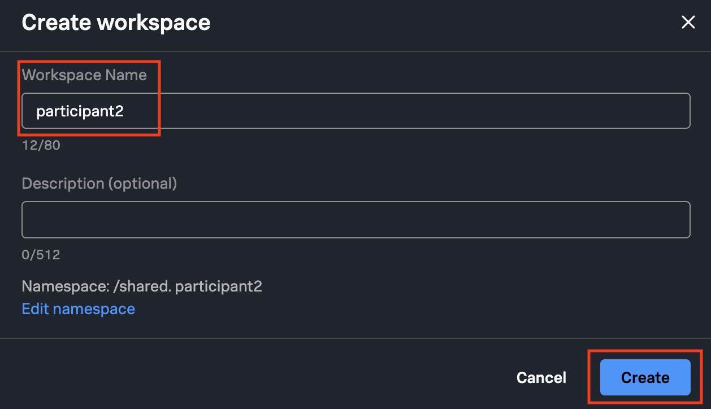

##  

## Create a Pipeline

5.  In your participant workspace, create a new IP pipeline by selecting **New → Ingest Processor Pipeline** in the upper right.  
      
    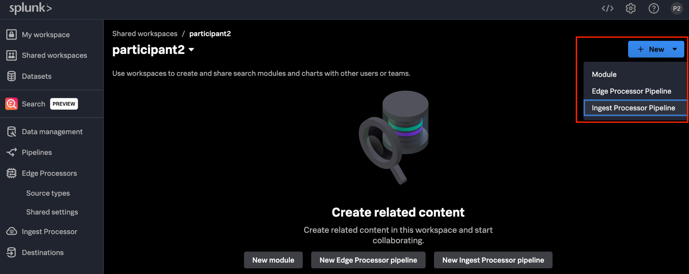

6.  On the Get Started screen, you can select from several templates, including Cisco ASA. For the purposes of this workshop, we will select the **Blank Pipeline** and choose **Next**.  
      
    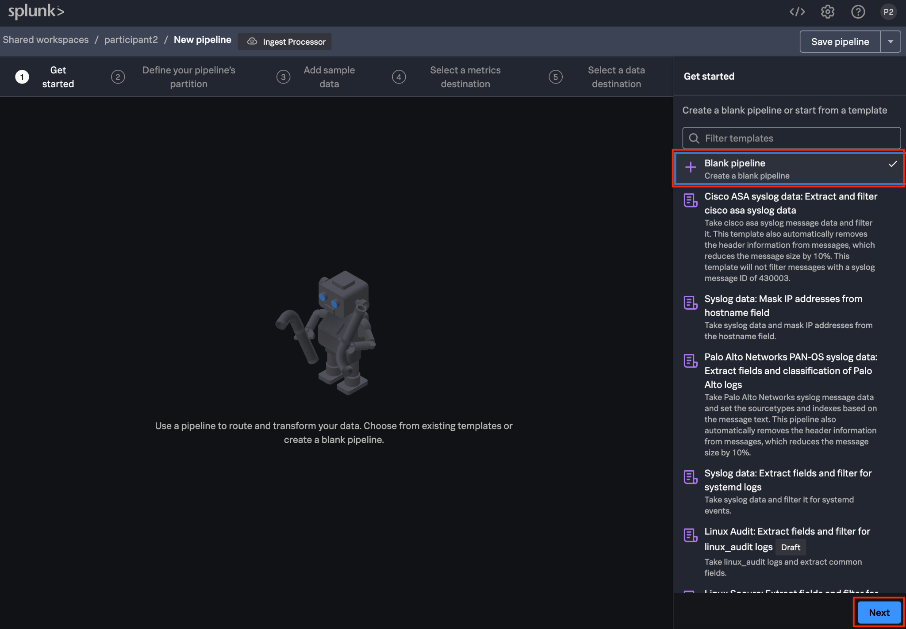

7.  The pipeline’s partition allows us to select which sourcetype is being ingested into Splunk Cloud that we want to process prior to indexing. Select **Partition by sourcetype** and enter the Cisco ASA sourcetype corresponding to your participant number. The format is **cisco:asa:ip:#**. **REPLACE \# WITH YOUR PARTICIPANT NUMBER.** Click **Apply**.  
      
    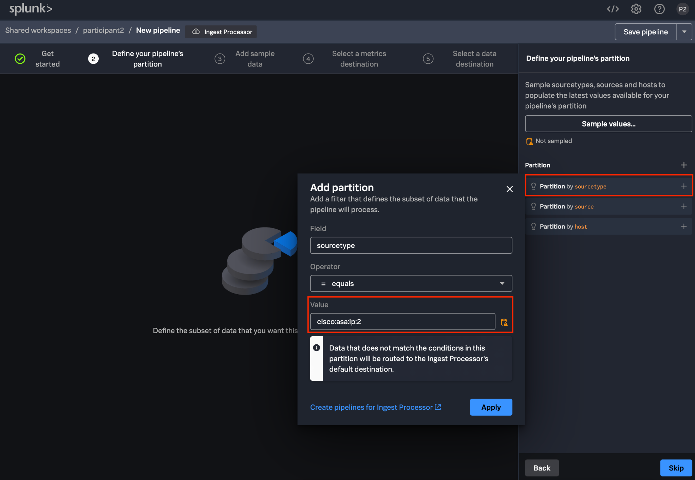

8.  Note the partition information now shows the entered sourcetype. Choose **Next**.  
    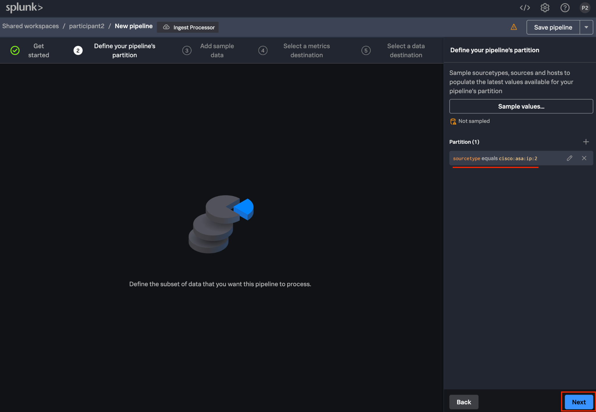

1.  Choose to add sample data **From snapshot**.
    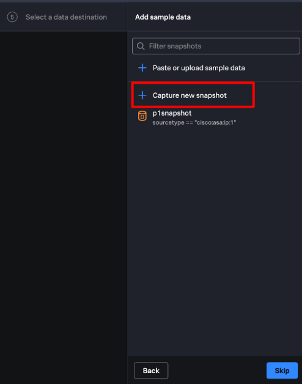

## Create a Preview Snapshot

10.  We will create a new snapshot from the data that is being ingested at this moment. Choose **Create new snapshot**, enter the snapshot name (such as **p#snapshot REPLACING \# WITH YOUR PARTICIPANT NUMBER**), and then initiate the snapshot process by selecting **Capture**. This will begin capturing up to 1000 events over the next 5 minutes. Note that our pipeline sourcetype is automatically populated.
    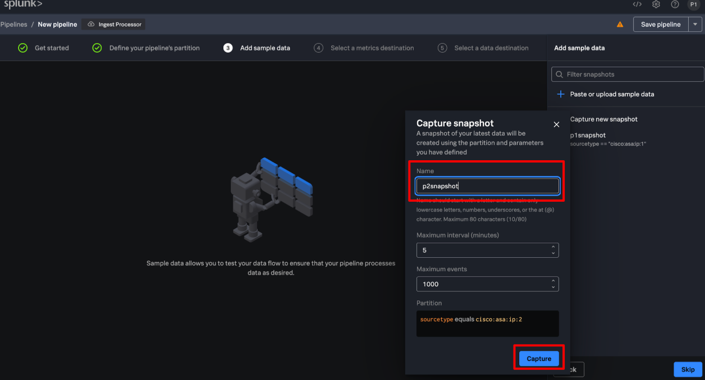

11. Select the newly created snapshot and choose **Next**.
    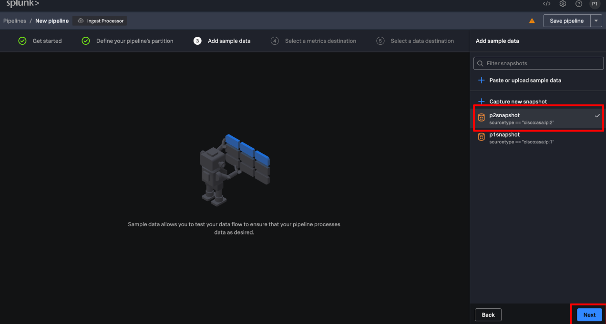

12. In this step, you are prompted for the default metrics destination. Choose the Splunk Show Splunk Observability destination that was automatically created for you, **show_o11y_org**. Then click **Next**.
    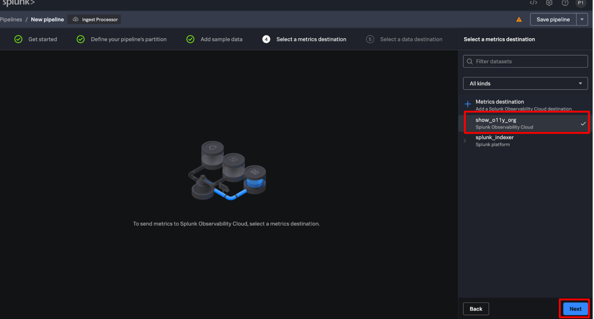

13. In this step, you are prompted to go to the default logs destination. Choose the Splunk indexer destination that was automatically created for you called **splunk_indexer**. Then click **Next**.
    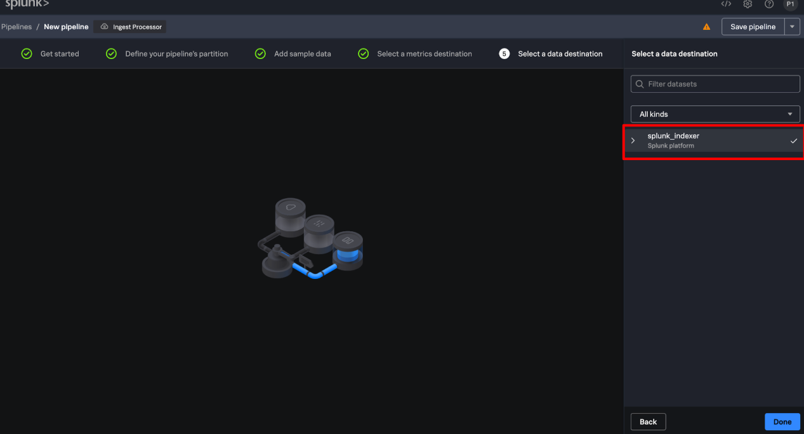

14. Leave the target index blank and select **Done**.
    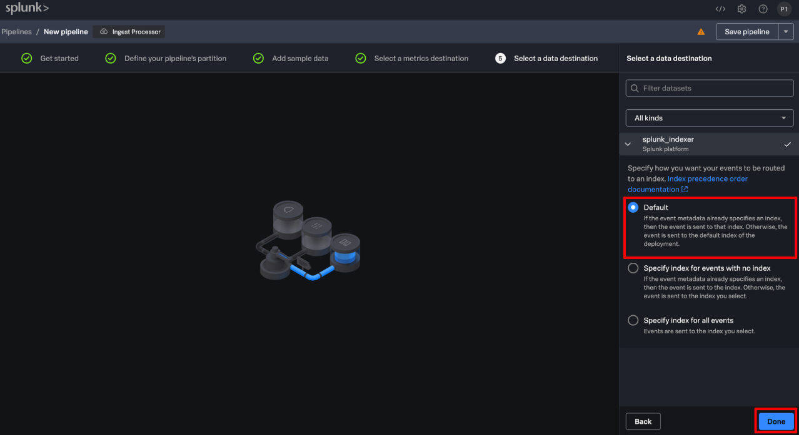

15. At this point, you will see the code editor experience, where you can write, edit, and test SPL2. This page should show a basic passthrough pipeline. Information about the pipeline is available on the right-hand side panel. The **Actions** section provides a UI-driven code editing experience with support for tasks like masking, filtering, selecting destinations, etc. To see the data that we captured in the snapshot in the previous steps, select the **play button** on the upper right.  
      
    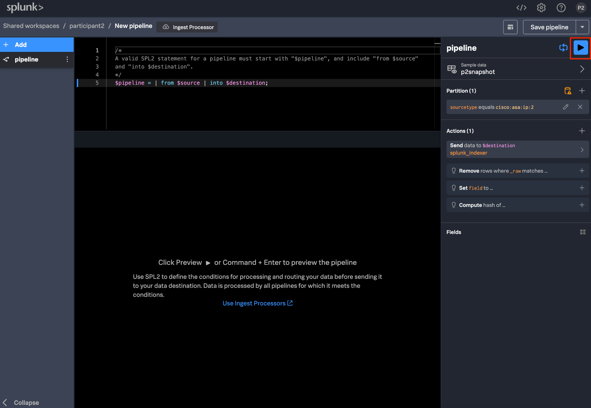

16. The snapshot data that has been captured so far is shown in the preview table below.  
    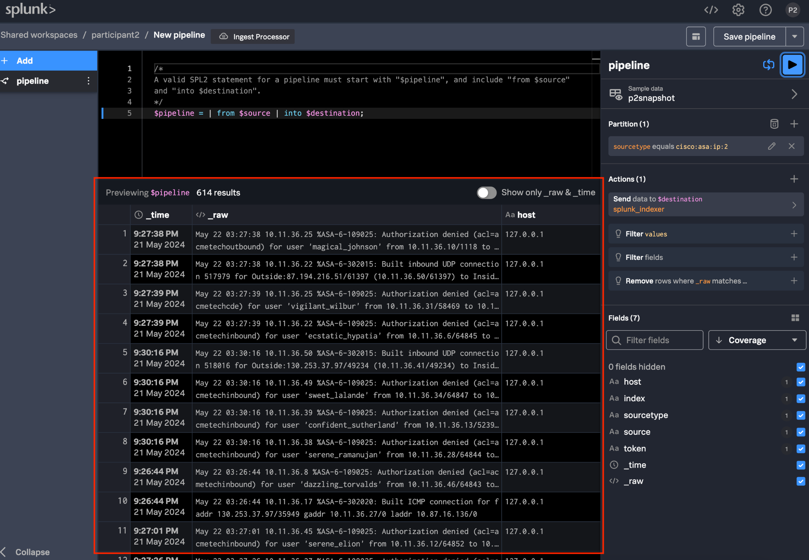

##  

## Save Your Pipeline Progress

17. We can inspect the data in the table to understand the fields and sample values that were captured during ingestion to Splunk Cloud. Note that these records shown in the preview are raw events that were also sent to the indexer. To save our progress thus far before we start editing the SPL2, choose the **Save Pipeline** button on the top right.  
      
    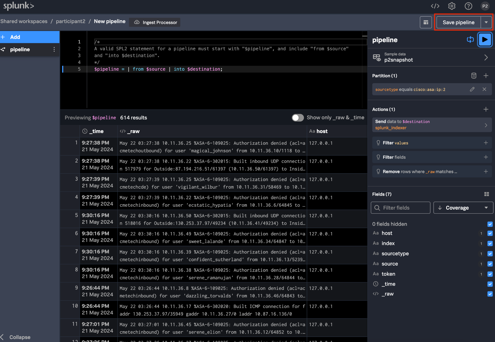

18. In the Save Pipeline modal that appears, name the pipeline **p#-ip-pipeline** **REPLACING \# WITH YOUR PARTICIPANT NUMBER** and select **Save**.  
      
    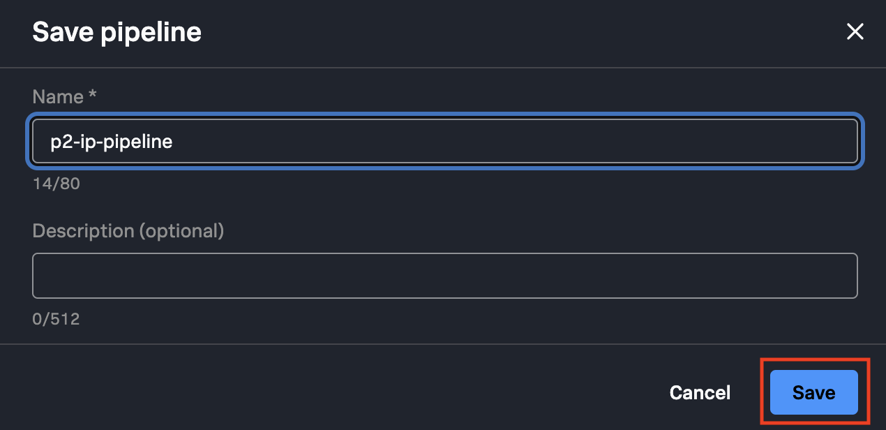

19. After saving, we will be prompted in another window to Apply the pipeline. The Apply step will push out the pipeline configuration and begin transforming the data according to the SPL2 we wrote. Since we haven’t written any SPL2 yet, we will select **No**.

> **Note:** If you accidentally selected Yes, don’t worry, we will overwrite the pipeline when we Apply our Cisco ASA SPL2 later.
> 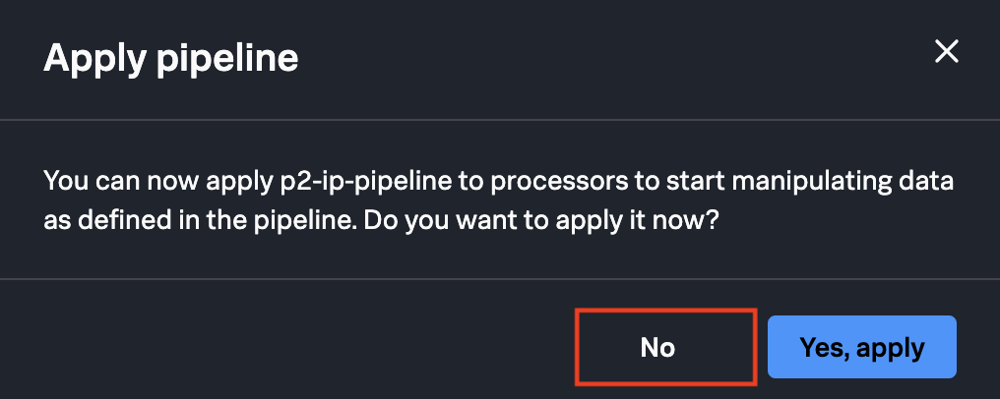

##  

## Author Your Pipeline

20. Now that we have our pipeline setup, we can start writing some SPL2! The first task will be to extract useful fields out of _raw. To do this, we will create an SPL2 function to extract the fields we care about. Copy/paste the following text into the SPL2 editor, replacing what was there before:

```
function extract_useful_fields($source) {
   return | from $source
   /* Extracted message matches with ASA or FTD */
   | rex field=_raw /(?P<_raw>(%ASA|%FTD).*)/
   /* Extract message number */
   | rex field=_raw /(%ASA|%FTD)-\d+-(?P<message_id>\d+)/
   /* Extract username */
   | rex field=_raw /^[^'\n]*'(?P<username>[^']+)/
}

$pipeline = | from $source
   // extract the useful fields
   | extract_useful_fields
   | into $destination;
```

The rex functions inside of extract_useful_fields will do the following:
- Ensure that all _raw fields start with either ASA or FTD
- Extract the message ID and store it in the message_id field
- Extract the username (if present) and store it in the username field


Pressing the preview “play” button again will show that the fields have been extracted. Note that sometimes the field list can get quite long, so we have unchecked several fields on the bottom right to reduce the size of the preview results table. You can also rearrange the columns however you want.
    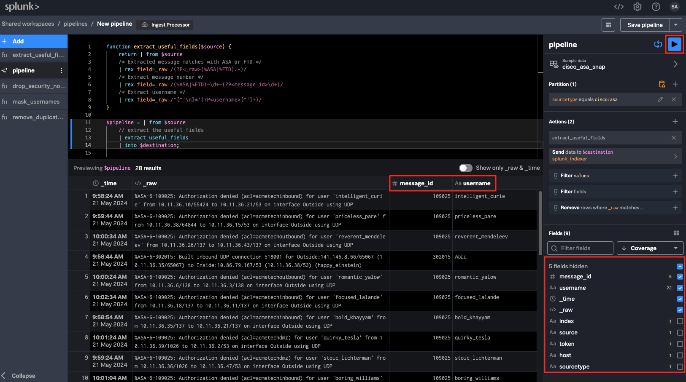

##  

## Filtering

21. Next, we are going to filter certain message IDs related to security that are noisy. Add the `drop_security_noise` SPL2 function to our editor, then pipe the parsed logs into our new function. The complete SPL2 now looks like:

```
function extract_useful_fields($source) {
   return | from $source
   /* Extracted message matches with ASA or FTD */
   | rex field=_raw /(?P<_raw>(%ASA|%FTD).*)/
   /* Extract message number */
   | rex field=_raw /(%ASA|%FTD)-\d+-(?P<message_id>\d+)/
   /* Extract username */
   | rex field=_raw /^[^'\n]*'(?P<username>[^']+)/
}


function drop_security_noise($source) {
   return | from $source
   | where message_id != "302013"
   | where message_id != "302015"
}


$pipeline = | from $source
   // extract the useful fields
   | extract_useful_fields
   // Filter "302013", "302015" message ID number
   | drop_security_noise
   | into $destination;
```

Preview again and notice the `302013` and `302015` message IDs have been filtered.
    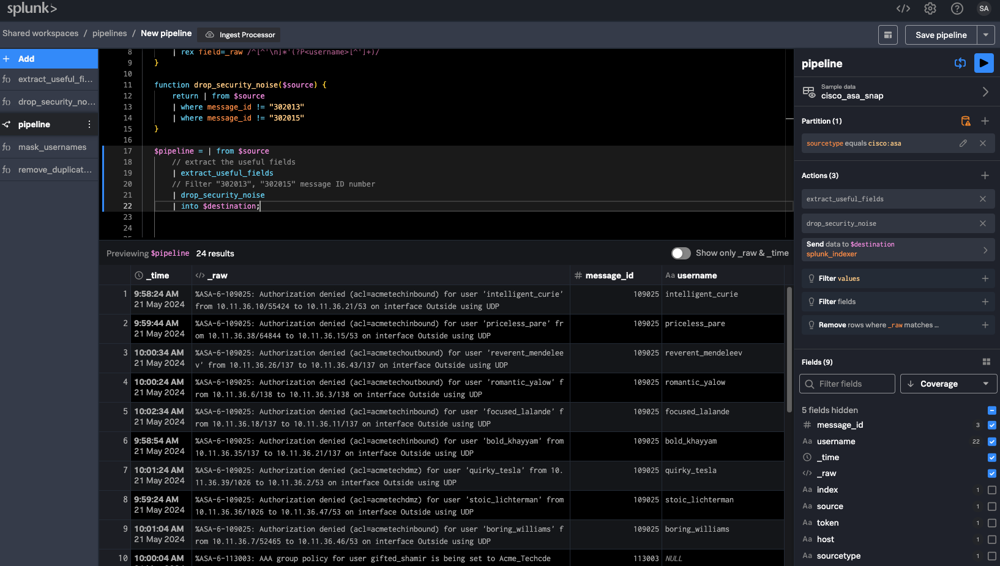

##  

## Masking

22. When we send this data to the index, we’ve decided to mask the usernames to maintain compliance. Here’s the `mask_usernames` function to replace usernames found in _raw:

```
function mask_usernames($source) {
   return | from $source
   | eval _raw=replace(_raw, username, "[NAME_REDACTED]")
}
```

Don’t forget to invoke `mask_usernames` in your pipeline:

```
$pipeline = | from $source
   // extract the useful fields
   | extract_useful_fields
   // Filter "302013", "302015" message ID number
   | drop_security_noise
   // Mask usernames to protect PII
   | mask_usernames
   | into $destination;
```
 
When previewing your results, you will see the username has been redacted in _raw. Note that the username is still present in the username field.
    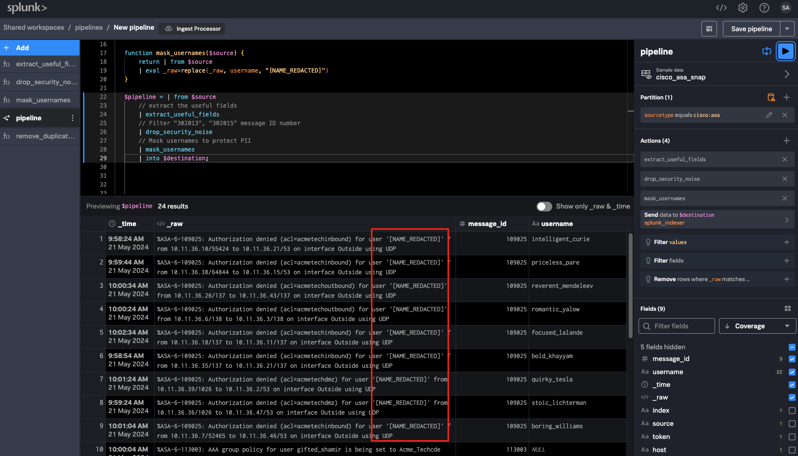

## Drop Fields & Set Index

23. Finally, we can remove the parsed fields as they are no longer needed, and we don’t want them sent to the indexer. Create the `remove_duplicate_fields` function:

```
function remove_duplicate_fields($source) {
   return | from $source
   | fields -username, message_id, FTD
}
```

Add the `remove_duplicate_fields` function to your pipeline definition and set the index to `dmx-ip-lab`.

```
$pipeline = | from $source
   // extract the useful fields
   | extract_useful_fields
   // Filter "302013", "302015" message ID number
   | drop_security_noise
   // Mask usernames to protect PII
   | mask_usernames
   // Remove duplicate fields
   | remove_duplicate_fields
   | eval index="dmx-ip-lab"
   | into $destination;
```

Preview now shows the results without these fields:
    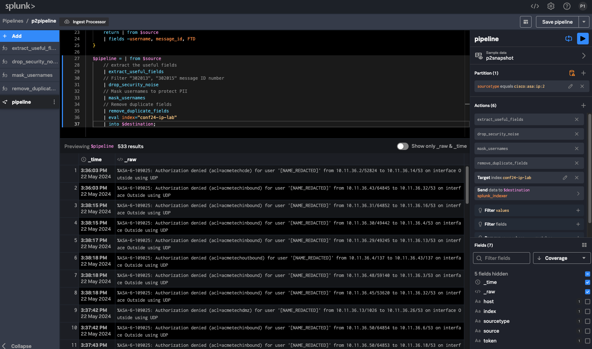

##  

## Apply Your Pipeline

24. We are satisfied with the results of our pipeline, so we will now apply it. Select the Save pipeline button at the top right.  
      
    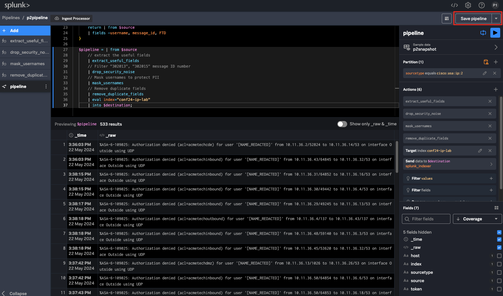

If prompted, select **Yes, apply** to apply the pipeline. If you are not prompted, the pipeline will be automatically applied on save.
    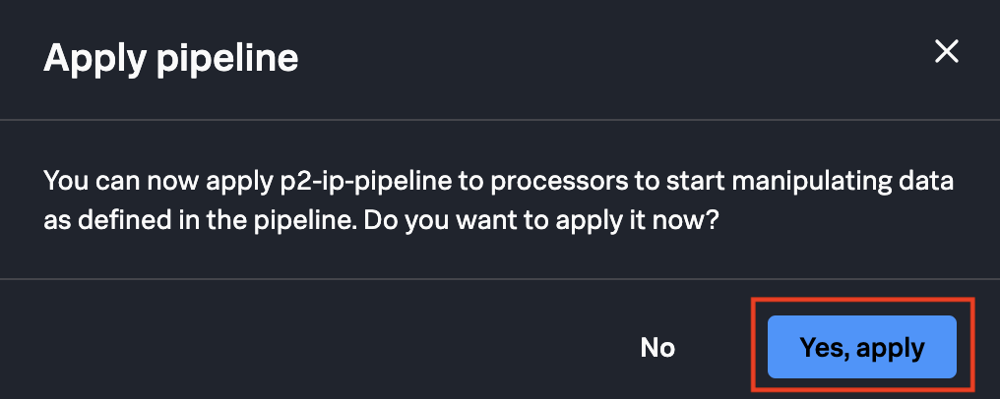

##  

## Check Your Data in Splunk Cloud

25. Log in to Splunk Cloud and open up the Search & Reporting app. Run the following search over the last 15 minutes and verify that you now see the redacted events:

`index=dmx-ip-lab sourcetype=cisco:asa:ip:#`
**(REPLACING \# WITH YOUR PARTICIPANT NUMBER)**

## Convert Logs To Metrics

We can instrument our incoming Cisco ASA log data using IP’s capability to convert logs to metrics and send them to Splunk Observability (o11y). To illustrate this capability, we will create a counter metric that increments by one each time we see a Cisco ASA log. We will also set message_id as a dimension, allowing us to compare message counts by ID. The metrics will be available in the Splunk Observability UI.

In the SPL2 code editor, at the top of the file, add the logs_to_metrics import statement:

`import logs_to_metrics from /splunk.ingest.commands`

Replace the definition of $pipeline with one that contains a thru command:

```
$pipeline = | from $source
   // extract the useful fields
   | extract_useful_fields
   // Filter "302013", "302015" message ID number
   | drop_security_noise
   // Mask usernames to protect PII
   | mask_usernames
   | thru [
       | logs_to_metrics time=_time name="cisco_asa" value=1 metrictype="counter" dimensions={"message_id": message_id}
       | into $metrics_destination
   ]
   // Remove duplicate fields
   | remove_duplicate_fields
   | eval index="dmx-ip-lab"
   | into $destination;
```

The `thru` command creates a branch where each path gets a copy of the data, similar to the Unix “tee” command. In this way we are able to continue sending data to the Splunk indexer while also sending a copy of all events down the logs_to_metrics path.

27. Several new actions are available in the right-hand panel. Choose the “Edit” icon on the “Generate metrics cisco_asa” to see a UI-driven metricization experience, including a preview of the metrics.  
      
    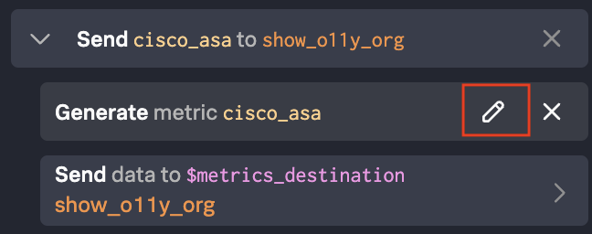

> You will see a screen similar to this:
>
> 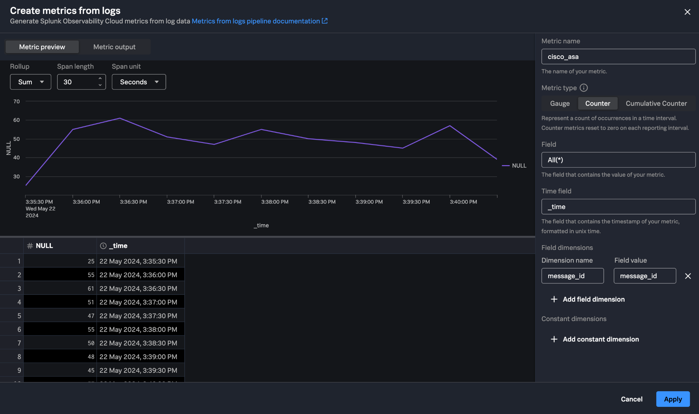
>
> Choose cancel to exit out of this screen.

28. Because we selected show_o11y_org as our default metrics destination when we created this pipeline, **it should automatically be selected for you**. However if no metrics destination is selected, you can click on **Send data to \$metrics_destination** and choose the o11y destination if necessary.

> 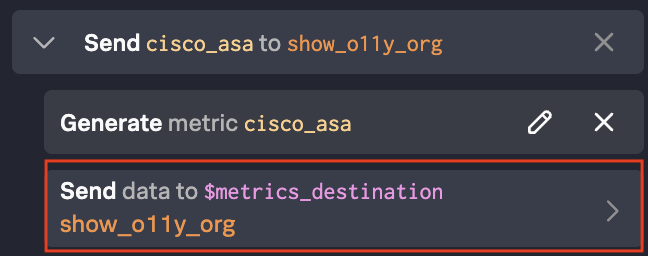

29. Save and apply your pipeline. IP will now send metrics to Splunk Observability while continuing to send logs to the Splunk Indexer.

##  

## Check Your Data in Splunk Observability

30. Log into *[Splunk Observability Cloud](https://app.us1.signalfx.com/#/chart/v2/new?template=default&filters=sf_metric:cisco_asa&orgID=GOH6EzYA4AQ)* with the username and password provided in [*Lab Connection Info*](../01-accessing-your-environment/_index.md#lab-connection-info) from your workshop runner (or your trial org if you've set that up as a destination in Ingest Processor). If you open the link and only see a white or black screen, please log out of your existing Splunk Observability (SignalFx) account prior to proceeding (choose Settings -\> Sign Out).

> 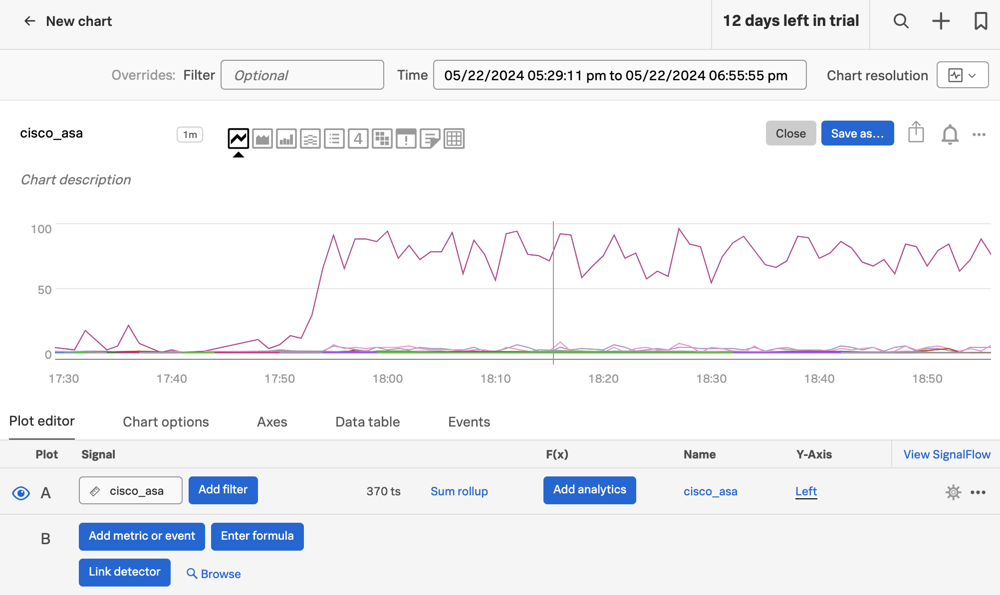
>
> You will be taken immediately to the Metric Finder, which displays the metric values for the cisco_asa metric from the last 15 minutes. Metrics from other participants will also be present in this chart. Use the filtering functionality shown below to filter metrics to those sent by your IP pipeline only.
>
> To filter by sourcetype, select Add filter → com.splunk.sourcetype → cisco:asa:ip:#.
>
> 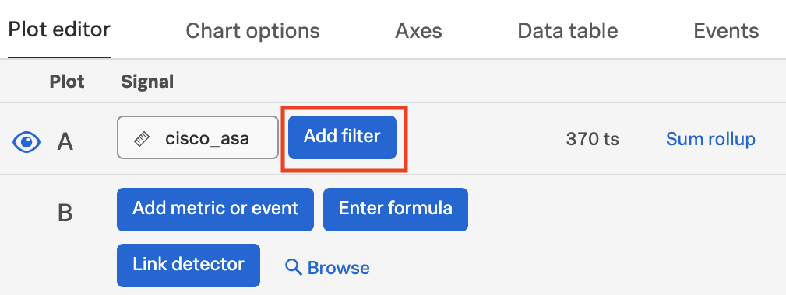
>
> Then choose com.splunk.sourcetype.
>
> 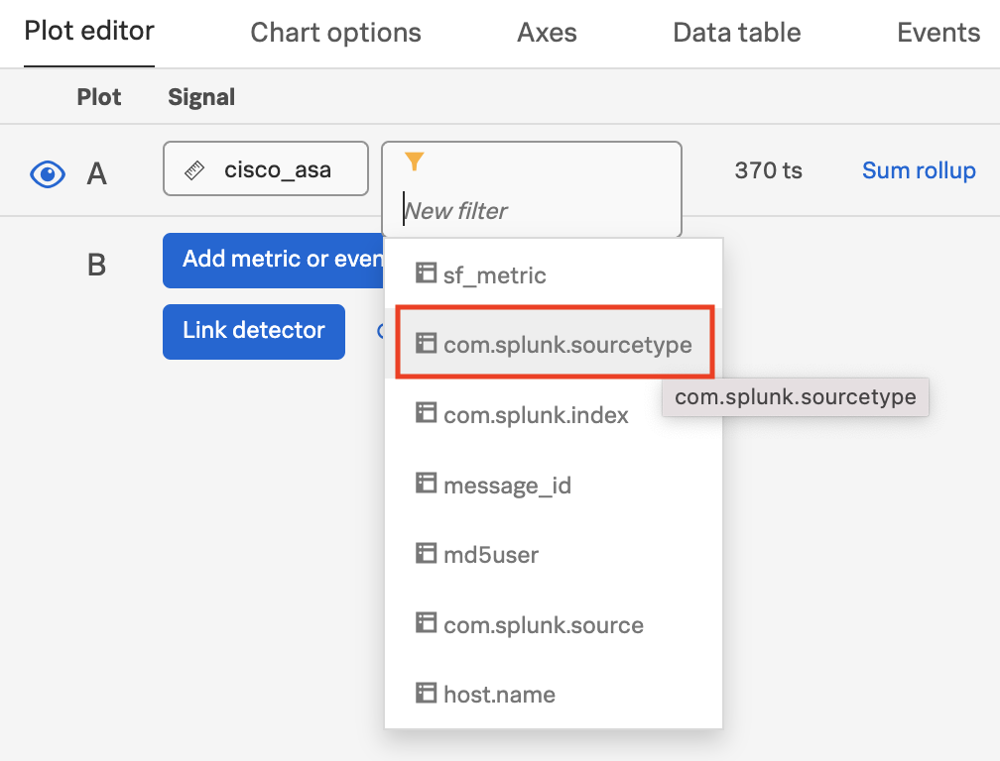
>
> And select the sourcetype corresponding to your participant ID.
>
> 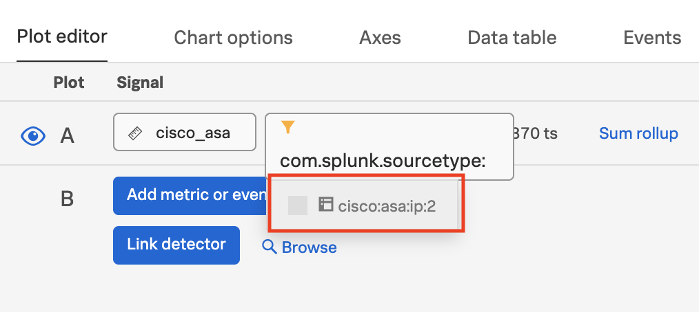
>
> Once selected, you will see the new filter applied to the metric.
>
> 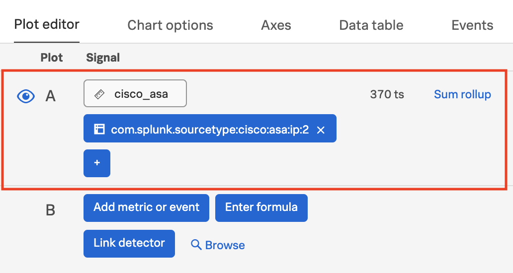
>
> Once your participant sourcetype has been filtered, you can confirm that Splunk o11y is receiving your metrics.


#
