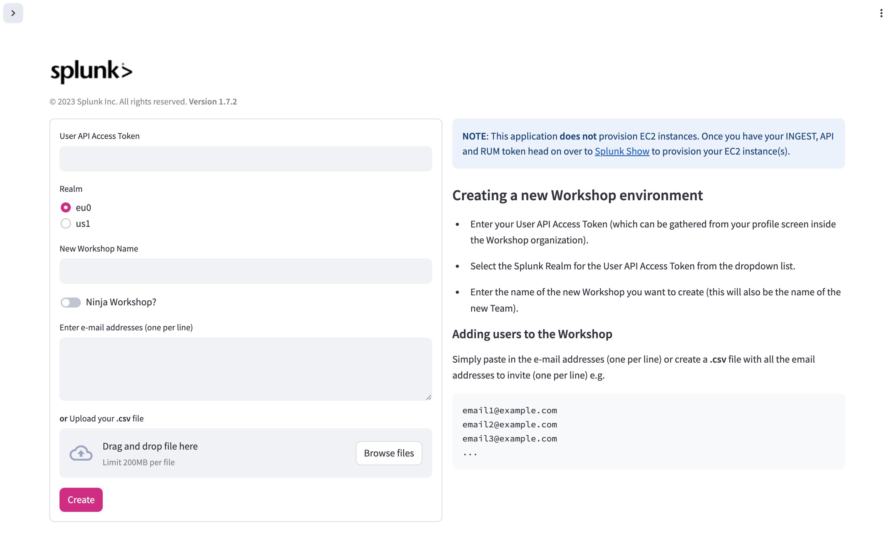

## **Configure your Org using SWiPE**

> [!IMPORTANT] Important
> **SWiPE** does **not** provision EC2 instances. These instances are provisioned separately using **Splunk Show**.

**SWiPE** is an online tool designed to help you configure a workshop environment in Splunk Observability Cloud. You can access **SWiPE** [**here**](https://swipe.splunk.show).

**SWiPE** will perform the following tasks your workshop environment:



- Upload a `.csv` file containing the email addresses (one per line), **or** copy and paste the email addresses directly (one per line).
- **NOTE:** Users will immediately be sent an email invitation to join the organization.





- If the **Ninja Workshop** option is enabled, all users will be provisioned with **Admin** access control.





- If **Override HEC URL and Token** is enabled, you can configure a custom HTTP Event Collector (HEC) URL and token. This overrides the default values used for sending logs to Splunk Cloud.





- **SWiPE** will create a team and automatically add all the users.





- **SWiPE** will create a unique **SWiPE ID** for your workshop. You will need to copy this ID and use it when provisioning workshop instances in [**Splunk Show**](https://show.splunk.com/home/).



> [!WARNING] Workshops with more than 40 users
> If your workshop has more than **40 users**, we recommend informing the support team in advance. This ensures that the trial or workshop environment is properly scaled to handle the load.
