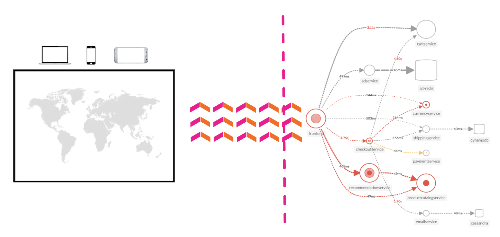

Splunk APM は、クラウドネイティブなマイクロサービスベースのアプリケーション向けの NoSample™ で 完全忠実なアプリケーションパフォーマンスモニタリングおよびトラブルシューティングソリューションです。

サンプリングされた部分的な情報ではなく、すべてのトレースを収集することで、異常が検出されないことはありません。ユーザーがエラーを経験しても、通常より長いレイテンシーを経験しても、数秒以内にそれを知り、対処することができます。ときに、悪い動作がエラーとして扱われないこともあります。開発者が新しいアプリケーションを作成する際には、そのカナリアリリースが期待通りの結果をもたらすかどうかを知る必要があります。すべてのトレースデータを収集して、初めて、クラウドネイティブアプリケーションが想定通り動作していることを確信できるようになります。

インフラとアプリケーションのパフォーマンスは相互に依存しています。全体像を把握するために、Splunk APM はクラウドのインフラとその上で動作するマイクロサービスをシームレスに相関付けます。メモリリーク、ノイズの多い隣のコンテナ、その他のインフラ関連の問題が原因でアプリケーションが動作した場合、Splunk がすぐに知らせてくれます。さらに、Splunk のログやイベントにインコンテキストでアクセスすることで、より詳細なトラブルシューティングや根本原因の分析が可能になります。

