* Online BoutiqueアプリケーションをKubernetes(K3s)にデプロイします
* アプリケーションが動作していることを確認します
* Locustを使って人工的なトラフィックを生成します
* UI で APM のメトリクスを見ましょう

---

## 1. Online Boutiqueをデプロイする

Online BoutiqueアプリケーションをK3sにデプロイするには、以下のデプロイメントを適用します。


  
    cd ~/workshop
    kubectl apply -f apm/microservices-demo/k8s/deployment.yam
  
  
    deployment.apps/checkoutservice created
    service/checkoutservice created
    deployment.apps/redis-cart created
    service/redis-cart created
    deployment.apps/productcatalogservice created
    service/productcatalogservice created
    deployment.apps/loadgenerator created
    service/loadgenerator created
    deployment.apps/frontend created
    service/frontend created
    service/frontend-external created
    deployment.apps/paymentservice created
    service/paymentservice created
    deployment.apps/emailservice created
    service/emailservice created
    deployment.apps/adservice created
    service/adservice created
    deployment.apps/cartservice created
    service/cartservice created
    deployment.apps/recommendationservice created
    service/recommendationservice created
    deployment.apps/shippingservice created
    service/shippingservice created
    deployment.apps/currencyservice created
    service/currencyservice created
  


Online Boutique アプリケーションが起動していることを確認するには:


  
    kubectl get pods
  
  
    NAME                                                          READY   STATUS    RESTARTS   AGE
    splunk-otel-collector-k8s-cluster-receiver-56585564cc-xclzj   1/1     Running   0          84s
    splunk-otel-collector-agent-hkshj                             1/1     Running   0          84s
    svclb-frontend-external-c74n6                                 1/1     Running   0          53s
    currencyservice-747b74467f-xxrl9                              1/1     Running   0          52s
    redis-cart-74594bd569-2jb6c                                   1/1     Running   0          54s
    adservice-6fb948b8c6-2xlrc                                    0/1     Running   0          53s
    recommendationservice-b5df8776c-sbt4h                         1/1     Running   0          53s
    shippingservice-6d6f7b8d87-5lg9g                              1/1     Running   0          53s
    svclb-loadgenerator-jxwct                                     1/1     Running   0          53s
    emailservice-9dd74d87c-wjdqr                                  1/1     Running   0          53s
    checkoutservice-8bcd56b46-bfj7d                               1/1     Running   0          54s
    productcatalogservice-796cdcc5f5-vhspz                        1/1     Running   0          53s
    paymentservice-6c875bf647-dklzb                               1/1     Running   0          53s
    frontend-b8f747b87-4tkxn                                      1/1     Running   0          53s
    cartservice-59d5979db7-bqf64                                  1/1     Running   1          53s
    loadgenerator-57c8b84966-7nr4f                                1/1     Running   3          53s
  


{}
Usually it should only take around 1min 30secs for the pods to transition into a Running state.
{}

---

## 3. UIで検証する

左上のハンバーガーメニューから、**Infrastructure → Kubernetes** をクリックします。

**Cluster**のドロップダウンを使用してクラスタを選択すると、新しいポッドが開始され、コンテナがデプロイされていることが確認できます。

Splunk UI で Cluster をクリックすると、次のような画面が表示されているはずです。

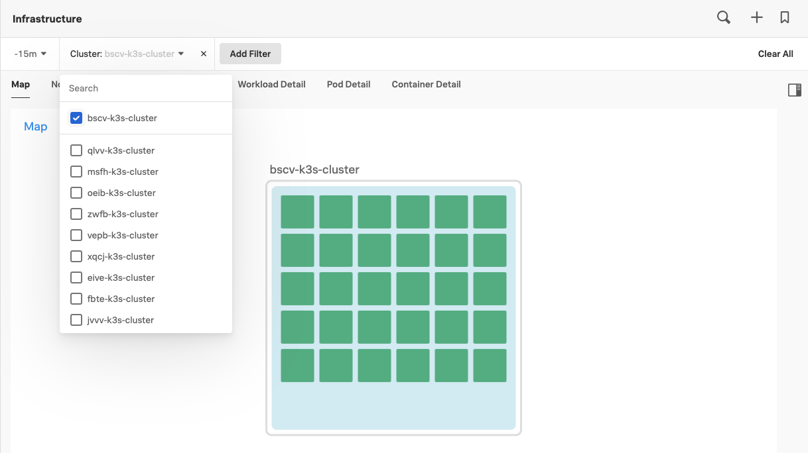

もう一度 **WORKLOADS** タブを選択すると、いくつかのデプロイメントとレプリカセットがあることがわかるはずです。

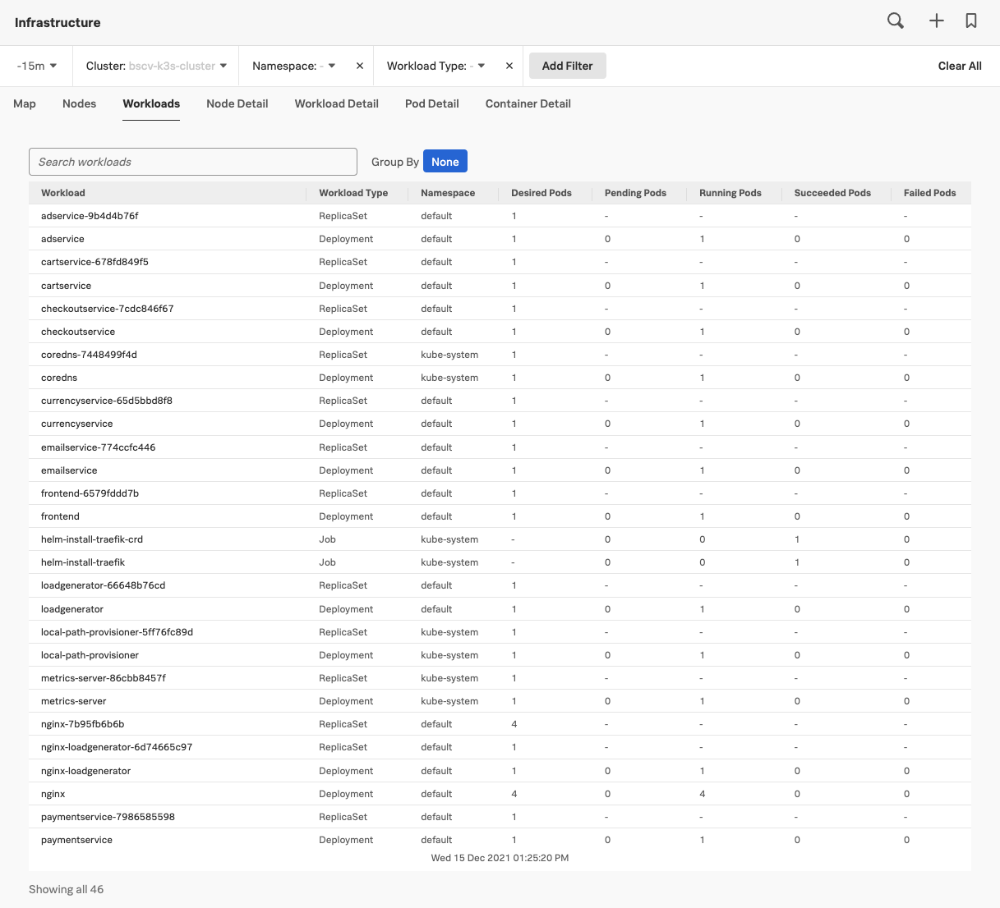

---

## 4. Online Boutique を閲覧する

Online Boutique は、EC2インスタンスのIPアドレスの81番ポートで閲覧できます。このIPアドレスは、ワークショップの冒頭でインスタンスにSSH接続したときに使用したものと同じIPアドレスです。

ウェブブラウザを開き、 `http://{==EC2-IP==}:81/` にアクセスすると、Online Boutique が起動しているのが確認できます。

---

## 5. 負荷をかける

Online Boutique のデプロイメントには、Locust が動作するコンテナが含まれており、これを使用してウェブサイトに対する負荷トラフィックを生成し、メトリクス、トレース、スパンを生成することができます。

Locust は、EC2インスタンスのIPアドレスの82番ポートで利用できます。ウェブブラウザで新しいタブを開き、 `http://{==EC2-IP==}:82/` にアクセスすると、Locust が動作しているのが確認できます。

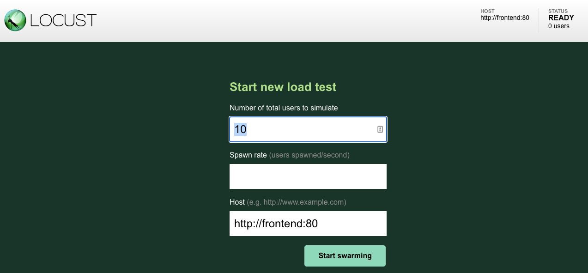

**Spawn rate** を 2 に設定し、**Start Swarming** をクリックすると、アプリケーションに緩やかな負荷がかかり続けます。

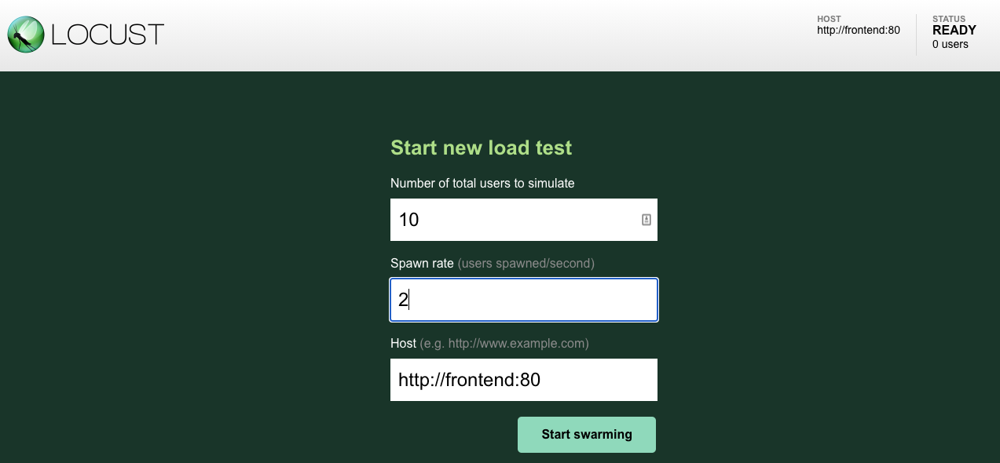

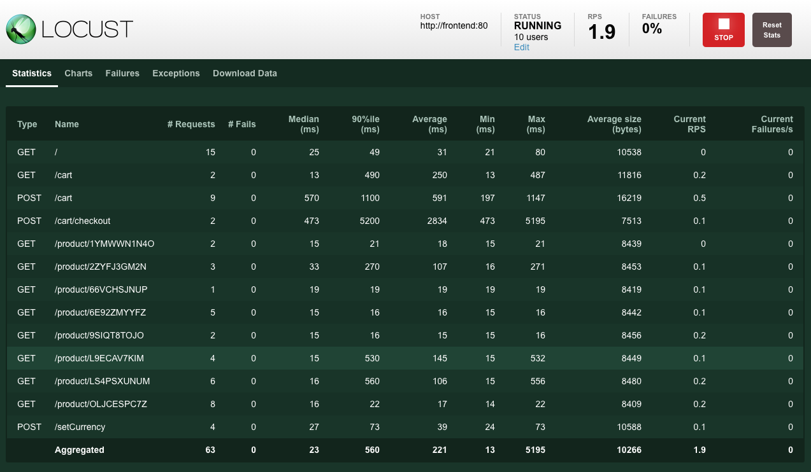

---

それでは、**Dashboards → APM Services → Service** を開きましょう。

このためには、アプリケーションの Environment 名を知る必要があります。このワークショップでは、`{==hostname==}-apm-env` のような Environment 名で定義されています。

ホスト名を調べるには、AWS/EC2インスタンス上で以下のコマンドを実行します:


  
    echo $(hostname)-apm-env
  
  
    bdzx-apm-env
  


前のステップで見つけた Environment を選択し、「frontend」サービスを選択し、時間を「Past 15 minutes」に設定します。

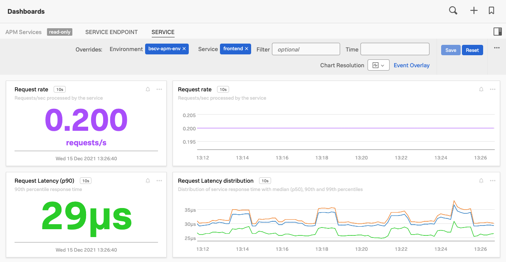

この自動生成されたダッシュボードでは、RED (Rate, Error & Duration) メトリクスを使用して、サービスの状態を監視することができます。このダッシュボードでは、パフォーマンスに関連したさまざまなチャートのほか、基盤となるホストやKubernetesポッド（該当する場合）の相関情報も提供されます。

ダッシュボードの様々なチャートを見てみましょう。

---

## 6. Splunk APM のメトリクスを確認する

左上のハンバーガーメニューから「APM」をクリックすると、APM Overview ダッシュボードが表示されます。

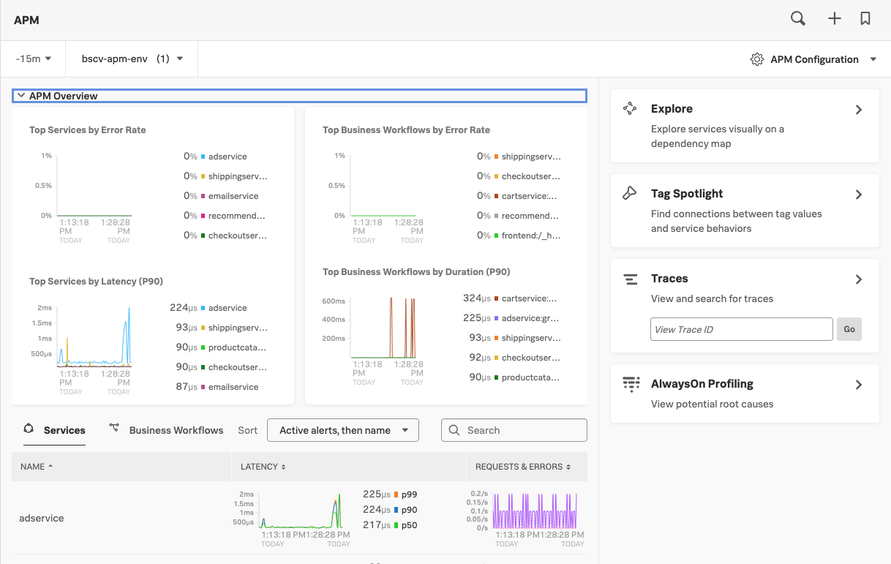

右側の **Explore** を選択し、先ほど見つけた Environment を選択し、時間を15分に設定します。これにより、自動的に生成されたOnline BoutiqueアプリケーションのDependency/Service Mapが表示されます。

以下のスクリーンショットのように表示されます:

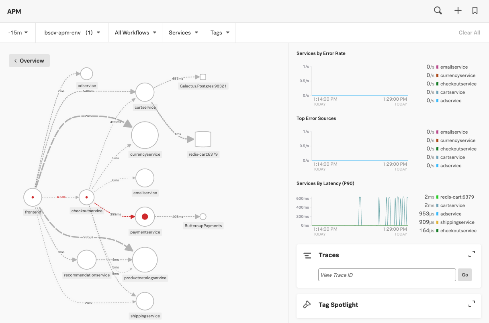

ページの下部にある凡例では、依存関係/サービスマップでの表記について説明しています。

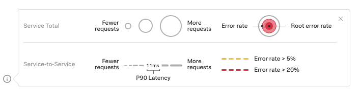{: : .shadow .zoom}

* サービスリクエスト、エラーレート、ルートエラーレート。
* リクエストレート、レイテンシー、エラーレート

また、このビューでは、全体的なエラー率とレイテンシー率のタイムチャートを見ることができます。

## 7. OpenTelemetry ダッシュボード

Open Telemetery Collector がデプロイされると、プラットフォームは自動的に OpenTelemetry Collector のメトリクスを表示するダッシュボードを作成します。

左上のハンバーガーメニューから、 **Dashboards → OpenTelemetry Collector** を選択し、メトリクスとスパンが送信されていることを確認しましょう。

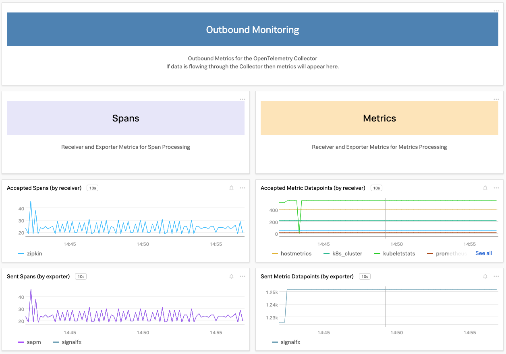

## 8. OpenTelemetry zpages

送信されたトレースをデバッグするには、zpages 拡張機能を使用できます。[zpages][zpages] は OpenTelemetry Collector の一種で、トラブルシューティングや統計用のライブデータを提供します。これらは、EC2インスタンスのIPアドレスのポート `55679` で利用できます。Webブラウザで新しいタブを開き、 `http://{==EC2-IP==}:55679/debug/tracez` と入力すると、zpages の出力を見ることができます。

[zpages]: https://github.com/open-telemetry/opentelemetry-specification/blob/main/experimental/trace/zpages.md#tracez

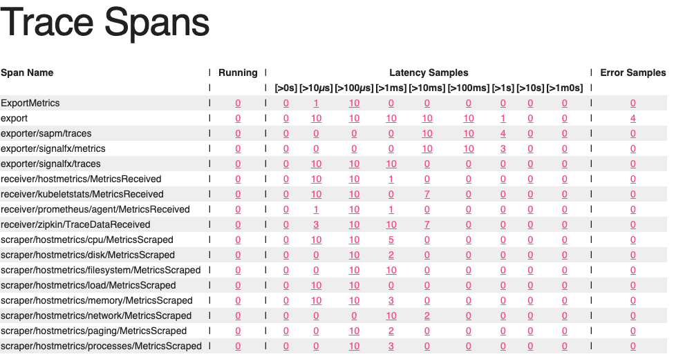

また、シェルプロンプトから、テキストベースのブラウザを実行することもできます。


  
    lynx http://localhost:55679/debug/tracez
  

