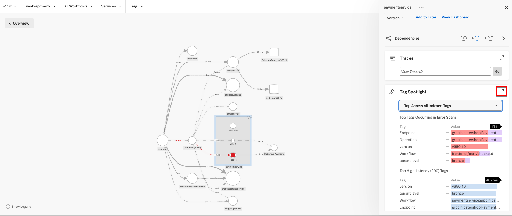
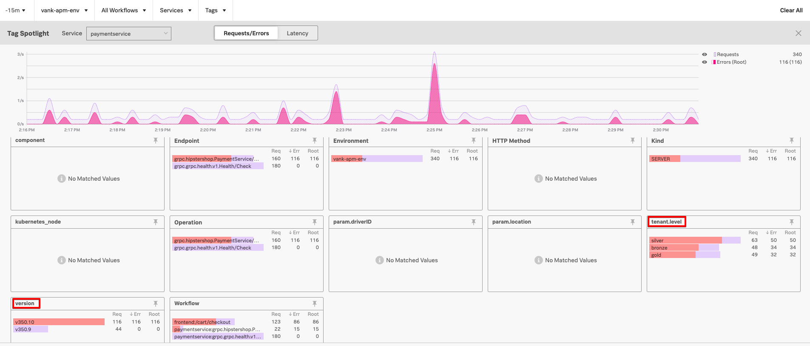
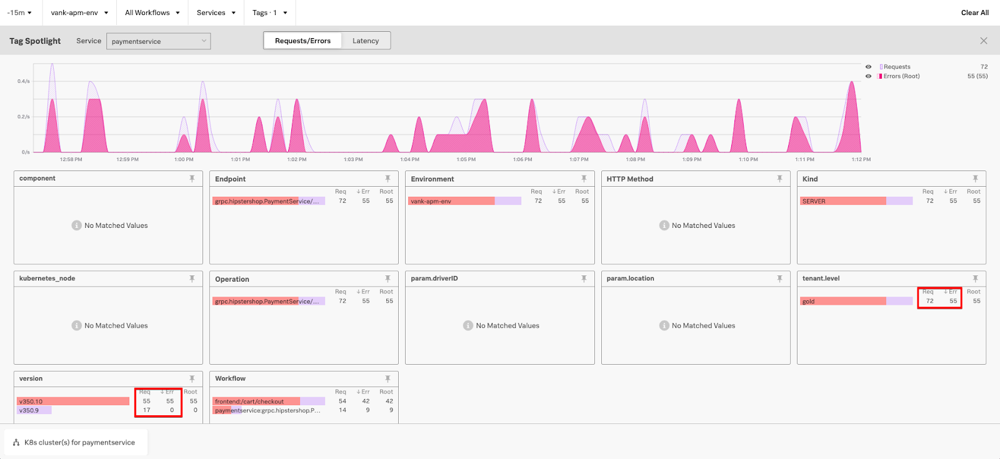
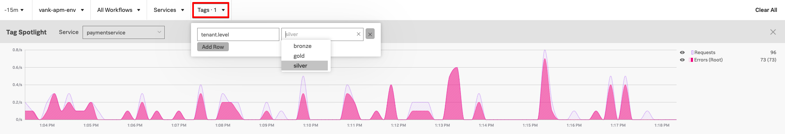
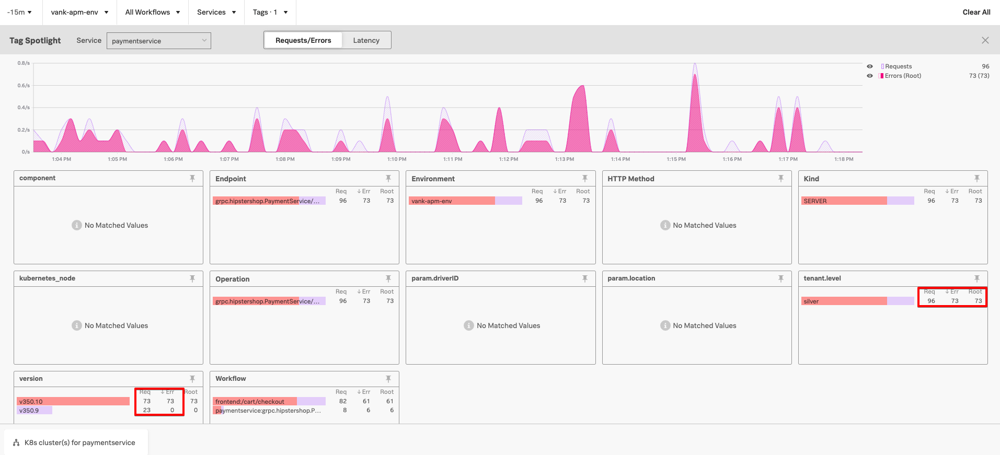
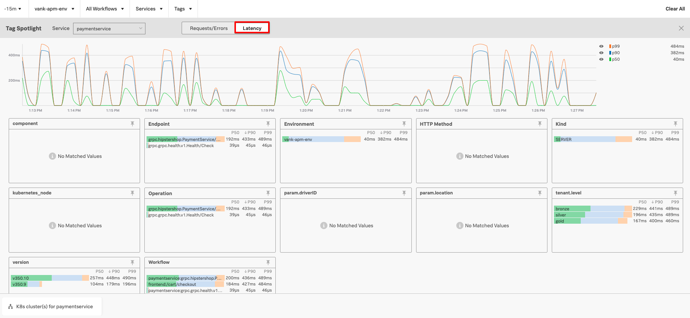
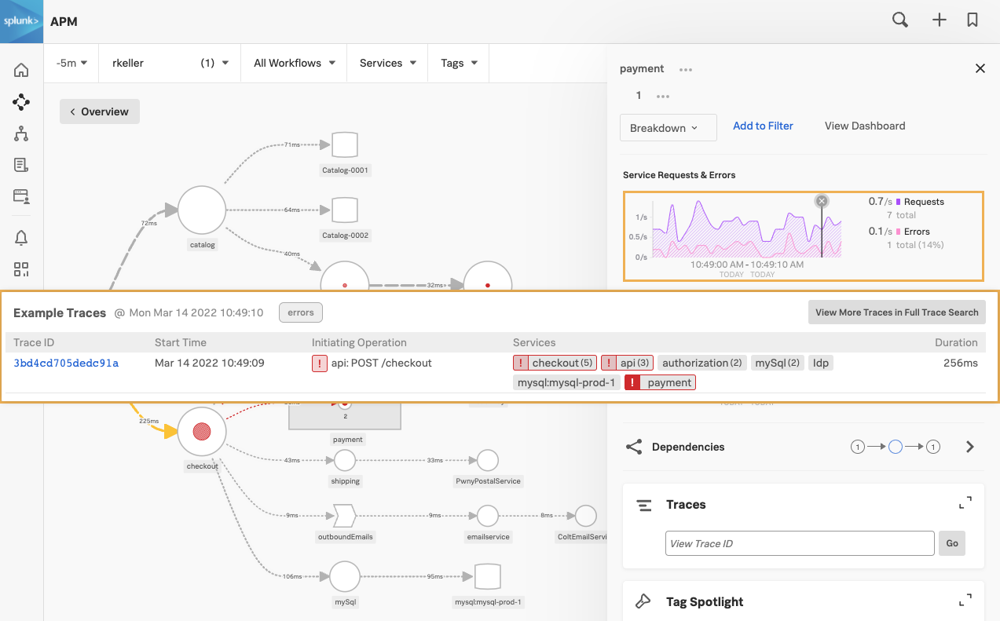
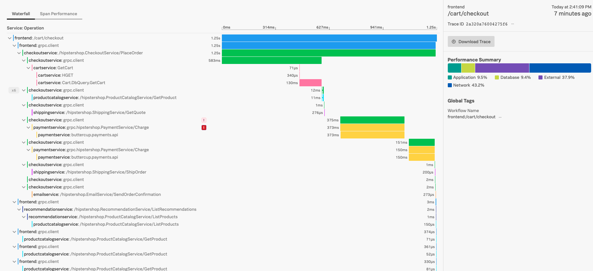
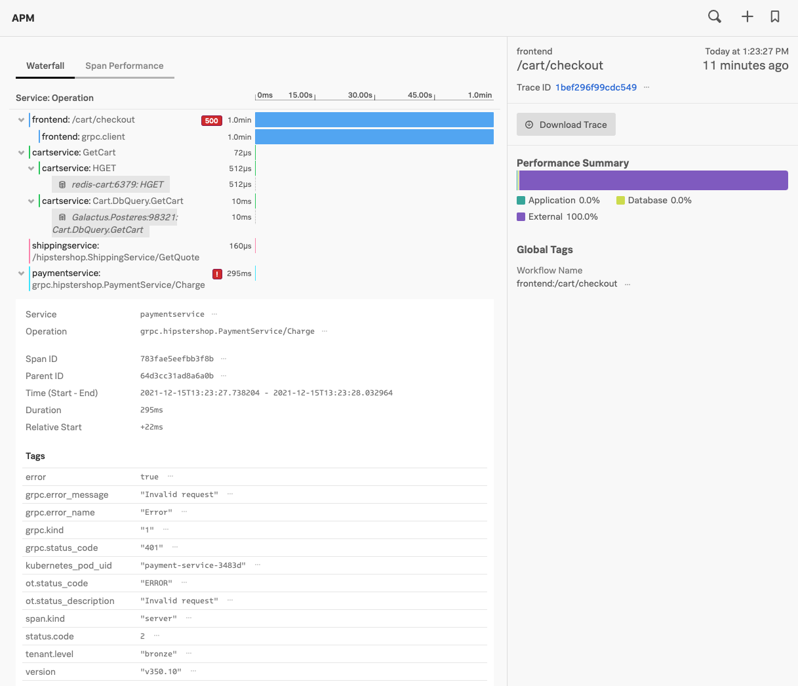
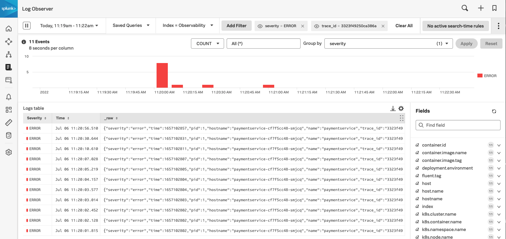

* APM の概要 - RED メトリクス
* サービスマップを利用する
* タグスポットライトの紹介
* トレースの例
* Infrastructure Monitoringとのリンク

## 1. トレースとスパンについて

トレースは、同じトレースIDを共有するスパンの集合体であり、アプリケーションとその構成サービスが処理する固有のトランザクションを表します。

各スパンには、そのスパンでキャプチャされた操作を表す名前と、その操作がどのサービス内で行われたかを表すサービス名があります。

さらにスパンは、その親として別のスパンを参照することができ、そのトランザクションを処理するために実行されたトレースでキャプチャされた処理の関係を定義します。

各スパンには、キャプチャされたメソッド、オペレーション、コードブロックに関する以下のような多くの情報が含まれています。例えば:

* 処理名
* 処理の開始時間（マイクロ秒単位の精度）
* 処理の実行時間（マイクロ秒単位の精度）
* 処理が行われたサービスの論理名
* 処理が行われたサービスインスタンスのIPアドレス

## 2. サービスマップ

サービスマップの **paymentservice** をクリックし、**paymentservice** の下にある`breakdown`のドロップダウンフィルタから **version** を選択します。これにより、カスタムスパンタグの **version** でサービスマップがフィルタリングされます。

これで、サービスマップが以下のスクリーンショットのように更新され、**paymentservice** の異なるバージョンが表示されていることがわかります。

## 3. タグスポットライト

画面の右側にある **Tag Spotlight** をスクロールダウンし、ドロップダウンから **Top Across All Indexed Tags** を選択します。選択したら、下のスクリーンショットにあるように をクリックします。

タグスポットライトのページが表示されます。このページでは、アプリケーションの上位のタグと、それに対応するエラー率や秒間リクエスト数を確認できます。

**version** スパンタグでは、バージョン `350.10` のエラー率が100%であることがわかります。また、**tenant.level** スパンタグでは、3つのテナント（Gold、Silver、Bronze）すべてにエラーがあることがわかります。

タグスポットライトのページはインタラクティブに、目的のタグをクリックするだけでフィルタとしてタグを追加することができます。**tenant.level** の下の **gold** をクリックして、フィルターとして追加します。これを行うと、ページには **tenant.level** が **gold** のデータのみが表示されます。

タグスポットライトは、データを分析して傾向を見極めるのに非常に便利です。Gold Tenantでは、リクエストの総数のうち55件がエラーであることがわかります。（この数字はワークショップの実施時刻により異なります）

これをバージョンタグと関連付けると、バージョン `350.10` が55件、バージョン `350.9` が17件のリクエストに対応していることがわかります。つまり、バージョン `350.10` を経由したリクエストは、すべてエラー状態になったということになります。

**paymentservice** のバージョン `350.10` からのすべてのリクエストがエラーになるというこの理論をさらに検証するために、タグセレクタを使用して、フィルタを別のテナントに変更することができます。フィルターを **gold** テナントから **silver** テナントに変更します。

ここで、**silver** テナントのエラーのあるリクエスト数を見て、バージョン番号と相関させることで、同様の分析を行うことができます。**silver** テナントのエラー数は、バージョン `350.10` のリクエスト数と一致していることに注目してください。

タグスポットライトでは、秒間リクエスト数やエラー率だけでなく、サービスごとのレイテンシーも見ることができます。これを行うには、レイテンシーボタンを選択し、silver テナントタグを削除することで、すべての paymentservice のレイテンシーを確認することができます。

右端の **Clear All** の下にある X ボタンを押して、サービスマップに戻りましょう。

## 4. サンプルトレース

右上にある「Services by Error Rate」グラフのピンク色の線上をクリックします。選択すると、サンプルトレースのリストが表示されます。`Initiating Operation of`が**frontend: POST /cart/checkout** であるサンプルトレースの1つをクリックしてください。

スパンとともに、選択したトレースの全体が表示されます。エラーが発生したスパンは、その横に赤い！マークが表示されます。グレーのボックスに**x6**などの数字が表示されている場合は、それをクリックすると`paymentservice` スパンを展開することができます。

赤い！マークが表示された`paymentservice` スパンの一つをクリックすると展開され、関連するメタデータやエラーの詳細が表示されます。このエラーが401エラーによるものであることがわかります。また、「テナント」や「バージョン」などの有用な情報も表示されています。

エラーの原因が**無効なリクエスト**であることがわかりましたが、正確なリクエストが何であるかはわかりません。ページの下部に、ログへのコンテキストリンクが表示されます。このリンクをクリックすると、このスパンに関連付けられているログが表示されます。

下の画像と同様の**Log Observer** ダッシュボードが表示されます。

フィルタを使用して、エラーログのみを表示できます。右上にある`ERROR`をクリックしてから、`Add to filter`をクリックします。

You should now have a shorter list of log entries which have a `severity` of `ERROR`
`severity`が`ERROR`であるログエントリに絞り込まれます。

いずれかのエントリを選択して詳細を表示します。これで、開発者が誤って本番環境にプッシュした**無効なAPIトークン**の使用によってエラーがどのように発生したかを確認できます。

おめでとうございます。これで、このAPMワークショップは完了です。

